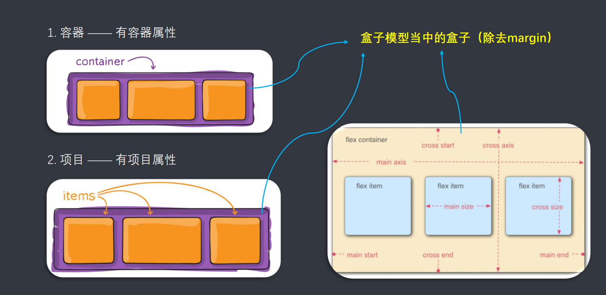
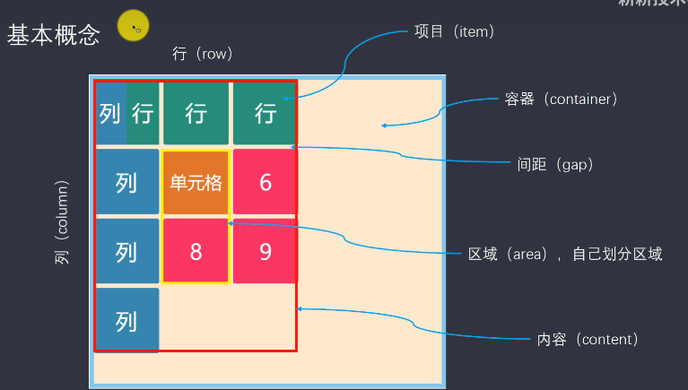
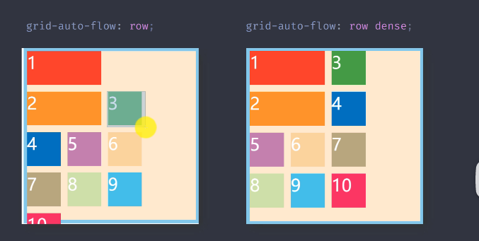
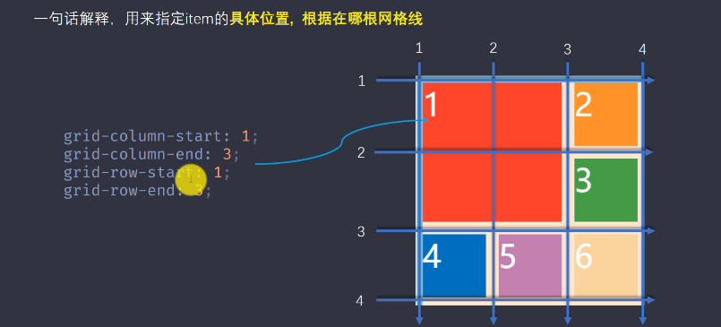
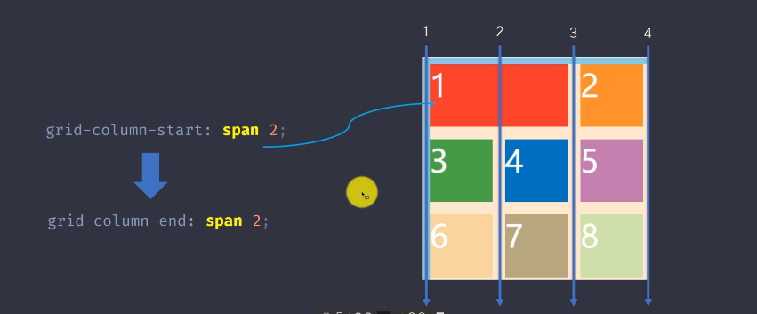
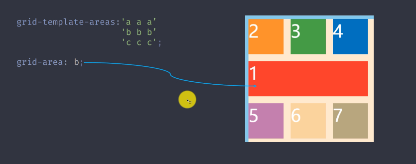
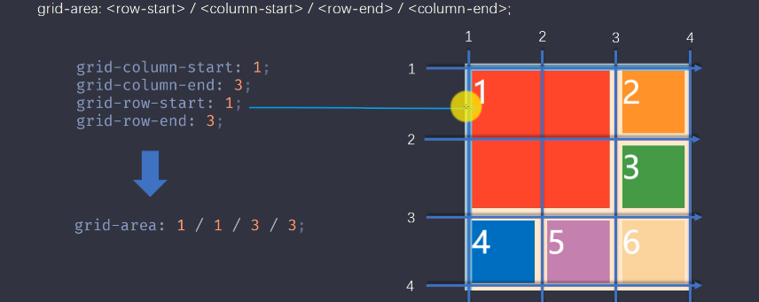
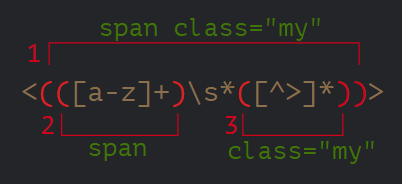
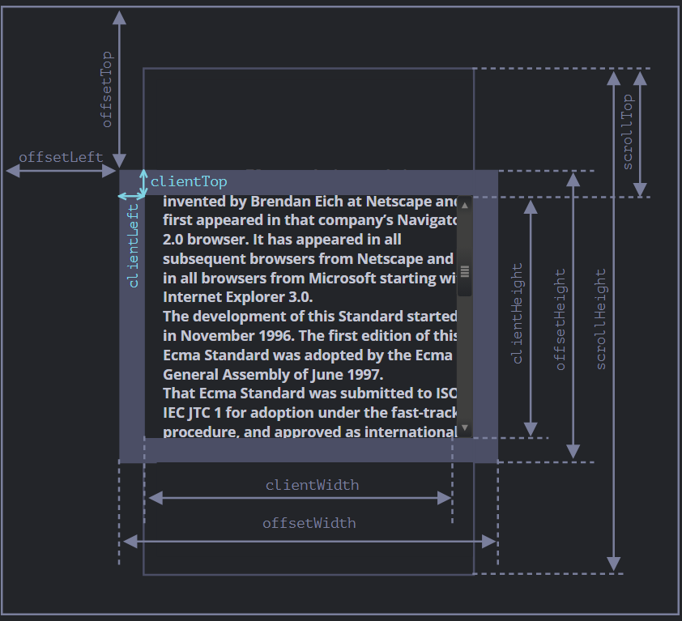
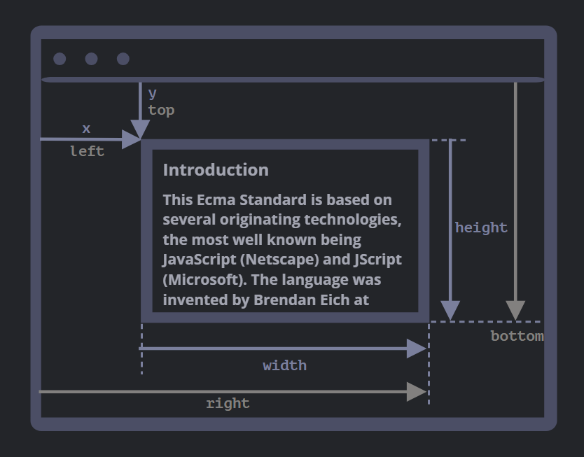

# HTML

## html概念

### 简介

```
超文本标记语言，主要用于描述一个页面
```

### 思想

```
页面中有很多数据，不同的数据可能需要不同的显示效果，就可以使用标签把要操作的数据包裹起来，通过修改标签的属性值，来实现标签内数据样式的改变

本质就是一个容器的思想
一个标签就相当于一个容器，想要修改容器内的数据样式，我们只需要修改容器的属性值，就可以实现
```


### 特点

```
语法非常宽松
标签名不区分大小写（建议使用小写-html5规范）
标签都是预定义好的，每个标签都有特定的含义（后端xml语言的标签可以自定义）
```


### 语法

```
标签
>>由一对尖括号括起来的关键字组成，又称为元素
属性
>>为元素提供更多信息，可以改变元素的样式，以名称和值得形式出现
标签体
>>开始标签和结束标签中间的所有内容都叫做标签体，可以是一段普通的文本，也可以是其他标签
注释
>>解释说明，给程序员看的	分行注释和块注释
特殊字符
>>空格&nbsp;
>>版权信息&copy;
>>大于号&gt;
```


## 常见标签

### 文档相关标签

```html
<html>		---根标签
	<head>		---文档的头部
		<tittle></title>		---文档的标题
	</head>
		<body>		---文档的正文
		</body>
</html>
```


### 文本相关标签

```html
字体标签
	<font></font>
标题标签
    <h1></h1>	标题 h1-h6
段落标签
	<p></p>	段落标签：用于定义段落,会自动在其前后创建一些空白.
```


### 格式相关标签

```html
粗体
<b></b>
<strong>粗体</strong>
斜体
<i></i>
<em>斜体</em>
下划线
<u>下划线</u>
删除线
<del>删除线</del>
标记
<mark>标记</mark><!--等同于==高亮显示==-->
```

==高亮显示==

### 列表相关标签

```html
无序列表
<ul>
	<li></li>
</ul>
有序列表
<ol>
    <li></li>
</ol>
```


### 标签分类(行内元素与块状元素)

依据:标签是否能独占一行

==行内元素==

```html
特点:上一级有空间就在上一行显示,如果没有空间,才会另起一行
	<font></font>
	<strong></strong>
纯粹的行内元素
	<span></span>
	默认没有任何样式,不可以换行,后期可以使用css设置样式,主要用于存放少量的数据

	行内元素的宽度是由内容决定的,设置文本居中,需要找它的父空间(其实也是设置行内元素本身相对于父控件的居中)
	行内元素居中,只能找到行内元素的父元素,设置它的父元素居中.
```

==块级元素==

```html
特点:不管上一行有没有空间,直接另起一行显示
	<p></p>
	<h1></h1>
纯粹的块级元素
	<div></div>
	没有任何样式,可以换行,后期使用css设置样式,主要用于布局,主流布局方式div+css
	
	对于块级元素,宽度默认独占一行,设置里面的文本居中,直接在这个块级元素上设置就行
	
	如果是块元素,相对于父元素居中,要用到外边距来设置
```

==居中问题的总结==

```css
对于行级元素,设置它自身相对于父控件的居中,需要通过父控件的text-align来设置

对于块级元素,设置它自身相对于父控件的居中,需要通过外边距来设置
```


### 图片媒体标签

==图片标签==

```html
标签
	src属性选择图片的路径
	alt属性包含一条对图像的文本描述
	title属性设置鼠标经过时的提示文字
src属性可以使用相对路径和绝对路径
	绝对路径
		以盘符开头的路径
	相对路径
		就是把相对于这个html文件的路径相同的部分去掉,剩下的就是相对路径
		三种情况
			图片在文件的下一级目录,写法: ./目录名/图片名
			图片在文件的同级目录,写法: ./图片名
			图片在文件的上一级目录,写法: ../目录名/图片名
推荐使用相对路径
```

==音频标签和视频标签==

```html
<audio src="#" controls="controls" autoplay="autoplay" muted="muted" loop="loop"></audio>

<video src="#" control="controls" autoplay="autoplay" muted="muted"></video>
	src属性规定音频文件的路径
	controls:如果声明了该属性，浏览器将提供一个包含声音，播放进度，播放暂停的控制面板，让用户可以控制音频的播放。
	autoplay属性规定了是否视频在浏览器页面加载完毕后自动播放,根据规定,媒体内容在满		足将音量设置为0或其他条件下才能自动播放
	muted属性规定了视频在默认情况下是否静音
	loop属性使视频循环播放
	
```

### 链接相关标签

```html
<a href="#" target="_blank"></a>
	href属性规定了链接的目标url
		href属性可以指向站内或者站外的任意网页或者资源
	target属性规定了目标的打开方式
		_blank:新窗口打开
		_self:当前窗口打开(default)
	href = "JavaScript:void(0);" 点击a标签不进行跳转,而是删除,并且保留超链接的样式
```

### 布局相关标签

```html
概念
	html5HTML5 提供了新的语义元素来明确一个Web页面的不同部分:
	之前	头部:<div class='header'></div>
		  底部:<div class='footer'></div>
		  导航栏:<div class='nav'></div>
	现在	 头部<header></header>
		   底部<footer></footer>
		   导航栏<nav></nav>
	这些标签也称为语义化标签,它们没有任何样式,主要用于划分不同的区域,便于进行页面布局
	<head></head>元素定义了文档的头部区域
	<main></main>元素定义了文档的主体部分
	<nav></nav>元素定义了文档的导航栏
	<footer></footer>元素定义了文档的底部区域
	<section></section><section> 标签定义文档中的节（section、区段）。比如章节、页眉、页脚或文档中的其他部分
	<article></article>元素定义独立的内容
	本质是块级元素,没有任何样式
```

### 表单相关标签

```html
概念
	表单是用来搜集用户输入的信息
	表单表示文档中的一个区域，此区域包含交互控件，将用户收集到的信息发送到 Web 服务器。
四大标签
	form标签:包含了表单元素的一个区域,用于定义表单要提交的范围和提交的地址
				有两个重要的属性
					action	用于设置表单提交的地址,默认是提交当前页面
					method	设置表单的提交方式,默认是get方式
						get方式:把数据拼接在地址栏后面,以名称和值的方式成对拼接,相对的不安全,只能提交少量数据.请求体中没有数据
						post方式:把数据拼接在请求体里,相对安全,可以提交大量数据,主要用于文件上传,或者提交敏感数据.地址栏后没有数据,数据在请求体中
	input标签:也叫输入项标签,根据type属性值的不同,可以显示不同的样式,方便用户输入或者选择
		type属性取值:text(文本框)、password(密码框)、radio(单选框)、checkbox(复选框)、file(文件框)、submit(提交按钮:将页面数据提交到后台)、reset(重置按钮:用于恢复页面到刚打开时的状态)、button(普通按钮:结合css使用)
		text(文本框)属性:placeholder(占位符:用于提示用户)
	select标签:选择框标签.对于取值是固定的几个值,可以使用下拉选择框
	textarea标签:文本域,主要用于个人简历,商品评价
	label标签:<label> 标签为 input 元素定义标注（标记）。label 元素不会向用户呈现任何特殊效果。不过，它为鼠标用户改进了可用性。如果您在 label 元素内点击文本，就会触发此控件。就是说，当用户选择该标签时，浏览器就会自动将焦点转到和标签相关的表单控件上。

<label> 标签的 for 属性应当与相关元素的 id 属性相同
	属性
		name
			如果表单元素想要把数据提交到后台,必须要有name属性
			还可以为单选和复选框进行分组,同一组的单选框一次只能选择一个
		value
			对于单选和复选框,需要指定value的值,用于在后台区分用户选择了哪一个选项
			可以设置下拉选择框option标签的值,设置之后,提交到后台使用的就是value里面的值,否则就是标签体里面的值
			可以设置submit、reset、文本框、密码框等元素设置默认值,实现记录用户名和密码
		checked
			作用于单选(radio)和复选框(checkbox),效果为在页面加载之后默认选中
		selected
			设置下拉选择框(select)的默认选中
		cols
			设置文本域的列数(宽度)
		rows
			设置文本域的行数(高度)

```

#### `button`元素

```html
button元素
	始终为button元素设置type属性,type属性的取值为:submit button(默认) reset
```


### 表格标签

```html
<table>		定义表格 align属性定义了表格相对于其他元素的对齐方式
    <tr>
        <th></th>	定义表头 文字居中并加粗
    </tr>	
    <tr>	定义表格中的行	align属性定义了表格行内元素对齐方式
        <td>	定义表格内容
        </td>
    </tr>
</table>
	colspan和rowspan属性可以用在td标签上,用来定义单元格合并的数目
```

----


# CSS

#### CSS概念及入门

==概念==

```css
层叠样式表,用于设置样式和布局控制,主流布局方式(div+css)
```

==组成==

```css
选择器
	用于选择页面中的元素,进而控制样式
属性
	用于设置样式,控制布局
```

==区别==

```css
和html属性控制样式的区别
	1、css更加专业,可以实现html属性实现不了的样式
	2、可以实现标签和样式的分离,提高样式的复用性,同时提高了开发效率
```

==布局的书写顺序==

```css
从上往下,从左往右,从外向里
```


#### CSS引入方式

##### 行内样式

==概念==

```css
用style属性在html标签上添加样式,也叫内嵌样式或者内联样式
```

==特点==

```css
简单,耦合性强,不利于代码和样式的分离,没有复用性
```


##### 内部样式

==概念==

```css
使用style标签,结合css选择器,给元素添加样式
```

==特点==

```css
实现了html代码和样式的分离,可以在当前页面进行复用
```


##### 外部样式

==概念==

```css
将css样式抽取到css文件中,然后通过link标签在页面中引入
```

==特点==

```css
实现html代码和样式的分离,可以在多个页面进行复用,可以统一网站的风格
```

##### 三种引入方式的优先级

```css
行内样式的优先级最高,它只为这一行服务.
内部样式和外部样式优先级相同,谁最后解析显示谁.
```

+++


#### CSS选择器

##### css基本选择器

###### id选择器

==概念==

```css
通过id的值来选择元素,一般选择唯一的元素
```

==语法==

```css
#id{
    
}   
```

###### 类选择器

==概念==

```css
通过类名class的值来选择元素,一般选择一批元素
```

==语法==

```css
.class{
    
}
```

###### 标签选择器

==概念==

```css
通过便签名来选择元素,一般选择的是一批元素
```

==语法==

```css
div{
    
}
```

###### 基本选择器的优先级

```css
!important(∞)
行内样式  (1,0,0,0)
id选择器  (0,1,0,0)
类选择器  (0,0,1,0)
标签选择器(0,0,0,1)
如果有多个相同的选择器，则它们的权值相加。在计算完所有选择器的权值后，具有最高权值的规则将应用于元素。如果权值相同，则后面的规则将覆盖前面的规则。
```

##### css 拓展选择器

###### 并集选择器

==作用==

```css
选择满足条件的多个元素
```

==语法==

```css
选择器a,选择器b
```


###### 交集选择器

==作用==

```css
选择满足所有条件的元素
```

==语法==

```css
选择器a.选择器b
```

###### 后代选择器

==作用==

```css
选择前一个元素的所有复合条件的后代元素
```

==语法==

```css
选择器a 选择器b
```

###### 子选择器

==作用==

```css
选择前一个元素的符合条件的直接子代元素
```

==语法==

```css
选择器a>选择器b
```

###### 相邻兄弟选择器

==作用==

```css
选择相邻元素,即后一个元素紧跟在前一个之后,并且共享一个父元素
```

==语法==

```css
选择器a+选择器b
```

###### 属性选择器

常用于表单选择器

==作用==

```css
通过属性来选择元素
```

==语法==

```css
[属性名=属性值]
```

###### 伪类选择器

==作用==

```css
用来添加选择器的特殊效果(不需要使用标签自带的属性,就可以实现)
```

==语法==

```css
标签名:link
标签名:visited
标签名:hover
标签名:active
```

###### 伪类选择器进阶


###### ==:focus伪类==

>`:focus`表示获得焦点的元素（如表单输入）。当用户点击或触摸元素或通过键盘的“tab”键选择它时会被触发。

###### ==:valid伪类==

>表示内容正确的`<input>`或其他`<form>`元素。这能简单地将校验字段展示为一种能让用户辨别出其输入数据的正确性的样式。

###### ==:target伪类==

>代表一个唯一的页面元素 (目标元素)，其 id 与当前 URL 片段匹配。

>其用法类似于用`<a>`标签的`锚`的作用

###### 伪类结构选择器

==作用==

```css
不需要在html当中添加额外的属性(id和css等),直接根据元素在html中的结构关系来选择元素
```

==与普通选择器的区别==

```css
普通选择器在html结构中有标识,id选择器,类选择器,他们在html中都有额外的属性
伪类选择器在html结构中没有标识,根据逻辑上的关系来选择元素
```

==语法==

```css
选择一个
标签:first-child{}
标签:last-child{}

选择多个
标签:nth-child(n){}匹配父元素的第n个元素,n可以是数字,关键字或者公式
	n是数字
		从1开始,代表第n个元素
	n是关键字
		奇数odd,偶数even
	n是公式
		(An+B),A代表一个循环的大小,n是一个计数器(从0开始),B是偏移量
		前五个(-n+5)
		第五个以后(n+5)
```

+++


#### CSS属性

##### 尺寸属性

###### 宽度:

`width`

###### 高度

`height`

##### 背景属性

###### ==background-color==

```css
background-color:规定了背景的颜色
	颜色取值
	1. 关键字
	2. rbg方式
	3. rgba方式
	4. 16进制
```

###### ==background-image==

```css
background-image:url(图片路径):规定了背景图片

background-repeat:规定背景图片是否平铺
    repeat	背景图像将向垂直和水平方向重复。这是默认
    repeat-x	只有水平位置会重复背景图像
    repeat-y	只有垂直位置会重复背景图像
    no-repeat	background-image 不会重复
    inherit	指定 background-repeat 属性设置应该从父元素继承

background-position:规定背景图片的位置
    left top
    left center
    left bottom
    right top
    right center
    right bottom
    center top
    center center
    center bottom	如果仅指定一个关键字，其他值将会是"center"
    x% y%	第一个值是水平位置，第二个值是垂直。左上角是0％0％。右下角是100％100％。如果仅指定了一个值，其他值将是50％。 。默认值为：0％0％
    xpos ypos	第一个值是水平位置，第二个值是垂直。左上角是0。单位可以是像素（0px 0px）或任何其他 CSS单位。如果仅指定了一个值，其他值将是50％。你可以混合使用％和positions
    inherit	指定background-position属性设置应该从父元素继承

background-size:规定了背景图片的尺寸
    length	设置背景图片高度和宽度。第一个值设置宽度，第二个值设置的高度。如果只给出一个值，第二个是设置为 auto(自动)
    percentage	将计算相对于背景定位区域的百分比。第一个值设置宽度，第二个值设置的高度，各个值之间以空格 隔开指定高和宽，以逗号 , 隔开指定多重背景。如果只给出一个值，第二个是设置为"auto(自动)"
    cover	此时会保持图像的纵横比并将图像缩放成将完全覆盖背景定位区域的最小大小。
    contain	此时会保持图像的纵横比并将图像缩放成将适合背景定位区域的最大大小。
```

###### ==精灵图==

```css
    将项目中用到的小图片合成一张大图,这张大图就叫做精灵图.
	好处:减少服务器发送图片的次数,提高页面的加载速度
	使用:
		1.创建一个盒子
		2.设置盒子的大小为展示的图片的大小
		3.设置精灵图为盒子的背景图片
		4.获取要展示的小图在精灵图上的坐标.取负值,设置到background-position属性中
```


###### ==复合属性==

```css
background:背景缩写属性可以在一个声明中设置所有的背景属性。
/*各值之间用空格分隔，不分先后顺序。*/

语法
background: bg-color bg-image position/bg-size bg-repeat bg-origin bg-clip bg-attachment initial|inherit;

bg-size单独写在background之后,或者写在bg-position之后
```

==linear-gradient线性渐变==

>由两种或多种颜色之间的渐进过渡组成。

```css
background: linear-gradient(to right, transparent, pink);
```


##### 字体属性

###### ==font-style==

```css
font-style 规定文本是否为斜体
	默认取值为:normal
	italic指定文本样式为斜体

```

###### ==font-weight==

```css

font-weight 规定文本是否加粗
	默认取值为normal,相当于数字400
	bold规定加粗,相当于数字700
	bolder规定更粗的文本
	也可以使用数字,取值范围为100-700
```

###### ==font-size==

```css
font-size 规定字体大小
	可以使用small,large等关键字
	一般使用像素值
```

###### ==font-famil==

```css
font-family 规定字体的系列
	取值取决于浏览器(默认是微软雅黑)
```


###### ==复合属性==

```css
font: font-style font-weight font-size/line-height font-family 
```


##### 文本属性

###### ==文本颜色color==

```css
color:定义文本的颜色
	rgba()

```

###### ==文本对齐text-align==

```css
text-align:定义文本的对齐方式
	left：
    内容左对齐。
    center：
    内容居中对齐。
    right：
    内容右对齐。
    justify：
    内容两端对齐，但对于强制打断的行（被打断的这一行）及最后一行（包括仅有一行文本的情况，因为它既是第一行也是最后一行）不做处理。（CSS3）
```

###### ==text-decoration==

```css
text-decoration-line:定义元素文本装饰线条位于文本的哪个位置。
	none：
    指定文字无装饰
    underline：
    指定文字的装饰是下划线
    overline：
    指定文字的装饰是上划线
    line-through：
    指定文字的装饰是贯穿线
```

##### 文本其他属性

###### ==行高line-height==

```css
line-height:规定的是基线到基线之间的距离,基线是整行文字中所有字母x的底部线上沿组成的水平线
	normal：
    允许内容顶开或溢出指定的容器边界。
    <length>：
    用长度值指定行高。不允许负值。
    <percentage>：
    用百分比指定行高，其百分比基于文本的font-size进行换算。不允许负值。
    <number>：
    用乘积因子指定行高。不允许负值。

	当line-height 等于 box的height时,可以实现 单行文本 垂直居中
```

```css
在网页基本布局时,可以设置line-height=1,来取消行高默认的上限间隙
```

```css
和font属性一起使用可能会被覆盖,一般将line-height属性放在font之后
```


###### ==首行缩进text-indent==

```css
text-indent:首行缩进
	<length>：
    用长度值指定文本的缩进。可以为负值。
    <percentage>：
    用百分比指定文本的缩进。可以为负值。
    each-line：
    定义缩进作用在块容器的第一行或者内部的每个强制换行的首行，软换行不受影响。（CSS3）
    hanging：
    反向所有被缩进作用的行。（CSS3）
```

###### 文本边框-webkit-text-stroke

>-webkit-text-stroke属性定了文本的边框

```css
-webkit-text-strok: 2px red; /* 宽度为2px,颜色为红色的文本边框 */
```


##### 边框属性

###### ==border-block==

```css
border-block 为简写属性，用于在样式表中的某处同时设置逻辑块向边框的各属性值。默认即上下边框的属性.
```

###### ==border-inline==

```css
border-inline 可以简单的理解为设置左右边框的属性
```


###### ==border-width==

```css
border-width:属性设置一个元素的四个边框的宽度。此属性可以有一到四个值。
    thin	定义细的边框。
    medium	默认。定义中等的边框。
    thick	定义粗的边框。
    length	允许您自定义边框的宽度。
    inherit	规定应该从父元素继承边框宽度。
```

###### ==border-style==

```css
border-style属性设置一个元素的四个边框的样式。此属性可以有一到四个值。
    none	定义无边框。
    hidden	与 "none" 相同。不过应用于表时除外，对于表，hidden 用于解决边框冲突。
    dotted	定义点状边框。在大多数浏览器中呈现为实线。
    dashed	定义虚线。在大多数浏览器中呈现为实线。
    solid	定义实线。
    double	定义双线。双线的宽度等于 border-width 的值。
    groove		显示为有雕刻效果的边框，样式与 ridge 相反。
    ridge		显示为有浮雕效果的边框，样式与 groove 相反。
    inset		显示为有陷入效果的边框，样式与 outset 相反。当它指定到 border-collapse 为 collapsed 的单元格时，会显示为 groove 的样式。
    outset		显示为有突出效果的边框，样式与 inset 相反。当它指定到 border-collapse 为 collapsed 的单元格时，会显示为 ridge 的样式。
```

###### ==border-color==

```css
border-color属性设置一个元素的四个边框颜色。此属性可以有一到四个值。
color	指定背景颜色。在CSS颜色值查找颜色值的完整列表
transparent	指定边框的颜色应该是透明的。这是默认
inherit	指定边框的颜色，应该从父元素继承
```

###### ==复合属性==

```css
border: border-width,border-style,border-color
```


###### ==边框合并border-collapse==

```css
border-collapse 用来决定表格的边框是分开的还是合并的。
	collapse:合并,相邻单元格共享边框
	separated:分隔,相邻单元格拥有不同的边框
```

###### ==边框圆角border-radius==

```css
border-radius 允许你设置元素的外边框圆角。当使用一个半径时确定一个圆形，当使用两个半径时确定一个椭圆。

当 border-collapse 的值为 collapse 时，border-radius 属性不会被应用到表格元素上。
```


##### CSS属性书写顺序

>按照 
>
>​		布局属性display
>
>​		盒子模型相关属性:
>
>​			宽高属性 width、height
>
>​			边距 margin padding等
>
>​			辅助背景颜色:bg-color等
>
>​		其他样式:文本 text, 字体 font, 行高 line-hight 等属性
>
>​		点缀的样式: 圆角 border-radius, 阴影 *-shadow, 指针 cursor 等
>
>的顺序书写

>重要性
>
>​	如果顺序不对,可能会影响页面布局
>
>​	为了方便维护考虑,一般会把布局属性,这些重要的属性放在前面,次要,点缀的属性放在后面

#### 选择器的使用

>推荐使用 类+后代选择器
>
>一般后代选择器的层级不要超过三个

+++


#### CSS三大特性

##### 层叠性

==概念与特点==

```css
后写的样式会覆盖先写的样式,相同的样式会被覆盖,不同的样式会被叠加
```

##### 继承性

==概念与特点==

```css
子元素会继承父元素的相关属性,可以在一定程度上减少代码

并不是父元素所有的样式属性子类都会继承,子元素只能继承父元素的部分样式,例如:文本、字体等
	父亲的高度不会被继承
```

==应用==

```css
给body设置font-size,统一页面的默认大小
给ul设置list-style属性,去掉无序列表中的小圆点
```


##### ==优先级==

==概念==

>不同的选择器具有不同的优先级,优先级高的选择器会覆盖优先级低的选择器

==优先级表==

```css
!important(∞)(写在属性值后面,分号的前面,不能提升继承的优先级,只要是继承,优先级为0.实际开发中不建议使用!important)
行内样式  (1,0,0,0)
id选择器  (0,1,0,0)
类选择器  (0,0,1,0)
标签选择器(0,0,0,1)
继承的属性(0,0,0,0)
如果有多个相同的选择器，则它们的权值相加。在计算完所有选择器的权值后，具有最高权值的规则将应用于元素。如果权值相同，则后面的规则将覆盖前面的规则。
```

+++


#### 盒子模型

==概念==

>在CSS中,万物皆盒子,把页面中的所有元素都抽象成一个盒子,盒子是占据空间的,可以进行布局
>
>行内元素对应的是行盒,块级元素对应的是块盒

###### 行盒、块盒互转

==特点==

```css
行内元素:不能独占一行,设置宽高没有效果,宽高由内容决定

块级元素:独占一行,设置宽高有效果.
    如果不设置宽度,默认与父元素一样宽,如果不设置高度,默认由内容撑开
```

==互转==

```css
display: block; 块级元素
display: inline;	行内元素
display: inline-block; 兼顾了行内元素和块级元素的特点,可以设置宽高
```

###### 盒子模型的组成

```css
内容:div等
边框:border;
内边距:padding;规定盒子边框和内容之间的间隙
外边距:margin;规定盒子与盒子之间的间隙
```


###### 内边距

```css
padding	规定了边框和内容区域的距离
padding-方位值 规定top right bottom left 四个方向的内边距
```

###### 盒子尺寸问题

==边框和内边距对尺寸的影响==

>加上边框和内边距之后,盒子会被撑大

>盒子宽度=边框宽度+内边距+内容宽度

>想要解决这个问题,需要通过手动的方式,将宽度减去边框和内边距的宽度

> box-sizing属性解决了盒子的大小需要通过计算手动调整内容宽度的问题

==box-sizing属性==

```css
box-sizing 属性定义了 user agent 应该如何计算一个元素的总宽度和总高度。
	content-box 是默认值。
	border-box	设置的边框和内边距的值是包含在 width 内的。
		浏览器将自动计算需要减去的尺寸,在内容区域自动减去
```

###### 外边距

```css
margin 规定了两个盒子之间的距离
margin-方位值 规定top right bottom left 四个方向的内边距
```

###### 外边距情况分析

==外边距正常情况==

>水平布局的盒子,左右margin正常,互不影响

>最终两者的间距为左右margin之和

==外边距合并情况==

>垂直布局的盒子,上下margin会合并,间距为margin的最大值

>只要给其中一个盒子设置margin即可

==外边距塌陷情况==

>互相嵌套的块级元素,给子元素设置`margin-top`,会导致父元素一起向下移动

>父子元素的`margin-top`是紧贴在一起的,给子元素设置`margin-top`会作用在父元素上,导致二者一起滑落

>让父元素上有元素分隔即可解决,或者
>
>设置父元素的上边框
>
>设置父元素的内边距
>
>`overflow:hidden`
>
>`display:inline-block`
>
>`float:left`

###### 清除内外边距

>浏览器会为部分标签设置默认的margin和padding,其实我们是不需要的,一般在项目开始之前,就需要清除这些样式
>
>例如
>
>​	`body`标签的默认margin
>
>​	`p`标签的默认上下margin
>
>​	`ul`标签的上限margin和padding

```css
/* 京东的处理方式 */
*{
    margin: 0;
    padding: 0;
}
```

###### 伪元素

==概念==

>伪元素是一个附加至选择器末的关键词，允许你对被选择元素的特定部分修改样式。它在html骨架中,并没有通过代码去实现,而是通过css模拟出来的

>一般在页面的非主体内容可以使用伪元素

==区别==

>普通元素通过html的标签生成
>
>伪元素通过CSS模拟出来标签效果
>
>本质区别是是否在html中创建了新的元素

==语法==

```css
::before和::after分别在父元素的最前面和最后面添加一个元素,这个元素默认是行内元素
```

==注意==

>必须设置伪元素的content属性

+++


#### 布局方式

##### 标准流

>又称文档流,浏览器默认采用的一套排版规则,规定了元素如何排布

==特点==

>块级元素	从上到下,垂直排布,独占一行
>
>行内元素	从左到右,水平排布,不能独占一行,只有上一行空间不够才另起一行

##### 浮动

>一种布局方式,让元素漂浮起来,可以实现元素水平排布,
>
>早期可以用于图文混排,现在主要用于页面布局,可以让块元素水平排布

==语法==

```css
float
	left	向左浮动
	right	向右浮动
	none	不浮动
```

==特点==

>浮动元素会脱离标准流,统称为"脱标",在标准流中不占位置,相当于从地面飘向了天空
>
>"浮动元素比标准流级别高,可以覆盖标准流中的元素"
>
>"下一个浮动元素会在上一个浮动元素的基础上进行左右浮动,这样实现了水平排布"
>
>
>
>"浮动元素会受到上面元素边界的影响,也就是说,浮动的元素只会影响在它之后的标准流,不会影响在它之前的标准流"
>
>
>
>"浮动元素有特殊的显示效果:  元素在设置浮动之后,就有了`行内块元素(inline-block)`的特性,可以设置宽高等属性,在布局的时候,不需要再加上`display:block`属性

###### 清除浮动

>子元素浮动,不能撑开标准流中父元素的高度,就会影响后面元素的布局,所以需要清除浮动
>
>"清除浮动的目的是让父元素有高度,从而不影响后面元素的布局

==解决方案==

>1
>
>给父元素设置高度
>
>简单粗暴,方便,但是在某些布局当中,父元素的高度可能是由内容决定的	

>2 额外标签法
>
>给父元素之后设置一个空的div,添加上`clear:both属性`
>
>会在页面中添加额外的标签,会让页面的结构变得复杂

>3 单伪元素清除法
>
>在父元素后面添加一个`::after`伪元素,设置`display:block`和`clear:both`属性
>
>使用方便,经常用在项目之中,只需要给标签添加`clearfix`属性,就可以清除浮动

>` 将清除浮动的代码单独放在通用的类clearfix里,将来需要清除浮动,直接加上类名即可,提高复用性`

```css
.clearfix:after{
content:"";
display:block;
height:0;
clear:both;
visibility:hidden;
}
.clearfix:after{
*zoom:1;
}
```

>4 双伪元素清除法
>
>在父元素前面添加`::befor`伪元素,后面添加`::after`伪元素,同时解决塌陷问题并清除浮动
>
>比单伪元素新增了解决塌陷问题

```css
.clearfix:before,
.clearfix:after{
content:"";
display:table;
}
.clearfix:after{
clear:both;
}
.clearfix{
*zoom:1;
}
```

+++


##### 定位

###### 简介

>一种布局方式,可以让元素自由摆放在页面中的任意位置(叠加效果等)
>
>
>
>可以解决盒子之间的层叠问题,定位之后元素的层级是最高的,可以叠加在其他盒子的上面
>
>解决固定在屏幕的某一位置上的问题
>
>
>
>设置定位方式,定位=定位模式+边偏移,即`position`+水平和垂直方向就近各取一个

###### 相对定位

>相对定位:相对于它之前的位置进行移动(自恋型)
>
>​	没有脱离标准流,移动后仍然占据原来的空间
>
>​	参照原点:以前在标准流中的左上角为原点
>
>用法:
>
>​	用于小范围的移动
>
>​	子绝父相,可以使子元素在父元素的任意位置上移动

###### 绝对定位

>相对定位:找到最近有定位的祖先元素进行移动(拼爹型)
>
>​	脱离标准流,不占据原来的位置

​	==子绝父相==

>>子绝父相,定位相关的布局技巧,子元素是绝对定位,父元素是相对定位
>>
>>​	让子元素相对于父元素自由移动
>>
>>​	父元素如果是相对定位,就不会脱离标准流,这样对页面的布局影响是最小的
>>
>>应用
>>
>>​	元素水平居中
>>
>>​	元素水平垂直居中

###### 固定定位

>​	相对于浏览器进行定位(死心眼定位)
>
>​	脱离标准流
>
>​	参照原点是body的左上角
>
>应用
>
>​	让盒子固定在屏幕的某一位置上

###### 粘性定位

>粘性定位(`position:sticky`)基本上是相对位置和固定位置的混合体，它允许被定位的元素表现得像相对定位一样，直到它滚动到某个阈值点（例如，从视口顶部起 10 像素）为止，此后它就变得固定了。

```css
position:static; /*静态定位*//*标准流*/
position:relative;/*相对定位*//*相对于它原来的位置*//*没有脱离标准流*//*移动后仍然保留原来的位置，不会被其他元素占用*/
position:absolute;/*绝对定位*//*没有祖先元素或者祖先元素无定位，则以浏览器为准定位*//*祖先元素有定位，则以最近一级祖先元素为准*//*不再占有原来的位置*/

position:fixed;/*固定定位*//*以可视窗口为参照*//*不再占有原来的位置*/
position:sticky;/*以可视窗口为参照*//*占有原来的位置*//*必须添加top、bottom、left、right四个中的一个*/

z-index:1;	/*正数、负数或者0*//*数值越大，元素越靠上*//*数值相同，后来居上*//*有定位才能生效*/

/* 居中*/
.son1 {
            width: 100px;
            height: 100px;
            background: skyblue;
            position: absolute;
            left: 50%;	/*父元素宽度的50%*/
		   transform:translateX(-50%);	/*沿X轴平移相对于自身的50%*/
            top: 50%;
            transform:translateY(-50%);
}
```

##### 不同布局之间的层级关系

>定位(position)的优先级要高于浮动(float)高于标准流
>
>定位的优先级是最高的,可以叠加在其他元素之上.

##### 不同定位之间的层级关系

>相对定位(relative)、绝对定位(absolute)和固定定位(fixed)的优先级相同,根据层叠性,写在下面的元素在最上面
>
>使用z-index属性可以用来更改元素在z轴上的优先级,z-index的值越大,元素在z轴上越"靠上",z-index可以取负值来降低优先级
>
>这样,就不需要修改html的结构

+++


#### 其他属性

###### 1 vertical-align

>基线
>
>​	基线是整行文字中所有字母x的底部线上沿组成的水平线

>`vertical-align`属性规定了文字垂直方向上的对齐方式
>
>​	`baseline`(默认) | `top` | `middle` | `bottom`

>使用`vertical-align: bottom`属性,可以使图片紧贴着div的下边框排布
>
>使用`vertical-align: middle`属性,可以使图片居中对齐

###### 2 overflow溢出

>`overflow`规定了内容区域溢出的元素的显示效果
>
>​	`visible` | `hidden` | `scroll` | `auto`
>
>​	scroll:显示滚动条
>
>​	auto:文字超出区域自动显示滚动条

###### 3 visibility可见性

>`visibility`属性规定了元素是否可见
>
>​	visibility: hidden;/*保留位置*/
>
>​	display: none; /*不保留位置*/

+++


#### 动态变量

>通过`:root`伪类选择器  和 `var()`  函数实现

```css
:root {
    --blue:#4fc3dc;
}

div {
    color: var(--blue);
}
```

>`:root`
>
>​	表示文档根元素,所有的主流浏览器都支持
>
>​	在`:root`中声明的变量相当于全局变量,只要当前页面引入了`:root`所在的文件,就可以使用`var()`函数来引用

>`var()`
>
>​	可以替代元素中任何属性中的值的任意部分,不能作为属性名,选择器或者其他除了属性值之外的值

+++


#### 引入外部文件

##### 字体图标

> 阿里巴巴官方字体库:iconfont.cn,添加到项目并引入CSS
>
> ​	在修改字体的大小属性时,使用类选择器设置样式
>
> font-awesome字体库:无需下载,直接引用

```javascript
<script src="https://kit.fontawesome.com/d9a152cf81.js" crossorigin="anonymous"></script>
```

##### 谷歌字体库

>通过link标签可以将谷歌字体库添加到自己的html文件中,添加谷歌的多种字体.
>
>​	使用family请求使用的字体样式,如果要请求多种样式,可以使竖线(|)隔开,字体名中间的空格用加号(+)表示
>
>​	此外,可以通过effect请求谷歌文本样式库,需要在字体之后用&符号,用effect请求谷歌样式

```xml
<link rel="stylesheet" href="https://fonts.googleapis.com/css?family=Tangerine">
```

+++


#### CSS新特性

##### filter滤镜

>`filter` 属性将模糊或颜色偏移等图形效果应用于元素。滤镜通常用于调整图像、背景和边框的渲染。
>
>`filter` 属性是一个复合属性,可以同时定义多个滤镜

```css
filter: blur(5px);	/* 将高斯模糊应用于输入图像。*/
filter: brightness(0.4);	/* 将线性乘法器应用于输入图像，使其看起来或多或少地变得明亮。值为 0% 将创建全黑图像。值为 100% 会使输入保持不变。 */
filter: contrast(200%);	/* 函数可调整输入图像的对比度。值是 0% 的话，图像会全黑。值是 100%，图像不变。 */
filter: drop-shadow(16px 16px 20px blue);	/* 函数对输入图像应用阴影效果。 */
filter: grayscale(50%);	/* 函数将改变输入图像灰度。amount 的值定义了转换的比例。值为 100% 则完全转为灰度图像，值为 0% 图像无变化。值 */
filter: hue-rotate(90deg);	/* 函数在输入图像上应用色相旋转。angle 一值设定图像会被调整的色环角度值。值为 0deg，则图像无变化。 */
filter: invert(75%);	/* 函数反转输入图像。amount 的值定义转换的比例。值为 100% 则图像完全反转。值为 0% 则图像无变化。 */
filter: opacity(25%);	/* 转化图像的透明程度。amount 的值定义转换的比例。值为 0% 则是完全透明，值为 100% 则图像无变化。 */
filter: saturate(30%);	/* 函数转换图像饱和度。amount 的值定义转换的比例。值为 0% 则是完全不饱和，值为 100% 则图像无变化。 */
filter: sepia(60%);	/* 函数将图像转换为深褐色。amount 的值定义转换的比例。值为 100% 则完全是深褐色的，值为 0% 图像无变化。 */
```

##### objcet-fit

>object-fit属性指定可替换元素（例如：`img` 或 `video`）的内容应该如何适应到其使用高度和宽度确定的框。
>
>​	fill | contain | cover | none | scale-down

```css
contain	/* 被替换的内容将被缩放，以在填充元素的内容框时保持其宽高比。 */
cover	/* 被替换的内容在保持其宽高比的同时填充元素的整个内容框  如果对象的宽高比与内容框不相匹配，该对象将被剪裁以适应内容框。 */
fill	/* 被替换的内容正好填充元素的内容框。整个对象将完全填充此框。如果对象的宽高比与内容框不相匹配，那么该对象将被拉伸以适应内容框。 */
none	/* 被替换的内容将保持其原有的尺寸。 */
scale-down	/* 内容的尺寸与 none 或 contain 中的一个相同，取决于它们两个之间谁得到的对象尺寸会更小一些。 */
```


##### 过渡transition

>`transition`属性规定了元素样式改变的方式,通常和`:hover`伪类配合使用
>
>​	transition: <属性名> <持续时间> [动画曲线] [过渡延迟];

>>过渡需要添加在过渡元素本身上

##### 变换transform

>`transform`属性允许你旋转，缩放，倾斜或平移给定元素。

###### 位移transform:translate(x,y)

>transform:translate()规定了元素沿x轴和y轴平移的距离
>
>​	像素值 | 百分比(相对于自身)

###### 旋转transform:rotate(deg)

>transform:rotate()定义了2d旋转
>
>​	正值(顺时针) | 负值(逆时针)

###### 渐变

>background: linear-gradient()函数用于创建一个表示两种或多种颜色线性渐变的图像

##### 动画

```css
/*定义动画*/
@keyframes move{	/*百分比可以调整，但百分比尽量用整数，百分比是总持续时间比例的划分*/
	0%{
	transform:translate(0%);/*开始状态*/
	}
	100%{
	transform:translate(100%);/*结束状态*/
	}	
}
/*调用动画*/
div{
    animation-name:move;/*动画名称*/
    animation-duration:0.5s/*持续时间*/
    animation-delay:5s;/*何时开始*/
    animation-iteration-count:infinite;/*重复次数*/
    animation-direction:alternate;/*反方向播放*/
    animation-fill-mode:forwards/backwards;/*保持结束状态/回到起始状态*/
    /*简写*/
    animation:动画名称 持续时间 运动曲线 何时开始 播放次数 是否反向 状态
}
```

+++


#### Flex布局

==display:flex概念==

>一种弹性的布局方式,使用它布局页面更加简单灵活,可以避免浮动脱离标准流的影响,布局更加高效,可以提高开发效率
>
>​	带有 `display:flex` 的容器会自动将子元素转化为弹性项目
>
>​	弹性项目的宽度和高度没有设置,那么它的宽度和高度由内容决定
>
>​	如果弹性项目设置了`stretch`属性,那么它的高度会等于弹性容器

==和浮动的区别==

>浮动会导致子元素脱离标准流,flex布局不会
>
>浮动属性写在子元素上,flex属性写在父元素上



##### 1 容器属性

###### Flex-direction

>Flex-direction属性规定了容器内项目的排列方向
>
>​	 row | row-reverse | column | column-reverse;
>
>​	修改轴向之后,要注意分辨主轴

###### Flex-wrap

>Flex-wrap属性规定了容器内的项目不拆行或不拆列
>
>​	nowrap | wrap | wrap-reverse;

###### flex-flow

>flex-flow属性是flex-direction和flex-wrap的复合属性

###### Justif-content

>Justify-content属性规定了弹性项目在主轴上的排列方式
>
>​	flex-start | flex-end | center | space-between | space-around (中间间隙是两端的两倍) | space-evenly (间隙等分)

###### align-items

>align-items属性规定了弹性项目在交叉轴上的排列方式
>
>​	stretch | flex-start(容器顶部) | flex-end(容器底部) | center(容器中心) | baseline |
>
>​		`align-items`有两个默认值`stretch`和`flex-start`,达成元素默认在容器的上方并拉伸元素和容器高度一致(子元素没有设置高度)的效果

###### align-content

>align-content属性规定了多根轴线的对齐方式,当`flex-wrap:nowrap`生效时,align-content属性不起作用
>
>​	flex-start | flex-end | center | space-between | space-around | Stretch |

###### gap

>gap属性规定了弹性项目之间的间隔


##### 2 项目属性

###### order

>order属性规定了弹性项目的排列顺序. order的数值越小,排列越靠前,order的默认值为0

###### align-self

>align-self允许单个弹性项目有不同的对齐方式,可以覆盖align-items属性

###### flex

>`flex`属性规定了弹性项目是如何分配空间的(复合属性),实现子元素宽度的动态调节
>
>flex属性是一个复合属性,由flex-grow,flex-shrink,flex-basis组成
>
>​	flex-grow属性规定了项目的放大比例,默认为0,即:如果容器存在剩余空间,也不放大
>
>​	flex-shrink属性规定了项目的缩小比例,默认是1,即:如果容器空间不足,项目将会缩小,当`flex-shrink: "0"`,当容器缩小时,项目不会缩小
>
>​	flex-basis属性规定了项目在分配多余空间之前,项目占据的主轴空间,默认是`auto`,即项目本身的大小,主轴方向为`row`时,flex-basis就是宽度,当主轴方向为`column`时,flex-basis就是高度
>
>​	flex复合属性的取值
>
>​		完整取值:
>
>​			默认取值:`felx: 0 1 auto` 或者`flex: 0;`
>
>​			其他取值: `felx: none;`=> flex: `0 0 auto;` `flex: auto` => `flex: 1 1 auto;`
>
>​						`flex : 像素值;` => `flex: 1 1 像素值;` 像素值代表正常情况下项目的宽度

+++


#### Grid布局



##### 1 容器属性

###### grid-template-column

>`grid-template-column`定义grid项目的列的数目和高度属性,后面有几个数值,就是几列,高度可以不同
>
>>`grid-template-column:repeat(3,100px)`效果等同于`grid-template-column:100px 100px 100px`
>
>>`grid-template-column:1fr minmax(100px,1fr)`规定了第二个单元格的最小和最大属性
>
>>`grid-template-column:100px auto 100px`中间的一列自动适应

###### fr属性

> grid布局提供了`fr`属性,`fr`意为片段,例如:`grid-template-column:1fr 2fr 3fr`意为将一列内容分为6份,三个项目分别占据1份 2份 3份

```css
grid-template-column:100px 200px 100px;
```

###### grid-template-row

>`grid-template-row`定义grid项目的行的数目和宽度属性,

```css
grid-template-row:100px 300px 100px;
```

###### 间距属性:gap

>`gap`属性规定了项目之间的间距

```css
gap: 20px 30px;
```

###### 区域属性:grid-template-area

>一个区域由单个或多个单元格组成,自己决定

###### grid-auto-flow

>`grid-auto-flow`规定了项目的放置顺序,默认是row,即"先行后列",当属性改为column时,放置方法为"先列后行"
>
>>`grid-auto-flow: row dense`属性规定了项目的排列方式,具体如图

###### 对齐方式属性:justify-( )(水平)/align-( )(垂直)

justify-items/align-items (项目对齐方式)

`start | end | center | stretch(默认)`

place-items复合属性

justify-content/align-content(内容对齐方式)

`start | end | center | stretch | space-around | space-between | space-evenly`

grid-auto-columns/grid-auto-rows

>用来设置多出来的项目的宽和高

##### 2 项目属性

###### grid-column-start / grid-column-end

###### grid-row-start / grid-row-end

>用来指定item的具体位置,根据在哪根网格线开始和结束
>
>
>
>>`grid-column-start: 1`和`grid-column-end: 3`简写为`grid-column: 1 / 3`
>
>>`grid-column-start: span 2`规定了跨行
>
>>

###### grid-area

>规定项目放在哪个区域
>
>
>
>###### 复合属性
>
>

###### justify-self / align-self / place-self

>规定了容器的对齐方式

>`start | end | center | stretch`

+++


#### 媒体查询

>通过**媒体查询**（**Media queries**），您可以根据各种设备特征和参数的值或者是否存在来调整您的网站或应用。

+++


#### 搭建项目

>1 创建文件夹,项目名最好见文知意
>
>2 创建css js image文件夹,用来存放css js 和图片等素材,index用来书写html页面
>
>3 favicon.ico放在项目根目录下

+++


# JavaScript

## ECMAScripit

### JavaScript的概念和入门

#### 概念

>一种运行在客户端的解释型语言(node.js就是运行在服务器端的JavaScript).

#### 作用

>1 可以动态控制页面元素的样式
>
>2 表单的校验
>
>3 页面的特效(轮播图)
>
>4 服务端的开发(node.js)

#### 组成

>ECMAScript
>
>​	基础语法
>
>​		数据类型 变量 运算符 内置对象
>
>DOM(文档对象模型)
>
>​	对html文档进行操作,动态的添加或者删除元素,修改元素的样式
>
>BOM(浏览器对象模型)
>
>​	弹框,窗口的打开和关闭,定时器

#### 引入方式

##### 内嵌式

>在html页面创建一个<script>标签,将js代码放进去

##### 外联式

>创建一个后缀为.js的文件,将JavaScriptDoc放进去,在html页面用<script>标签引入
>
>外联式的好处
>
>​	可以在多个页面中引入,提高代码的复用性
>
>**如果一个<script>标签既有内嵌式又有外联式,它只会执行外联式.**
>
>如果需要额外编写JavaScriptDoc,需要再写一个<script>标签

#### 注释

```JavaScript
// 这是单行注释

/* 这是多行
	注释 */

*** 多行注释只能嵌套单行注释 ***
```

#### 输入和输出

##### 输出

> 通过
>
>​	alert();
>
>​	console.log();
>
>​	document.write();	等方法输出

```JavaScript
alert();
	alert会显示一条信息
		alert("Hello"); //hello

console.log();
	console.log //显示在控制台上
        console.log("Hello"); 

document.write();
	document.write //显示在文档流中
		document.write("write");
```

+++

##### 输入

>通过
>
>​	prompt();
>
>​	confirm();	方法输入

```css
prompt:
	prompt 函数接收两个参数：
		result = prompt(title, [default]);
			default是可选参数,指定input框的默认值,result的类型为String
console.log(typeof result); //String

confirm:
	confirm 函数显示一个带有 question 以及确定和取消两个按钮的模态窗口。
	点击确定返回 true，点击取消返回 false。
		let isBoss = confirm("Are you the boss?");
		alert( isBoss ); // 如果“确定”按钮被按下，则显示 true
```

### 变量

#### 概念

>本质是内存中存取数据的那块空间(容器),用来储存变化的数据.

#### 使用

>1 先声明再赋值
>
>2 声明的同时赋值

#### 注意点

>1 以字母开头
>
>2 可以以 **$** 或者 **_** 开头,但是不建议
>
>3 变量名大小写敏感
>
>4 不能是关键字或者保留字
>
>5 尽量见名知义
>
>6 使用驼峰命名法
>
>**尽量不要使用name作用变量名,name是JavaScript的关键字**

### 数据类型

>JavaScript是一种 **弱类型 (weakly typed)** 语言,它不强制规定变量的类型,变量的类型根据后面的值来决定
>
>**强类型 (strongly typed) **语言在定义完变量的类型后,只能存储固定类型的变量
>
>数据类型给数据进行分类,方便管理
>
>数据分为**基本数据类型(值类型)** 和 **对象类型(引用类型)**

##### 基本数据类型

```JavaScript
JavaScript是被称为“动态类型”（dynamically typed）的编程语言，意思是虽然编程语言中有不同的数据类型，但是你定义的变量并不会在定义后，被限制为某一数据类型。

number类型
	代表整数和浮点数,还包括"特殊数值":Infinity(无穷大)、-Infinity 和 NaN。
	NaN代表一个计算错误,它是一个不正确的或者一个未定义的数学操作所得到的结果.
	NaN 是粘性的。任何对 NaN 的进一步数学运算都会返回 NaN：
	alert( NaN + 1 ); // NaN
	alert( 3 * NaN ); // NaN
	alert( "not a number" / 2 - 1 ); // NaN

BigInt类型
	可以通过将 n 附加到整数字段的末尾来创建 BigInt 值。

String类型
    用单引号、双引号或者反引号包含字符串
    需要特别注意的是:反引号是 功能扩展 引号。它们允许我们通过将变量和表达式包装在 ${…} 中，来将它们嵌入到字符串中。以下是一个例子
    let name = "John";
    // 嵌入一个变量
    alert( `Hello, ${name}!` ); // Hello, John!
    // 嵌入一个表达式
    alert( `the result is ${1 + 2}` ); // the result is 3

Boolean类型(逻辑类型)
    boolean 类型仅包含两个值：true 和 false。

null值
    它构成了一个独立的类型，只包含 null 值：

undefined值
    特殊值 undefined 和 null 一样自成类型。
    undefined 的含义是未被赋值。
    如果一个变量已被声明，但未被赋值，那么它的值就是 undefined
```

+++

##### 对象类型

>对象(Object)
>
>数组(Array)
>
>函数(Function)
>
>正则
>
>日期(Date)

+++

##### 类型转换

###### 强制转换

>String();	将数字转换为字符串
>
>Number();	将数据转换为数字
>
>Boolean();	将数据转换为true和false

```JavaScript
字符串转换 String()
	比如，alert(value) 将 value 转换为字符串类型，然后显示这个值.
	我们也可以显式地调用 String(value) 来将 value 转换为字符串类型.

数字型转换 Number()
	在算术函数和表达式中，会自动进行 number 类型转换。
        alert( "6" / "2" ); // 3, string 类型的值被自动转换成 number 类型后进行计算
        我们也可以使用 Number(value) 显式地将这个 value 转换为 number 类型。
        转换Boolean类型的值时,会将 true 和 false 分别转换为 1 和 0 
        //无法转非数字类型的字符串和 undefined,会将null转换为数值 0
        //转换失败的例子
        let age = Number("an arbitrary string instead of a number");
        alert(age); // NaN，转换失败
	parseInt()和parseFloat()方法
		parseInt方法可以逐个解析,直到遇到非数字的字符才结束
		Number()方法不能逐个解析,只要遇到非数字字符,直接显示NaN
		let n1 = "111aaa";
		Number(n1) = NaN;
		Number(111aaa) = 111;

布尔型转换 Boolean()
	直观上为“空”的值（如 0、空字符串、null、undefined 和 NaN）将变为 false。
	其他值变成 true。
```

###### 自动转换

>对任意类型的数据+字符串,执行的都是字符串的拼接
>
>**如果加号两端有一端是字符串, 就会执行字符串的拼接**
>
>**如果加号两端都不是字符串, 就会默认使用Number()进行强制转换,然后再执行加法运算**

```JavaScript
let a = true + "100";
console.log(a); // true100
```

>true , false , null 在跟数字进行运算的时候,会被转换成数字

### 运算符

#### 算术运算符

```JavaScript
数学运算		//结果可能是浮点型
	加法 +,
	减法 -,
	乘法 *,
	除法 /,
	取余 %,
    	取余运算符是 %，尽管它看起来很像百分数，但实际并无关联。a % b 的结果是 a 整除 b 的余数。
	求幂 **.
    	求幂运算 a ** b 将 a 提升至 a 的 b 次幂。
        
        //在某些情况下,浮点数显示的是无限接近的数
```

#### 自增/自减

>在自身的基础上,加一或者减一,只能作用于变量上
>
>++在前,变量的值+1,然后返回计算后的结果
>
>++在后,先返回计算后的结果,然后变量的值+1
>
>不管++在前还是在后,最终变量的值会+1

```JavaScript
let i = 1;
console.log(++i); // 2
console.log(i++); // 2
console.log(i); // 3
```

#### 比较运算符

>大于(>) 小于(<) 大于等于(>=) 小于等于(<=) 不等于(!=)

```JavaScript
等于(==) 和 严格相等(===)

当对不同类型的值进行比较时，JavaScript 会首先将其转化为数字（number）再判定大小。
	对于布尔类型值，true 会被转化为 1、false 转化为 0。

严格相等
	严格相等运算符 === 在进行比较时不会做任何的类型转换。
```

>这些比较的输出结果为Boolean类型

#### 逻辑运算符

>用来连接多个条件
>
>&& (逻辑与)
>
>```JavaScript
>console.log(true&&true); true
>
>console.log(true&&false); false
>```
>
>|| (逻辑或)
>
>```JavaScript
>console.log(true||true); true
>
>console.log(true||false); true
>```
>
>
>
>! (逻辑非)
>
>	逻辑非运算符接受一个参数，并按如下运作：
>	    将操作数转化为布尔类型：true/false。
>	    返回相反的值。

#### 赋值运算符

##### 基本赋值运算符

>==

##### 复合赋值运算符

>+=
>
>-=
>
>*=
>
>/=

#### 三元运算符

>表达式(变量)a?表达式(变量)b:表达式(变量)c

```JavaScript
let a = 10;
let b = 20;
let max = a>b ? a : b;
console.log(max); //b
```


### 流程控制

#### 顺序结构

>从上到下,依次执行

#### 选择结构

##### if-else语句

>**主要用于判断一个条件,根据判断的结果来判断语句是否执行**
>
>​	if语句
>
>​	if-else语句
>
>​	if-else-if语句

```JavaScript
if(condition) {
    语句体;
}

//	if condition = true; 执行语句体,否则跳过
```

```JavaScript
if(condition) {
    语句体1;
}
else {
    语句体2;
}

//	if condition = true; 执行语句体1,否则执行语句体2
```

```JavaScript
if(condition1) {
    语句体1;
}

else if(condition2) {
    语句体2;
}

else if(condition3) {
    语句体3;
}
......

//哪个condition = true; 就执行哪个语句体
//从上往下,以此判断每一个条件,如果满足条件就会执行对应的语句体,剩下的条件及时满足也不会执行;
//如果前面的条件都不成立,则执行else里的语句体
```

##### switc-case语句

>`switch` 语句可以替代多个 `if` 判断。
>
>`switch` 语句为多分支选择的情况提供了一个更具描述性的方式。

>- 比较 `x` 值与第一个 `case`（也就是 `value1`）是否**严格相等**，然后比较第二个 `case`（`value2`）以此类推。
>- 如果相等，`switch` 语句就执行相应 `case` 下的代码块，直到遇到最靠近的 `break` 语句（或者直到 `switch` 语句末尾）。
>- 如果没有符合的 case，则执行 `default` 代码块（如果 `default` 存在）。

```javascript
switch(x) {
  case 'value1':  // if (x === 'value1')
    ...
    [break]

  case 'value2':  // if (x === 'value2')
    ...
    [break]

  default:
    ...
    [break]
}
```

```javascript
// 可以对JavaScript进行分组
let a = 3;

switch (a) {
  case 4:
    alert('Right!');
    break;

  case 3: // (*) 下面这两个 case 被分在一组
  case 5:
    alert('Wrong!');
    alert("Why don't you take a math class?");
    break;

  default:
    alert('The result is strange. Really.');
}

// 分组本质上是switch 语句没有 break 时的副作用。因为没有 break，case 3 会从 (*) 行执行到 case 5。
```

>`if`语句和`if-else`语句一次只能判断一个条件
>
>`if-else-if`语句和`switch`一次可以判断多个条件
>
>所有的`switch`语句都可以使用`if-else-if`语句改写,但是所有的`if-else-if`语句并不一定能用`switch`改写
>
>​	`if`语句主要用于范围的判断,`switch`语句主要用于等值判断
>
>​	如果结果只有固定的几个取值, 可以考虑使用`switch`,因为`switch`层次更加清晰.

#### 循环结构

>根据条件重复执行某些代码
>
>​		for循环
>
>​		while循环
>
>​		do-while循环

##### 分类

###### for循环

```JavaScript
// for循环的基本结构和执行顺序
for (begin;condition;step) {
    循环体语句;
}

/*	执行顺序
	condition成立 => 循环体语句 => step;
	也就是说,begin执行一次，然后进行迭代：每次检查 condition 后，执行 body 和 step。	*/
```

###### while循环

```JavaScript
// while循环
while(condition) {
    代码;
    "循环体";
}

//下面是一个例子
let i = 0;
while (i < 3) { // 依次显示 0、1 和 2
  alert( i );
  i++;
}
```

###### do...while循环

```JavaScript
// do...while 循环
do {
    代码;
    "循环体";
}
while(condition);
// 无论怎样都会执行一次,在实际开发中比较少用
```

###### 区别

>`for`循环和`while`循环先判断条件后执行循环体,`do-while`循环先执行循环体,再判断条件(不管条件是否成立,都会执行一次循环体)

###### 应用场景

>循环次数确定,建议使用`for`循环,它的结构比较简单紧凑
>
>循环次数不确定,一般循环条件是确定的,建议使用`while`循环


##### 跳出循环

>`break`:  通常条件为假时，循环会终止。但我们随时都可以使用 `break` 指令强制退出。
>
>`continue`:  `continue` 指令是 `break` 指令的“轻量版”。它不会停掉整个循环。而是停止当前这一次迭代，并强制启动新一轮循环（如果条件允许的话）。
>
>​	**`continue`** 只允许出现在循环语句中
>
>​	**`break`** 指令 允许出现在循环语句和 `switch` 语句之中

###### 循环嵌套中的跳出循环

>`break` 只会影响当前所在的循环,不会影响外层循环

### 数组

#### 概念

>很多时候我们发现需要 **有序集合**，里面的元素都是按顺序排列的。这时一个特殊的数据结构数组（`Array`）就派上用场了，它能存储有序的集合。
>
>数组元素和字符串一样,也是从`0`开始编号,我们可以通过方括号 **`[]`+数字** 获取数组中的元素

#### 声明和操作

##### 声明

```JavaScript
// 方式一
let arr = new Array();
//方式二
let arr = [];

// 两种方式都可以在声明的同时赋值
let arr = new Array(1,2,3,4);

let arr = [1,2,3,4];

//一般而言,第二种声明数组的方式更常用.
```

##### 数组操作

```JavaScript
let fruit = ["apple","Orange","Plum"]

alert( fruits[0] ); // Apple
alert( fruits[1] ); // Orange
alert( fruits[2] ); // Plum

//	数组可以替换元素
fruit[1] = "Pear";

//	向数组添加新的元素
fruit[3] = "Lemon";

// leng属性的值是数组中元素的总个数
alert(fruit.length); // 4

// 用alert来显示整个数组
alert( fruits ); // Apple,Pear,Plum,Lemon

// 删除元素
delete fruit[1]; //Apple,undefined,Plum,Lemon
//等效于
fruit[1] = undefined;


// 数组可以储存任何类型的元素,甚至是对象(Object)
let arr = [ 'Apple', { name: 'John' }, true, function() { alert('hello'); } ];

//	获取索引为 1 的对象然后显示它的 name
alert( arr[1].name ); // John
```

##### 二维数组

>数组里的项也可以是数组。我们可以将其用于多维数组，例如存储矩阵：

```JavaScript
let matrix = [
  [1, 2, 3],
  [4, 5, 6],
  [7, 8, 9]
];

alert( matrix[1][1] ); // 最中间的那个数
```

### 函数

>函数是封装了一段具有特殊功能的代码块

```JavaScript
//用function关键字声明函数
function <函数名>() {
    函数体
}

//调用函数
<函数名>();
```

#### 函数的参数

>我们可以通过参数将任意数据传递给函数。
>
>在如下示例中，函数有两个参数：`from` 和 `text`。**这样提高了程序的通用型和拓展性**

```JavaScript
function showMessage(from, text) { // 参数：from 和 text
  alert(from + ': ' + text);
}

showMessage('Ann', 'Hello!'); // Ann: Hello! (*)
showMessage('Ann', "What's up?"); // Ann: What's up? (**)

//在这里例子中,from 和 text 被称为"形式参数"	而 Ann 和 Hello! 被称为"实际参数"
```

#### 返回值

>函数可以将一个值返回到调用代码中作为结果。
>
>指令 `return` 可以在函数的任意位置。当执行到达时，函数停止，并将值返回给调用代码（分配给上述代码中的 `result`）。
>
>`return` 后面的代码不再执行


#### 函数分类

##### 具名函数

>有名字的函数

##### 匿名函数

>没有名字的函数,通过一个变量接受函数的内容,并使用这个变量名调用函数

```JavaScript
let f = function (num1 ,num2) {
	return num1 > num2 ? num1 : num2;
}
f(20,30);
```

#### 注意事项

>如果函数没有显式地调用return,函数就没有返回值,强行接收,接收的值就是 `undefined`

>函数名代表整个函数,类似数组名代表整个数组,因为它们都是对象类型

>实际参数的个数小于形式参数,则没有被赋值的形式参数的值为 `undefined`

### 面向对象(Object-Oriented Programming)

>面向对象是一种软件开发的思想和方法,它将程序中的数据和操作封装在对象中,通过对象之间的交互来实现程序的功能.
>
>在面向对象编程中，代码被组织成对象，对象可以包含数据和行为，并通过定义类来实现。类是具有相同属性和方法的对象的模板，可以通过实例化类来创建对象，并使用对象的方法和属性来操作和访问数据。面向对象编程的核心思想是封装、继承和多态。
>
>**完成一件事,需要多少个对象**

##### 面向过程和面相对象

>在面向过程编程中，代码被组织成一个个独立的函数，函数是对数据的处理，数据和函数之间的关系是松散的，数据通常是全局变量，函数只是对全局变量进行操作。面向过程编程的核心思想是把问题分解为一个个小的可重用的模块，然后按照一定的顺序调用这些模块。
>
>**完成一件事,需要多少步骤**

>总的来说，面向对象编程强调的是对象和类的概念，更加注重代码的可重用性和维护性；面向过程编程强调的是函数的概念，更加注重程序的执行效率和速度。

##### 类

>类是一个抽象的概念,它描述了一类具有相同特征和行为的对象,类是对象的模板
>
>对象是类的**实例**, 它具有类所描述的特征和行为

```JavaScript
// 创建一个类
class <类名>{
    constructor(){
        
    }
    <方法名>{    
}
}
// 注意  类的属性和方法之间不需要逗号

// 新建一个基于类的对象
let <对象名> = new <类名>;
```

```JavaScript
// 创建一个对象(字面量)
let <对象名> = {
    属性: 值;
    方法名: 匿名函数;
}

// 注意,对象的所有键(key)的的类型只有两种,字符串(String)和Symbol
```


##### 类和对象的意义

>通过代码来描述现实生活中的事物,进行编程(编程就是源于生活)

### Math对象

>算术相关的对象,可以执行算术相关的任务

##### 特点

>`Math` 对象没有构造函数,可以直接用类名调用.

##### 属性

```JavaScript
Math.PI	//圆周率
```

##### 方法

```JavaScript
// 舍入
"向下舍入"
Math.floor:3.1变成3,-1.1变成-2
"向上舍入"
Math.ceil:3.1变成4,-1.1变成-1
"向最近的整数舍入"
Math.round:3.1变成3,中间值3.5变成4
"移除小数点后的所有内容"`IE 浏览器不支持这个方法`
Math.trunc:3.1变成3,-1.1变成-1
"舍到小数点后若干位"
toFixed(n)函数将数字舍入到小数点后n位,并以字符串形式返回结果.
let num = 12.36;
alert(num.toFixed(5));//12.36000
```

```JavaScript
// 生成N-M之间的随机数(包含N和M)
function getRandom(N,M) {
    return Math.floor(Math.random*(M-N+1)+N);
}

//	生成N-M之间的随机数(不包含M)
function getRandom(N,M) {
    return Math.floor(Math.random*(M-N)+N);
}
```

### Date对象

#### 创建

```JavaScript
// 无参数构造
let date = new Date();

// 加入参数
let date = new Date("2023-4-1");
```

#### 方法

```JavaScript
let date = new Date();
// 获取年
date.getFullYear();
// 获取月 (0-11)
date.getMonth();
// 获取日
date.getDate();
// 获取星期(0-6)
date.getDay();
// 获取时分秒
date.getHours();
date.getMinutes();
date.getSeconds();
```

#### 时间戳

>1970年1月1日 00:00:00到现在的时间的**毫秒数**

```JavaScript
// 获取当前时间的时间戳
let date = new Date();
date.getTime();
date.valueOf();

//或者
+new Date();
//
Date.now()
```

### Array对象

#### 数组的添加和删除

```JavaScript
//	添加元素
//	push() 方法将一个或多个元素添加到数组的末尾，并返回新数组的长度。
let fruits = ["apple", "banana"];
let count = fruits.push("orange");

console.log(fruits); // ["apple", "banana", "orange"]
console.log(count); // 3

//	unshift() 方法将一个或多个元素添加到数组的开头，并返回新数组的长度。

let fruits = ["apple", "banana"];
let count = fruits.unshift("orange");

console.log(fruits); // ["orange", "apple", "banana"]
console.log(count); // 3

```

```JavaScript
//   删除元素
//   pop() 方法从数组中删除最后一个元素，并返回该元素的值。
let fruits = ["apple", "banana", "orange"];
let lastFruit = fruits.pop();

console.log(fruits); // ["apple", "banana"]
console.log(lastFruit); // "orange"


//	shift() 方法从数组中删除第一个元素，并返回该元素的值。
let fruits = ["apple", "banana", "orange"];
let firstFruit = fruits.shift();

console.log(fruits); // ["banana", "orange"]
console.log(firstFruit); // "apple"

```

```JavaScript
// splice() 方法从数组中添加或删除元素。它可以接受多个参数，包括要添加或删除的元素，以及要添加或删除的位置。
// splice(开始的索引,删除元素的个数,添加的元素)
let fruits = ["apple","banana"];
fruits.splice(2,0,"pear","orange");
console.log(fruits);
```

#### 数组的查找和过滤

```JavaScript
// filter() 方法对数组中的每个元素执行一次回调函数，并将返回值为 true 的元素保存在一个新数组中。
arr.filter(callback(element[, index[, array]])[, thisArg]);


// 例子
const numbers = [1, 2, 3, 4, 5];
const isEven = number => number % 2 === 0;

const evenNumbers = numbers.filter(isEven);

```

```JavaScript
// find() 方法对数组中的每个元素执行一次回调函数，返回第一个使回调函数返回 true 的元素，如果没有这样的元素，则返回 undefined。
arr.find(callback(element[, index[, array]])[, thisArg]);

// 例子
const numbers = [1, 2, 3, 4, 5];
const isEven = number => number % 2 === 0;

const firstEvenNumber = numbers.find(isEven);
console.log(firstEvenNumber); // 2

```

#### 转换数组

```JavaScript
// map() 方法对数组中的每个元素执行一次回调函数，并将结果保存在一个新数组中。
arr.map(callback(element[, index[, array]])[, thisArg]);

// 例子
const numbers = [1, 2, 3, 4, 5];
const double = number => number * 2;

const doubledNumbers = numbers.map(double);
console.log(doubledNumbers); // [2, 4, 6, 8, 10]


// join() 方法将数组中所有元素转换为字符串并连接在一起，返回一个字符串。默认使用逗号作为分隔符，也可以自定义分隔符。
arr.join([separator])

//例子
const fruits = ['apple', 'banana', 'orange'];
const fruitString = fruits.join(', ');
console.log(fruitString); // "apple, banana, orange"


// toString() 方法是 JavaScript 中数组对象的一个内置方法。它将数组转换为一个字符串，并返回结果。转换后的字符串由数组中的每个元素的值以逗号分隔组成，其中两个元素之间会有一个空格。
const arr = [1, 2, 3, 4, 5];
const str = arr.toString();
console.log(str); // "1, 2, 3, 4, 5"
```

#### 数组的判断

```JavaScript
// some() 方法对数组中的每个元素执行一次回调函数，如果任意一个元素的回调函数返回 true，则 some() 方法返回 true。
arr.some(callback(element[, index[, array]])[, thisArg]);

//下面是一个例子
const numbers = [1, 2, 3, 4, 5];
const isEven = number => number % 2 === 0;

const hasEvenNumber = numbers.some(isEven);
console.log(hasEvenNumber); // true


//	every() 方法对数组中的每个元素执行一次回调函数，如果所有元素的回调函数都返回 true，则 every() 方法返回 true。
arr.every(callback(element[, index[, array]])[, thisArg]);


// 下面是一个例子
const numbers = [1, 2, 3, 4, 5];
const isNumber = number => typeof number === 'number';

const allNumbers = numbers.every(isNumber);
console.log(allNumbers); // true

```

#### 数组的拼接

```JavaScript
//concat() 方法用于连接两个或多个数组，并返回一个新数组，不会修改原数组。新数组中包含所有被连接数组中的元素。
arr.concat(arg1, arg2, ..., argN)

// 例子
const arr1 = [1, 2, 3];
const arr2 = [4, 5, 6];
const arr3 = [7, 8, 9];

const concatenatedArray = arr1.concat(arr2, arr3);
console.log(concatenatedArray); // [1, 2, 3, 4, 5, 6, 7, 8, 9]


// slice() 方法返回一个新数组，包含从开始到结束（不包括结束）的原数组中的元素。原始数组不会被修改。

arr.slice([begin[, end]])

const numbers = [1, 2, 3, 4, 5];

const slicedArray = numbers.slice(1, 4);
console.log(slicedArray); // [2, 3, 4]
//注意，slice() 方法的起始和结束参数都是可选的。如果省略了第二个参数，slice() 方法会一直提取到原数组的末尾。如果省略了两个参数，slice() 方法会返回原数组的一个浅拷贝。
```

#### 数组的查找

```JavaScript
// indexOf() 方法返回数组中第一个匹配元素的索引。如果数组中不存在该元素，则返回 -1。
arr.indexOf(searchElement[, fromIndex])

// 例子
const numbers = [1, 2, 3, 4, 5];
const index = numbers.indexOf(3);
console.log(index); // 2


//includes() 方法判断数组是否包含某个元素，返回一个布尔值。
arr.includes(searchElement[, fromIndex])

// 例子
const numbers = [1, 2, 3, 4, 5];
const result = numbers.includes(3);
console.log(result); // true

//如果 fromIndex 参数被指定，则从该参数指定的索引处开始搜索元素。
```

#### 数组遍历

```JavaScript
//forEach() 方法对数组中的每个元素执行一次回调函数，不会改变原始数组。

arr.forEach(callback(element[, index[, array]])[, thisArg]);

//下面是一个例子
const numbers = [1, 2, 3, 4, 5];
const callback = function(element, index, array) {
  console.log(`element: ${element}, index: ${index}, array: ${array}`);
};

numbers.forEach(callback);


```

#### 数组的排序

```JavaScript
// .sort()方法对数组进行排序
const arr = [2, 5, 1, 6, 3, 4];

// 升序排序
const ascArr = arr.sort((a, b) => a - b);
console.log(ascArr); // [1, 2, 3, 4, 5, 6]

// 降序排序
const descArr = arr.sort((a, b) => b - a);
console.log(descArr); // [6, 5, 4, 3, 2, 1]

```

#### ...运算符

>`...` 是 JavaScript 中的扩展运算符（spread operator），可以将一个可迭代对象（如数组、字符串等）拆分成单独的元素。它的主要作用是在函数调用时方便地传递多个参数，或者在创建新数组时将多个数组合并成一个数组。

### String

1. `charAt()`：返回指定索引处的字符。

   ```javascript
   const str = "hello";
   console.log(str.charAt(0)); // "h"
   ```

2. `concat()`：将两个或多个字符串合并成一个新字符串。

   ```JavaScript
   const str1 = "hello";
   const str2 = "world";
   console.log(str1.concat(" ", str2)); // "hello world"
   ```

3. `indexOf()`：返回字符串中指定字符的第一个匹配项的索引，如果没有找到则返回-1。

   ```JavaScript
   const str = "hello world";
   console.log(str.indexOf("o")); // 4
   console.log(str.indexOf("z")); // -1
   ```

4. `lastIndexOf()`：返回字符串中指定字符的最后一个匹配项的索引，如果没有找到则返回-1。

   ```JavaScript
   const str = "hello world";
   console.log(str.lastIndexOf("o")); // 7
   console.log(str.lastIndexOf("z")); // -1
   ```

5. `slice()`：提取字符串中的一部分并返回一个新字符串。

   ```JavaScript
   const str = "hello world";
   console.log(str.slice(0, 5)); // "hello"
   console.log(str.slice(6)); // "world"
   ```

6. `substring()`：提取字符串中两个指定的索引之间的字符，并返回一个新字符串。不同于slice方法，第一个参数可以大于第二个参数。

   ```JavaScript
   const str = "hello world";
   console.log(str.substring(0, 5)); // "hello"
   console.log(str.substring(6)); // "world"
   ```

7. `replace()`：替换字符串中的某些字符，并返回一个新字符串。

   ```JavaScript
   const str = "hello world";
   console.log(str.replace("world", "there")); // "hello there"
   ```

8. `toLowerCase()`：将字符串中的所有字符转换为小写字母。

   ```JavaScript
   const str = "HELLO WORLD";
   console.log(str.toLowerCase()); // "hello world"
   ```

9. `toUpperCase()`：将字符串中的所有字符转换为大写字母。

   ```JavaScript
   const str = "hello world";
   console.log(str.toUpperCase()); // "HELLO WORLD"
   ```

10. `trim()`：去除字符串两端的空格，并返回一个新字符串。

   ```JavaScript
   const str = "  hello world  ";
   console.log(str.trim()); // "hello world"
   ```

11. `split()` 方法将一个字符串分割成一个字符串数组。可以将分隔符作为参数传递给方法。

```JavaScript
str.split([separator[, limit]]);
sentence = 'The quick brown fox jumps over the lazy dog';
const words = sentence.split(' ');
console.log(words); // ["The", "quick", "brown", "fox", "jumps", "over", "the", "lazy", "dog"]
```

### 正则表达式

>正则表达式是提供了一种在文本中进行搜索和替换的强大的方式的模式。
>
>在 JavaScript 中，我们可以通过 RegExp 对象使用它们，也可以通过两个斜线 `/.../` 来创建
>
>正则表达式（可叫作 “regexp”，或 “reg”）由 **模式** 和可选的 **修饰符** 组成。
>
>正则表达式一般和字符串结合使用

#### 引入

##### 搜索str.match()

>`str.match(regexp)` 方法在字符串 `str` 中寻找 `regexp` 的所有匹配项。
>
>它有三种工作模式:

```JavaScript
// 1、如果正则表达式具有修饰符 g，它返回一个由所有匹配项所构成的数组：

let str = "We will, we will rock you";

alert( str.match(/we/gi) ); // We,we（由两个匹配的子字符串构成的数组）


//2、如果没有这样的修饰符，它则会以数组形式返回第一个匹配项，索引 0 处保存着完整的匹配项，返回的结果的属性中还有一些其他详细信息：
let str = "We will, we will rock you";

let result = str.match(/we/i); // 没有修饰符 g

alert( result[0] );     // We（第一个匹配项）
alert( result.length ); // 1

// 详细信息：
alert( result.index );  // 0（匹配项的位置）
alert( result.input );  // We will, we will rock you（源字符串）


//3、最后，如果没有匹配项，则返回 null（无论是否有修饰符 g）。
let matches = "JavaScript".match(/HTML/); // = null

if (!matches.length) { // Error: Cannot read property 'length' of null
  alert("Error in the line above");
}

// 如果我们希望结果始终是一个数组,可以这样写
let matches = "JavaScript".match(/HTML/) || [];
```

##### 替换str.replace()

>`str.replace(regexp, replacement)` 方法使用 `replacement` 替换在字符串 `str` 中找到的 `regexp` 的匹配项（如果带有修饰符 `g` 则替换所有匹配项，否则只替换第一个）。

```JavaScript
// 没有修饰符 g
alert( "We will, we will".replace(/we/i, "I") ); // I will, we will

// 带有修饰符 g
alert( "We will, we will".replace(/we/ig, "I") ); // I will, I will
```

>第二个参数是字符串 `replacement`。我们可以在其中使用特殊的字符组合来对匹配项进行插入：

| **符号** | 在替换字符串中的行为                                         |
| -------- | ------------------------------------------------------------ |
| $&       | 插入整个匹配项                                               |
| $`       | 插入字符串中匹配项之前的字符串部分                           |
| $'       | 插入字符串中匹配项之后的字符串部分                           |
| $n       | 如果 `n` 是一个 1-2 位的数字，则插入第 n 个分组的内容，详见 [捕获组](https://zh.javascript.info/regexp-groups) |
| $<name>  | 插入带有给定 `name` 的括号内的内容，详见 [捕获组](https://zh.javascript.info/regexp-groups) |
| $$       | 插入字符 `$`                                                 |

##### 替换regexp.text

>`regexp.test(str)` 方法寻找至少一个匹配项，如果找到了，则返回 `true`，否则返回 `false`。

```JavaScript
let str = "I love JavaScript";
let regexp = /LOVE/i;

alert( regexp.test(str) ); // true
```

#### 修饰符

> 正则表达式中的修饰符用于调整匹配规则，包括全局匹配、忽略大小写、多行匹配等。以下是JavaScript中常用的6个修饰符及其作用：

1. `g`（全局匹配）：查找所有匹配，而不是在找到第一个匹配后停止。例如：

   ```JavaScript
   const str = 'Hello, world!';
   const regex = /l/g;
   const matches = str.match(regex);
   console.log(matches); // ["l", "l", "l"]
   ```

2. `i`（忽略大小写匹配）：在匹配时忽略大小写。例如：

   ```JavaScript
   const str = 'Hello, world!';
   const regex = /hello/i;
   const matches = str.match(regex);
   console.log(matches); // ["Hello"]
   ```

3. `m`（多行匹配）：在多行字符串中匹配每一行。例如：

   ```JavaScript
   const str = `First line
   Second line`;
   const regex = /^S/gm;
   const matches = str.match(regex);
   console.log(matches); // ["S", "S"]
   ```

4. `s`（dotAll模式）：使`.`匹配包括换行符在内的所有字符。例如：

   ```JavaScript
   const str = `First line
   Second line`;
   const regex = /First.+Second/s;
   const matches = str.match(regex);
   console.log(matches); // ["First line\n   Second line"]
   ```

5. `u`（Unicode匹配）：启用Unicode匹配模式，用于匹配Unicode字符。例如：

   ```JavaScript
   const str = '\u{1F601}';
   const regex = /\uD83D\uDE01/u;
   const matches = str.match(regex);
   console.log(matches); // ["😁"]
   ```

6. `y`（粘性匹配）：只匹配从上一个匹配的结束位置开始的字符串。例如：

   ```JavaScript
   const str = 'abcabcabc';
   const regex = /abc/y;
   let matches;
   while ((matches = regex.exec(str)) !== null) {
     console.log(`Found ${matches[0]} at ${regex.lastIndex}`);
   }
   // Found abc at 0
   // Found abc at 3
   // Found abc at 6
   ```

#### 字符类

>**字符类（Character classes）** 是一种特殊的符号，匹配特定集合中的任何符号。
>
>最常用的是
>
>`\d` ("d"来自"digit")
>
>数字：从 `0` 到 `9` 的字符。
>
>`\s`（“s” 来自 “space”）
>
>空格符号：包括空格，制表符 `\t`，换行符 `\n` 和其他少数稀有字符，例如 `\v`、`\f` 和 `\r`。
>
>`\w`（“w” 来自 “word”）
>
>“单字”字符：拉丁字母或数字或下划线 `_`。非拉丁字母（如西里尔字母或印地文）不属于 `\w`。
>
> **它们可以结合起来使用** 
>
>例如，`\d\s\w` 表示“数字”，后跟“空格字符”，后跟“单字字符”，例如 `1 a`。
>
> **正则表达式可能同时包含常规符号和字符类**
>
>例如，`CSS\d` 匹配 `CSS` 后面带有一个数字的字符串

##### 反向类

>对于每个字符类，都有一个“反向类”，用相同的字母表示，但是大写的。
>
> `\D`
>
>非数字：除 `\d` 以外的任何字符，例如字母。
>
> `\S`
>
>非空格符号：除 `\s` 以外的任何字符，例如字母。
>
> `\W`
>
>非单字字符：除 `\w` 以外的任何字符，例如非拉丁字母或空格。

##### 点字符(.)

>点 `.` 是一种特殊字符类，它与“除换行符之外的任何字符”匹配。
>
>带有 `s ` 修饰符时, `.` 修饰符匹配所有字符

#### Unicode：修饰符 "u" 和类 \p{...}

>这一部分的内容作了解用,参见 [现代JavaScript教程-正则表达式-Unicod : 修饰符 "u" 和类 \p{...}](https://zh.javascript.info/regexp-unicode)

#### 锚点:字符串开始^和末尾$

>插入符号 `^` 和美元符号 `$` 在正则表达式中具有特殊的含义。它们被称为“锚点”。
>
>插入符号 `^` 匹配文本开头，而美元符号 `$` 则匹配文本末尾。

```JavaScript
// 测试文本是否以 Mary 开头
let str1 = "Mary had a little lamb";
alert( /^Mary/.test(str1) ); // true

// 测试文本是否以 snow 结束
let str1 = "it's fleece was white as snow";
alert( /snow$/.test(str1) ); // true
```

##### ^和$的多行模式,修饰符"m"

>多行模式由修饰符 `m` 启用。
>
>它只影响 `^` 和 `$` 的行为。
>
>在多行模式下，它们不仅仅匹配文本的开始与末尾，还匹配每一行的开始与末尾。

```JavaScript
//在这个有多行文本的例子中，模式 `/^\d/gm` 将从每行的开头取一个数字：

let str = `1st place: Winnie
2nd place: Piglet
3rd place: Eeyore`;

console.log( str.match(/^\d/gm) ); // 1, 2, 3


//没有修饰符 m 时，仅会匹配第一个数字：

let str = `1st place: Winnie
2nd place: Piglet
3rd place: Eeyore`;

console.log( str.match(/^\d/g) ); // 1
```

>要寻找新的一行，我们不仅可以使用锚点 `^` 和 `$`，也可以使用换行符 `\n`。

```JavaScript
let str = `Winnie: 1
Piglet: 2
Eeyore: 3`;

console.log( str.match(/\d\n/g) ); // 1\n,2\n
```

>因为在 `3` 之后没有换行符（但是有文本末尾，所以它匹配 `$`）。
>
>另一个区别是，现在每个匹配项都包含一个换行符 `\n`。与锚点 `^` `$` 不同，锚点只测试条件（行的开始/末尾），而 `\n` 是一个字符，因此它成为了结果的一部分。

#### 词边界: \b

>词边界 `\b` 是一种检查，就像 `^` 和 `$` 一样。
>
>有三种不同的位置可作为词边界：
>
>- 在字符串开头，如果第一个字符是单词字符 `\w`。
>- 在字符串中的两个字符之间，其中一个是单词字符 `\w`，另一个不是。
>- 在字符串末尾，如果最后一个字符是单词字符 `\w`。

```javascript
alert( "Hello, Java!".match(/\bJava\b/) ); // Java
alert( "Hello, JavaScript!".match(/\bJava\b/) ); // null
```

#### 转义, 特殊字符

##### 转义

>假如我们想要找到一个点号 `.`。
>
>要将特殊字符用作常规字符，请在其前面加上反斜杠：`\.`。
>
>这就是所谓的“转义字符”。

```JavaScript
alert( "Chapter 5.1".match(/\d\.\d/) ); // 5.1（匹配了！）
alert( "Chapter 511".match(/\d\.\d/) ); // null（寻找一个真正的点 \.）
```

##### 一个斜杠

>斜杠符号 `'/'` 并不是一个特殊字符，但是它被用于在 Javascript 中开启和关闭正则匹配：`/...pattern.../`，所以我们也应该转义它。

```JavaScript
// 一个搜索斜杠 "/" 的表达式
alert( "/".match(/\//) ); // '/'
```

>如果我们使用 `new RegExp` 创建正则表达式，那么我们不必转义 `/`，但需要进行一些其他转义。

##### new RegExp

>如果我们使用 `new RegExp` 创建正则表达式，那么我们不必转义 `/`，但需要进行一些其他转义。
>
>在字符串中的反斜杠表示转义或者类似 `\n` 这种只能在字符串中使用的特殊字符。这个引用会“消耗”并且解释这些字符，比如说：
>
>- `\n` —— 变成一个换行字符，
>- `\u1234` —— 变成该编码所对应的 Unicode 字符，
>- ……而当没有特殊含义时：如 `\d` 或者 `\z`，碰到这种情况时则会自动移除反斜杠。
>- 如果要修复这个问题，我们需要双斜杠，因为引用会把 `\\` 变为 `\`：

```JavaScript
let regStr = "\\d\\.\\d";
alert(regStr); // \d\.\d（现在对了）

let regexp = new RegExp(regStr);

alert( "Chapter 5.1".match(regexp) ); // 5.1
```

#### 集合和范围

##### 集合

>在方括号 `[…]` 中的几个字符或者字符类表示“搜索给定字符中的**任意一个**”。
>
>例如，`[eao]` 表示以下 3 个字符中的任何一个：`'a'`、`'e'` 或 `'o'` 。
>
>这就是所谓的 **集合**。在正则表达式中，可以将集合和常规字符一起使用。

```JavaScript
// 查找 "V"，然后匹配 [o 或 i]，之后匹配 "la"
alert( "Voila".match(/V[oi]la/) ); // null，无匹配项
```

##### 范围

>方括号也可以包含 **字符范围**。
>
>例如，`[a-z]` 表示从 `a` 到 `z` 范围内的字符，`[0-5]` 表示从 `0` 到 `5` 的数字。
>
>在下面的示例中，我们将搜索首先是 `"x"`，然后有两位数或两个在 `A` 到 `F` 范围内的字符紧随其后的字符串。
>
>
>
>
>**字符类是某些字符集合的简写**
>
>例如：
>
>- **\d** —— 和 `[0-9]` 相同，
>- **\w** —— 和 `[a-zA-Z0-9_]` 相同，
>- **\s** —— 和 `[\t\n\v\f\r ]` 外加少量罕见的 Unicode 空格字符相同。

##### 排除范围

>除了普通的范围匹配，还有像这样 `[^…]` 的“排除”范围匹配。
>
>通过在开头添加插入符号 `^` 来表示匹配所有 **除了给定的字符** 之外的任意字符。
>
>例如：
>
>- `[^aeyo]` —— 匹配除了 `'a'`、`'e'`、`'y'` 或 `'o'` 之外的任何字符。
>- `[^0-9]` —— 匹配除了数字之外的任何字符，与 `\D` 作用相同。
>- `[^\s]` —— 匹配任何非空格字符，与 `\S` 作用相同。

##### 范围和修饰符"u"

>如果集合中有代理对（surrogate pairs），则需要标志 `u` 才能使它们正常工作。
>
>例如，让我们在字符串 `𝒳` 中查找 `[𝒳𝒴]`：

```JavaScript
alert( '𝒳'.match(/[𝒳𝒴]/) ); // 显示了一个奇怪的字符，像 [?]
//（搜索执行不正确，返回了半个字符）
```

>结果不正确，因为默认情况下正则表达式“不知道”代理对。
>
>正则表达式引擎认为 `[𝒳𝒴]` —— 不是两个字符，而是四个字符：
>
>1. `𝒳` 的左半部分 `(1)`，
>2. `𝒳` 的右半部分 `(2)`，
>3. `𝒴` 的左半部分 `(3)`，
>4. `𝒴` 的右半部分 `(4)`。

```JavaScript
// 如果我们添加了修饰符 u，那么行为就正常了：
alert( '𝒳'.match(/[𝒳𝒴]/u) ); // 𝒳

//  当我们查找范围时也会出现类似的情况，就像 [𝒳-𝒴]。
//  如果我们忘记添加修饰符 u，则会出现错误：
'𝒳'.match(/[𝒳-𝒴]/); // Error: Invalid regular expression

```

#### 量词 +, *, ?,和{n}

##### 数量{n}

>最简单的量词便是大括号中的数字：`{n}`。
>
>在一个字符（或一个字符类，或 `[...]` 等）后附加一个量词，用来指出我们具体需要的数量。


>让我们来看一个例子:
>
>确切的位数：`{5}`
>
>`\d{5}` 表示 5 位数，与 `\d\d\d\d\d` 相同。

```JavaScript
//	下面这个例子查找一个五位数的数字：
alert( "I'm 12345 years old".match(/\d{5}/) ); //  "12345"
```


>范围：`{3,5}`，匹配 3-5 个
>
>要查找 3-5 位的数字，我们可以将限制写在花括号中：`\d{3,5}`

```JavaScript
alert( "I'm not 12, but 1234 years old".match(/\d{3,5}/) ); // "1234"
```


>我们可以省略上限。
>
>那么正则表达式 `\d{3,}` 就会查找位数大于等于 `3` 的数字：

```JavaScript
alert( "I'm not 12, but 345678 years old".match(/\d{3,}/) ); // "345678"
```

##### 缩写

>大多数常用的两次都有简写形式

###### +

>`+` :代表“一个或多个”，与 `{1,}` 相同。

```JavaScript
//	例如，\d+ 用来查找所有数字：
let str = "+7(903)-123-45-67";

alert( str.match(/\d+/g) ); // 7,903,123,45,67
```

###### ?

>`?` 代表“零个或一个”，与 `{0,1}` 相同。换句话说，它使得符号变得可选。
>
>例如，模式 `ou?r` 查找 `o`，后跟零个或一个 `u`，然后是 `r`。
>
>所以 `colou?r` 会找到 `color` 和 `colour`

###### *

>`*` :代表“零个及以上”，与 `{0,}` 相同。也就是说，字符可以出现任何次数或者不出现。

##### 贪婪量词和惰性量词

>**这一部分是拓展阅读**
>
>[贪婪量词和惰性量词](https://zh.javascript.info/regexp-greedy-and-lazy)

#### 捕获组

>模式的一部分可以用括号括起来 `(...)`。这被称为**“捕获组（capturing group）”**。
>
>这有两个影响：
>
>1. 它允许将匹配的一部分作为结果数组中的单独项。
>2. 如果我们将量词放在括号后，则它将括号视为一个整体。

##### 匹配中的括号的内容

>括号被从左到右编号。正则引擎会记住它们各自匹配的内容，并允许在结果中获取它。
>
>方法 `str.match(regexp)`，如果 `regexp` 没有修饰符 `g`，将查找第一个匹配项，并将它作为数组返回：
>
>1. 在索引 `0` 处：完整的匹配项。
>2. 在索引 `1` 处：第一个括号的内容。
>3. 在索引 `2` 处：第二个括号的内容。

```JavaScript
let str = '<h1>Hello, world!</h1>';

let tag = str.match(/<(.*?)>/);

alert( tag[0] ); // <h1>
alert( tag[1] ); // h1
```

##### 嵌套组

>括号可以嵌套。在这种情况下，编号也从左到右。
>
>例如，在搜索标签 `<span class="my">` 时，我们可能会对以下内容感兴趣：
>
>1. 整个标签的内容：`span class="my"`。
>2. 标签名称：`span`。
>3. 标签特性：`class="my"`。
>
>让我们为它们添加括号：`<(([a-z]+)\s*([^>]*))>`。
>
>这是它们的编号方式（根据左括号从左到右）：
>
>

```JavaScript
// 嵌套组的代码实现
let str = '<span class="my">';

let regexp = /<(([a-z]+)\s*([^>]*))>/;

let result = str.match(regexp);
alert(result[0]); // <span class="my">
alert(result[1]); // span class="my"
alert(result[2]); // span
alert(result[3]); // class="my"
```

##### 可选组

>即使组是可选的并且在匹配项中不存在（例如，具有量词 `(...)?`），也存在相应的 `result` 数组项，并且等于 `undefined`。
>
>例如，让我们考虑正则表达式 `a(z)?(c)?`。它查找 `"a"`，后面是可选的 `"z"`，然后是可选的 `"c"`。

```JavaScript
// 如果我们在单个字母的字符串上运行 a，则结果为：

let match = 'a'.match(/a(z)?(c)?/);

alert( match.length ); // 3
alert( match[0] ); // a（完整的匹配项）
alert( match[1] ); // undefined
alert( match[2] ); // undefined


//	对字符串 ac 的匹配会更复杂：

let match = 'ac'.match(/a(z)?(c)?/)

alert( match.length ); // 3
alert( match[0] ); // ac（完整的匹配项）
alert( match[1] ); // undefined, 因为没有 (z)? 的匹配项
alert( match[2] ); // c
```

##### 命名组

>用数字记录组很困难。对于简单的模式，它是可行的，但对于更复杂的模式，计算括号很不方便。我们有一个更好的选择：给括号命名。
>
>在左括号后紧跟着放置 `?<name>` 即可完成对括号的命名。

```JavaScript
//	例如，让我们查找 “year-month-day” 格式的日期：

let dateRegexp = /(?<year>[0-9]{4})-(?<month>[0-9]{2})-(?<day>[0-9]{2})/;
let str = "2019-04-30";

let groups = str.match(dateRegexp).groups;

alert(groups.year); // 2019
alert(groups.month); // 04
alert(groups.day); // 30
```

##### 替换中的捕获组

>让我们能够替换 `str` 中 `regexp` 的所有匹配项的方法 `str.replace(regexp, replacement)` 允许我们在 `replacement` 字符串中使用括号中的内容。这使用 `$n` 来完成，其中 `n` 是组号。

```JavaScript 
let str = "John Bull";
let regexp = /(\w+) (\w+)/;

alert( str.replace(regexp, '$2, $1') ); // Bull, John
```

>对于命名的括号，引用为 `$<name>`。
>
>例如，让我们将日期格式从 “year-month-day” 更改为 “day.month.year”：

```JavaScript
let regexp = /(?<year>[0-9]{4})-(?<month>[0-9]{2})-(?<day>[0-9]{2})/g;

let str = "2019-10-30, 2020-01-01";

alert( str.replace(regexp, '$<day>.$<month>.$<year>') );
// 30.10.2019, 01.01.2020
```

##### 非捕获组?:

>有时我们需要用括号才能正确应用量词，但我们不希望它们的内容出现在结果中。
>
>可以通过在开头添加 `?:` 来排除组。
>
>例如，如果我们要查找 `(go)+`，但不希望括号内容（`go`）作为一个单独的数组项，则可以编写：`(?:go)+`。
>
>在下面的示例中，我们仅将名称 `John` 作为匹配项的单独成员：

```javascript
let str = "Gogogo John!";

// ?: 从捕获组中排除 'go'
let regexp = /(?:go)+ (\w+)/i;

let result = str.match(regexp);

alert( result[0] ); // Gogogo John（完整的匹配项）
alert( result[1] ); // John
alert( result.length ); // 2（在数组中没有其他数组项）
```

#### 选择(or) `|`

>选择是正则表达式中的一个术语，实际上是一个简单的“或”。
>
>在正则表达式中，它用竖线 `|` 表示。
>
>例如，我们想要找出编程语言：HTML、PHP、Java 或 JavaScript。
>
>对应的正则表达式为：`html|php|java(script)?`。
>
>我们看到过类似的东西 —— 方括号。它允许我们在多个字符中进行选择，例如 `gr[ae]y` 匹配 `gray` 或 `grey`。
>
>方括号只允许字符或字符类。选择允许任何表达式。正则表达式 `A|B|C` 表示表达式 `A`、`B` 或 `C` 其一均可。

```JavaScript
// 一个例子
let regexp = /html|php|css|java(script)?/gi;

let str = "First HTML appeared, then CSS, then JavaScript";

alert( str.match(regexp) ); // 'HTML', 'CSS', 'JavaScript'
```

#### 前瞻断言与后瞻断言

>有时我们只需要为一个模式找到那些在另一个模式之后或之前的匹配项。
>
>有一种特殊的语法，称为“前瞻断言（lookahead）”和“后瞻断言（lookbehind）”。

##### 前瞻断言

>语法为：`x(?=y)`，它表示“仅在后面是 `Y` 时匹配 `X`”。这里的 `X` 和 `Y` 可以是任何模式。
>
>那么对于一个后面跟着 `€` 的整数，正则表达式应该为：`\d+(?=€)`。

```JavaScript
let str = "1 turkey costs 30€";

alert( str.match(/\d+(?=€)/) ); // 30，数字 1 被忽略了，因为它后面没有 €

// 请注意：前瞻断言只是一个测试，括号 (?=...) 中的内容不包含在匹配结果 30 中。
```

>更复杂的测试也是可能的，例如 `X(?=Y)(?=Z)` 表示：
>
>1. 寻找 `X`。
>2. 检查 `Y` 是否紧跟在 `X` 之后（如果不是则跳过）。
>3. 检查 `Z` 是否也在 `X` 之后（如果不是则跳过）。
>4. 如果两个测试都通过了，那么 `X` 是匹配的，否则继续搜索。

##### 否定的前瞻断言

>假设我们想要一个数量，而不是来自同一字符串的价格。那是一个数字 `\d+`，后面不是 `€`。
>
>为此，我们可以使用否定的前瞻断言。
>
>语法是：`X(?!Y)`，意思是“搜索 `X`，但前提是后面没有 `Y`”。

```JavaScript
let str = "2 turkeys cost 60€";

alert( str.match(/\d+\b(?!€)/g) ); // 2（价格不匹配）
```

##### 后瞻断言

>前瞻断言允许添加一个“后面要跟着什么”的条件判断。
>
>后瞻断言也类似，只不过它是在相反的方向上进行条件判断。也就是说，它只允许匹配前面有特定字符串的模式。
>
>语法为如下：
>
>- 肯定的后瞻断言：`(?<=Y)X`，匹配 `X`，仅在前面是 `Y` 的情况下。
>- 否定的后瞻断言：`(?<!Y)X`，匹配 `X`，仅在前面不是 `Y` 的情况下。

##### 捕获组

>在某些情况下，我们可能还想捕获前瞻断言和后瞻断言所匹配的内容，或者部分内容。这也是可行的。只需要将该部分包装在额外的括号中。
>
>在下面的示例中，货币符号 `(€|kr)` 和金额一起被捕获了：

```JavaScript
let str = "1 turkey costs 30€";
let regexp = /\d+(?=(€|kr))/; // €|kr 两侧有额外的括号

alert( str.match(regexp) ); // 30, €

//	后瞻断言也是一样
let str = "1 turkey costs $30";
let regexp = /(?<=(\$|£))\d+/;

alert( str.match(regexp) ); // 30, $
```

#### 正则表达式和字符串的方法

##### str.match(regexp)

>`str.match(regexp)` 方法在字符串 `str` 中查找 `regexp` 的匹配项。
>
>它有 3 种模式：

```JavaScript
//	1. 如果 regexp 不带有修饰符 g，则它以数组的形式返回第一个匹配项，其中包含捕获组和属性 index（匹配项的位置）、input（输入字符串，等于 str）：
let str = "I love JavaScript";

let result = str.match(/Java(Script)/);

alert( result[0] );     // JavaScript（完全匹配）
alert( result[1] );     // Script（第一个分组）
alert( result.length ); // 2

// 其他信息：
alert( result.index );  // 7（匹配位置）
alert( result.input );  // I love JavaScript（源字符串）


//	2. 如果 regexp 带有修饰符 g，则它将返回一个包含所有匹配项的数组，但不包含捕获组和其它详细信息。
let str = "I love JavaScript";

let result = str.match(/Java(Script)/g);

alert( result[0] ); // JavaScript
alert( result.length ); // 1


//	3. 如果没有匹配项，则无论是否带有修饰符 g，都将返回 null。
let str = "I love JavaScript";

let result = str.match(/HTML/);

alert(result); // null
alert(result.length); // Error: Cannot read property 'length' of null
```

##### str.matchAll(regexp)

>方法 `str.matchAll(regexp)` 是 `str.match` 的“更新、改进”的变体。
>
>它主要用来搜索所有组的所有匹配项。
>
>与 `match` 相比有 3 个区别：
>
>1. 它返回一个包含匹配项的可迭代对象，而不是数组。我们可以用 `Array.from` 将其转换为一个常规数组。
>2. 每个匹配项均以一个包含捕获组的数组形式返回（返回格式与不带修饰符 `g` 的 `str.match` 相同）。
>3. 如果没有结果，则返回的是一个空的可迭代对象而不是 `null`。

```JavaScript
//	用法举例
let str = '<h1>Hello, world!</h1>';
let regexp = /<(.*?)>/g;

let matchAll = str.matchAll(regexp);

alert(matchAll); // [object RegExp String Iterator]，不是数组，而是一个可迭代对象

matchAll = Array.from(matchAll); // 现在是数组了

let firstMatch = matchAll[0];
alert( firstMatch[0] );  // <h1>
alert( firstMatch[1] );  // h1
alert( firstMatch.index );  // 0
alert( firstMatch.input );  // <h1>Hello, world!</h1>
```

##### str.split(regexp|substr,limit)

>使用正则表达式（或子字符串）作为分隔符来分割字符串。

```JavaScript
//	我们可以用 split 来分割字符串，像这样：
alert('12-34-56'.split('-')) // 数组 ['12', '34', '56']

//	但同样，我们也可以用正则表达式：
alert('12, 34, 56'.split(/,\s*/)) // 数组 ['12', '34', '56']
```

##### str.search(regexp)

>方法 `str.search(regexp)` 返回第一个匹配项的位置，如果没找到，则返回 `-1`：

```JavaScript
let str = "A drop of ink may make a million think";

alert( str.search( /ink/i ) ); // 10（第一个匹配位置）

//	重要限制：search 仅查找第一个匹配项。

//	如果我们需要其他匹配项的位置，则应使用其他方法，例如用 str.matchAll(regexp) 查找所有位置。
```

##### str.replace(str|regexp,str|func)

>这是用于搜索和替换的通用方法，是最有用的方法之一。它是搜索和替换字符串的瑞士军刀。

```JavaScript
//	我们可以在不使用正则表达式的情况下使用它来搜索和替换子字符串：

// 用冒号替换连字符
alert('12-34-56'.replace("-", ":")) // 12:34-56
```

>不过有一个陷阱。
>
>**当 `replace` 的第一个参数是字符串时，它只替换第一个匹配项。**
>
>如要找到所有的连字符，我们不应该用字符串 `"-"`，而应使用带 `g` 修饰符的正则表达式 `/-/g`：

```JavaScript
// 将所有连字符都替换为冒号
alert( '12-34-56'.replace( /-/g, ":" ) )  // 12:34:56
```

>第二个参数是替换字符串。我们可以在其中使用特殊字符：

|   符号    | 替换字符串中的行为                                           |
| :-------: | :----------------------------------------------------------- |
|   `$&`    | 插入整个匹配项                                               |
|    $`     | 插入字符串中匹配项之前的字符串部分                           |
|   `$'`    | 插入字符串中匹配项之后的字符串部分                           |
|   `$n`    | 如果 `n` 是一个 1-2 位的数字，则插入第 n 个分组的内容，详见 [捕获组](https://zh.javascript.info/regexp-groups) |
| `$<name>` | 插入带有给定 `name` 的括号内的内容，详见 [捕获组](https://zh.javascript.info/regexp-groups) |
|   `$$`    | 插入字符 `$`                                                 |

```JavaScript
let str = "John Smith";

// 交换名字和姓氏
alert(str.replace(/(john) (smith)/i, '$2, $1')) // Smith, John
```

>**对于需要“智能”替换的场景，第二个参数可以是一个函数。**
>
>每次匹配都会调用这个函数，并且返回的值将作为替换字符串插入。
>
>该函数 `func(match, p1, p2, ..., pn, offset, input, groups)` 带参数调用：
>
>1. `match` —— 匹配项，
>2. `p1, p2, ..., pn` —— 捕获组的内容（如有），
>3. `offset` —— 匹配项的位置，
>4. `input` —— 源字符串，
>5. `groups` —— 具有命名的捕获组的对象。
>
>如果正则表达式中没有括号，则只有 3 个参数：`func(str, offset, input)`。

```JavaScript
//	将所有匹配项大写
let str = "html and css";

let result = str.replace(/html|css/gi, str => str.toUpperCase());

alert(result); // HTML and CSS
```

##### str.replaceAll(str|regexp,str|func)

>这个方法与 `str.replace` 本质上是一样的，但有两个主要的区别：
>
>1. 如果第一个参数是一个字符串，它会替换 **所有出现的** 和第一个参数相同的字符串，而 `replace` 只会替换 **第一个**。
>2. 如果第一个参数是一个没有修饰符 `g` 的正则表达式，则会报错。带有修饰符 `g`，它的工作方式与 `replace` 相同。
>
>`replaceAll` 的主要用途是替换所有出现的字符串。

##### regexp.exec(str)

>`regexp.exec(str)` 方法返回字符串 `str` 中的 `regexp` 匹配项。与以前的方法不同，它是在正则表达式而不是在字符串上调用的。
>
>它的行为取决于正则表达式是否具有修饰符 `g`。
>
>如果没有修饰符 `g`，则 `regexp.exec(str)` 会返回与 第一个匹配项，就像 `str.match(regexp)` 那样。这种行为并没有带来任何新的东西。
>
>但是，如果有修饰符 `g`，那么：
>
>- 调用 `regexp.exec(str)` 会返回第一个匹配项，并将紧随其后的位置保存在属性 `regexp.lastIndex` 中。
>- 下一次这样的调用会从位置 `regexp.lastIndex` 开始搜索，返回下一个匹配项，并将其后的位置保存在 `regexp.lastIndex` 中。
>- ……以此类推。
>- 如果没有匹配项，则 `regexp.exec` 返回 `null`，并将 `regexp.lastIndex` 重置为 `0`。
>
>因此，重复调用会一个接一个地返回所有匹配项，使用属性 `regexp.lastIndex` 来跟踪当前搜索位置。

##### regexp.test(str)

>方法 `regexp.test(str)` 查找匹配项，然后返回 `true/false` 表示是否存在。

```javascript
let str = "I love JavaScript";

// 这两个测试相同
alert( /love/i.test(str) ); // true
alert( str.search(/love/i) != -1 ); // true
```


### JSON

>[JSON](https://en.wikipedia.org/wiki/JSON)（JavaScript Object Notation）是表示值和对象的通用格式。在 [RFC 4627](https://tools.ietf.org/html/rfc4627) 标准中有对其的描述。最初它是为 JavaScript 而创建的，但许多其他编程语言也有用于处理它的库。因此，当客户端使用 JavaScript 而服务器端是使用 Ruby/PHP/Java 等语言编写的时，使用 JSON 可以很容易地进行数据交换。

>JSON比XML更小 更快 更易解析
>
>JSON 易于人阅读和编写
>
>本质是一个字符串
>
>主要用于储存和传输数据,一般用于服务端向客服端传递数据
>
>**json字符串本质上是一个字符串,一般用于网络传输**
>
>**js对象时一个对象的实例,不能在网络上传输**

#### 语法规则

>- 数据是键值对的集合，使用大括号 {} 包裹，每个键值对使用冒号 : 分隔，键和值之间使用逗号 , 分隔。例如：{ "name": "Tom", "age": 18 }
>- JSON中的键名必须使用双引号 " 包裹，而不是单引号 ' 。
>- JSON中的值可以是数字、字符串、布尔值、数组、对象、null 等。字符串必须使用双引号 " 包裹。
>- JSON中的对象使用大括号 {} 包裹，键值对之间使用逗号 , 分隔。例如：{ "person": { "name": "Tom", "age": 18 } }
>- JSON中的数组使用方括号 [] 包裹，元素之间使用逗号 , 分隔。例如：{ "fruits": ["apple", "banana", "orange"] }
>
>JSON的格式一般采用缩进格式，增加可读性，例如：
>
>```json
>{
>    "person": {
>        "name": "Tom",
>        "age": 18,
>        "gender": "male"
>    },
>    "fruits": ["apple", "banana", "orange"]
>}
>```

#### JSON和JavaScript中的转换

>1. JSON.stringify(): 将JavaScript对象转换为JSON字符串
>2. JSON.parse(): 将JSON字符串转换为JavaScript对象

##### 转换的目的

>json本质上是一个字符串,想要获取里面的数据非常麻烦
>
>而转换为js对象之后,获取里面的元素非常方便

```JavaScript
// 我们有一个JavaScript对象
const person = {
  name: 'John',
  age: 30,
  hobbies: ['reading', 'swimming'],
  address: {
    street: '123 Main St',
    city: 'New York'
  }
};

//我们可以使用JSON.stringify()将其转换为JSON字符串：
const jsonStr = JSON.stringify(person);
console.log(jsonStr);
// 输出: {"name":"John","age":30,"hobbies":["reading","swimming"],"address":{"street":"123 Main St","city":"New York"}}

```

```JavaScript
// 同样地，我们可以使用JSON.parse()将JSON字符串转换为JavaScript对象：
const jsonObj = JSON.parse(jsonStr);
console.log(jsonObj);
// 输出: {name: "John", age: 30, hobbies: Array(2), address: {…}}

//需要注意的是，JSON字符串中的属性名必须用双引号括起来，否则将无法被正确解析为JavaScript对象。例如，下面这个JSON字符串是错误的：

const invalidJsonStr = "{'name': 'John', 'age': 30}";
const jsonObj = JSON.parse(invalidJsonStr); // 报错：Unexpected token ' in JSON at position 1

```

## DOM(document object model)

### DOM树

>HTML 文档的主干是标签（tag）。
>
>根据文档对象模型（DOM），每个 HTML 标签都是一个**对象**。嵌套的标签是闭合标签的“子标签（children）”。标签内的文本也是一个对象。
>
>DOM 将 HTML 表示为标签的树形结构。
>
>每个树的节点都是一个对象。
>
>标签被称为 **元素节点**（或者仅仅是元素），并形成了树状结构：`<html>` 在根节点，`<head>` 和 `<body>` 是其子项，等。
>
>元素内的文本形成 **文本节点**，被标记为 `＃text`。一个文本节点只包含一个字符串。它没有子项，并且总是树的叶子。
>
>此外还有 **属性节点** 和 **注释节点** 

#### DOM操作页面元素的思想

>将html页面中的所有组成部分(标签,属性,标签体,注释)都抽象成对象,用面向对象的方式来操作
>
>因为对象中有属性和方法,比单纯操作字符串方便的多.

#### 作用

>通过HTML DOM, 可以访问 JavaScript HTML 文档的所有元素
>
>JavaScript能够改变页面中的所有 HTML 元素
>
>JavaScript能够改变页面中的所有 HTML 属性
>
>JavaScript能够改变页面中的所有 CSS 样式
>
>JavaScript能够对页面中的所有事件做出反应

#### document对象

>JavaScript的一个内建类对象
>
>当浏览器载入 HTML 文档, 它就成为 Document 对象
>
>Document 对象是 HTML 的根节点

##### document方法

###### document.getElement*

>如果使用document.getElementByTagName或者document.getElementByClassName,有多个对象时,会返回一个elementCollector(可迭代对象)

###### document.querySelector

>`elem.querySelector(css)` 调用会返回给定 CSS 选择器的第一个元素。
>
>换句话说，结果与 `elem.querySelectorAll(css)[0]` 相同，但是后者会查找 **所有** 元素，并从中选取一个，而 `elem.querySelector` 只会查找一个。因此它在速度上更快，并且写起来更短。

###### document.querySelectorAll

>到目前为止，最通用的方法是 `elem.querySelectorAll(css)`，它返回 `elem` 中与给定 CSS 选择器匹配的所有元素。

### 事件

#### 事件三要素

>事件源(按钮),事件(一个动作),事件处理函数(事件发生之后需要做的事)

#### 事件注册

>这里有两种事件注册的方法:
>
>
>
>处理程序可以设置在 HTML 中名为 `on<event>` 的特性（attribute）中。
>
>例如，要为一个 `input` 分配一个 `click` 处理程序，我们可以使用 `onclick`，像这样；
>
>```markup
><input value="Click me" onclick="alert('Click!')" type="button">
>```
>
>
>
>上述分配处理程序的方式的根本问题是 —— 我们不能为一个事件分配多个处理程序。
>
>假设，在我们点击了一个按钮时，我们代码中的一部分想要高亮显示这个按钮，另一部分则想要显示一条消息。
>
>我们想为此事件分配两个处理程序。但是，新的 DOM 属性将覆盖现有的 DOM 属性。
>
>Web 标准的开发者很早就了解到了这一点，并提出了一种使用特殊方法 `addEventListener` 和 `removeEventListener` 来管理处理程序的替代方法。它们没有这样的问题。

#### 事件类型

##### 鼠标事件

>```
>mousedown/mouseup
>```
>
>在元素上点击/释放鼠标按钮。
>
>```
>mouseover/mouseout
>mouseenter/mouseleave
>```
>
>鼠标指针从一个元素上移入/移出。
>
>```
>mousemove
>```
>
>鼠标在元素上的每个移动都会触发此事件。
>
>```
>click
>```
>
>如果使用的是鼠标左键，则在同一个元素上的 `mousedown` 及 `mouseup` 相继触发后，触发该事件。
>
>```
>dblclick
>```
>
>在短时间内双击同一元素后触发。如今已经很少使用了。
>
>```
>contextmenu
>```
>
>在鼠标右键被按下时触发。还有其他打开上下文菜单的方式，例如使用特殊的键盘按键，在这种情况下它也会被触发，因此它并不完全是鼠标事件。

###### 组合键: shift, alt, ctrl, meta

>所有的鼠标事件都包含有关按下的组合键的信息。
>
>事件属性：
>
>- `shiftKey`：Shift
>- `altKey`：Alt（或对于 Mac 是 Opt）
>- `ctrlKey`：Ctrl
>- `metaKey`：对于 Mac 是 Cmd
>
>如果在事件期间按下了相应的键，则它们为 `true`。
>
>比如，下面这个按钮仅在 Alt+Shift+click 时才有效：
>
>```JavaScript
><button id="button">Alt+Shift+Click on me!</button>
>
><script>
>  button.onclick = function(event) {
>    if (event.altKey && event.shiftKey) {
>      alert('Hooray!');
>    }
>  };
></script>
>```

##### 键盘事件

>当一个按键被按下时，会触发 `keydown` 事件，而当按键被释放时，会触发 `keyup` 事件。
>
>事件对象的 `key` 属性允许获取字符，而事件对象的 `code` 属性则允许获取“物理按键代码”。
>
>例如，同一个按键 Z，可以与或不与 `Shift` 一起按下。我们会得到两个不同的字符：小写的 `z` 和大写的 `Z`。
>
>`event.key` 正是这个字符，并且它将是不同的。但是，`event.code` 是相同的

##### 表单事件

>当元素聚焦时，会触发 `focus` 事件，当元素失去焦点时，会触发 `blur` 事件。
>
>`elem.focus()` 和 `elem.blur()` 方法可以设置和移除元素上的焦点。
>
>`focus` 和 `blur` 事件不会向上冒泡。
>
>例如，我们不能把 `onfocus` 放在 `<form>` 上来对其进行高亮
>
>当元素更改完成时，将触发 `change` 事件。
>
>对于文本输入框，当其失去焦点时，就会触发 `change` 事件。
>
>每当用户对输入值进行修改后，就会触发 `input` 事件。
>
>与键盘事件不同，只要值改变了，`input` 事件就会触发，即使那些不涉及键盘行为（action）的值的更改也是如此：使用鼠标粘贴，或者使用语音识别来输入文本。
>
>这些事件发生于剪切/拷贝/粘贴一个值的时候。
>
>它们属于 [ClipboardEvent](https://www.w3.org/TR/clipboard-apis/#clipboard-event-interfaces) 类，并提供了对剪切/拷贝/粘贴的数据的访问方法。
>
>我们也可以使用 `event.preventDefault()` 来中止行为，然后什么都不会被复制/粘贴。

##### 事件高级

###### 事件流

>[DOM 事件](http://www.w3.org/TR/DOM-Level-3-Events/)标准描述了事件传播的 3 个阶段：
>
>1. 捕获阶段（Capturing phase）—— 事件（从 Window）向下走近元素。
>
>2. 目标阶段（Target phase）—— 事件到达目标元素。
>
>3. 冒泡阶段（Bubbling phase）—— 事件从元素上开始冒泡。
>
>   冒泡（bubbling）原理很简单。
>
>   **当一个事件发生在一个元素上，它会首先运行在该元素上的处理程序，然后运行其父元素上的处理程序，然后一直向上到其他祖先上的处理程序。**
>
>   冒泡事件从目标元素开始向上冒泡。通常，它会一直上升到 `<html>`，然后再到 `document` 对象，有些事件甚至会到达 `window`，它们会调用路径上所有的处理程序。
>
>   但是任意处理程序都可以决定事件已经被完全处理，并停止冒泡。
>
>   用于停止冒泡的方法是 `event.stopPropagation()`。
>
>   如果一个元素在一个事件上有多个处理程序，即使其中一个停止冒泡，其他处理程序仍会执行。
>
>   换句话说，`event.stopPropagation()` 停止向上移动，但是当前元素上的其他处理程序都会继续运行。
>
>   有一个 `event.stopImmediatePropagation()` 方法，可以用于停止冒泡，并阻止当前元素上的处理程序运行。使用该方法之后，其他处理程序就不会被执行。
>
>   使用 `on<event>` 属性或使用 HTML 特性（attribute）或使用两个参数的 `addEventListener(event, handler)` 添加的处理程序，对捕获一无所知，它们仅在第二阶段和第三阶段运行。
>
>   为了在捕获阶段捕获事件，我们需要将处理程序的 `capture` 选项设置为 `true`

###### 事件对象

>为了正确处理事件，我们需要更深入地了解发生了什么。不仅仅是 “click” 或 “keydown”，还包括鼠标指针的坐标是什么？按下了哪个键？等等。
>
>当事件发生时，浏览器会创建一个 **`event` 对象**，将详细信息放入其中，并将其作为参数传递给处理程序。
>
>`event` 对象的一些属性：
>
>- `event.type`
>
>  事件类型，例如 `"click"`。
>
>- `event.currentTarget`
>
>  处理事件的元素。这与 `this` 相同，除非处理程序是一个箭头函数，或者它的 `this` 被绑定到了其他东西上，之后我们就可以从 `event.currentTarget` 获取元素了。
>
>- `event.clientX / event.clientY`
>
>  指针事件（pointer event）的指针的窗口相对坐标。
>
>  **引发事件的那个嵌套层级最深的元素被称为目标元素,可以通过 `event.target` 访问。**
>
>  注意与 `this`（=`event.currentTarget`）之间的区别：
>
>  - `event.target` —— 是引发事件的“目标”元素，它在冒泡过程中不会发生变化。
>  - `this` —— 是“当前”元素，其中有一个当前正在运行的处理程序。
>
>  例如，如果我们有一个处理程序 `form.onclick`，那么它可以“捕获”表单内的所有点击。无论点击发生在哪里，它都会冒泡到 `<form>` 并运行处理程序。
>
>  在 `form.onclick` 处理程序中：
>
>  - `this`（=`event.currentTarget`）是 `<form>` 元素，因为处理程序在它上面运行。
>  - `event.target` 是表单中实际被点击的元素。

###### 事件委托

>捕获和冒泡允许我们实现最强大的事件处理模式之一，即 **事件委托** 模式。
>
>这个想法是，如果我们有许多以类似方式处理的元素，那么就不必为每个元素分配一个处理程序 —— 而是将单个处理程序放在它们的共同祖先上。
>
>使用 `event.target` 来获取点击的元素。

### 操作元素内容

>`innerHTML` 属性允许将元素中的 HTML 获取为字符串形式。
>
>我们也可以修改它。因此，它是更改页面最有效的方法之一。
>
>`innerText` 和 `innerHTML` 的作用大体相同,但是它不解析标签

```javascript
<body>
  <p>A paragraph</p>
  <div>A div</div>

  <script>
    alert( document.body.innerHTML ); // 读取当前内容
    document.body.innerHTML = 'The new BODY!'; // 替换它
  </script>

</body>
```

>`data` `innerHTML` 属性仅对元素节点有效。
>
>其他节点类型，例如文本节点，具有它们的对应项：`nodeValue` 和 `data` 属性。这两者在实际使用中几乎相同，只有细微规范上的差异。因此，我们将使用 `data`，因为它更短。

```javascript
<body>
  Hello
  <!-- Comment -->
  <script>
    let text = document.body.firstChild;
    alert(text.data); // Hello

    let comment = text.nextSibling;
    alert(comment.data); // Comment
  </script>
</body>
```

>`textContent` 提供了对元素内的 **文本** 的访问权限：仅文本，去掉所有 `<tags>`。

```javascript
<div id="news">
  <h1>Headline!</h1>
  <p>Martians attack people!</p>
</div>

<script>
  // Headline! Martians attack people!
  alert(news.textContent);
</script>
```

### 修改元素的样式和类

>我们使用`elem.*` 来修改元素的属性,例如 `img` 标签的 `src`属性等
>
>对于写在 `style` 标签中的属性,大致分为三类
>
>有些时候,我们只想要修改某项属性,例如背景颜色或者背景图片,这时候
>
>`elem.style.*` 允许修改元素的某一项属性
>
>因此，对于类，引入了看起来类似的属性 `"className"`：`elem.className` 对应于 `"class"` 特性（attribute）。如果我们对 `elem.className` 进行赋值，它将替换类中的整个字符串。有时，这正是我们所需要的，但通常我们希望添加/删除单个类。
>
>这里还有另一个属性：`elem.classList`。
>
>`elem.classList` 是一个特殊的对象，它具有 `add/remove/toggle` 单个类的方法。
>
>- `elem.classList.add/remove(class)` —— 添加/移除类。
>- `elem.classList.toggle(class)` —— 如果类不存在就添加类，存在就移除它。
>- `elem.classList.contains(class)` —— 检查给定类，返回 `true/false`。

#### 计算样式 getComputedStyle

>例如，我们想知道元素的 size，margins 和 color。应该怎么获取？
>
>**`style` 属性仅对 `"style"` 特性（attribute）值起作用，而没有任何 CSS 级联（cascade）。**
>
>因此我们无法使用 `elem.style` 读取来自 CSS 类的任何内容。
>
>```javascript
>getComputedStyle(element, [pseudo])
>```
>
>element
>
>需要被读取样式值的元素。
>
>pseudo
>
>伪元素（如果需要），例如 `::before`。空字符串或无参数则意味着元素本身。

```JavaScript
<head>
  <style> body { color: red; margin: 5px } </style>
</head>
<body>

  <script>
    let computedStyle = getComputedStyle(document.body);

    // 现在我们可以读取它的 margin 和 color 了

    alert( computedStyle.marginTop ); // 5px
    alert( computedStyle.color ); // rgb(255, 0, 0)
  </script>

</body>
```


### 操作节点

#### 创建新节点

>- `document.createElement(tag)` —— 用给定的标签创建一个元素节点，
>- `document.createTextNode(value)` —— 创建一个文本节点（很少使用），
>- `elem.cloneNode(deep)` —— 克隆元素，如果 `deep==true` 则与其后代一起克隆。

#### 插入和移除节点

>- `node.append(...nodes or strings)` —— 在 `node` 末尾插入，
>- `node.prepend(...nodes or strings)` —— 在 `node` 开头插入，
>- `node.before(...nodes or strings)` —— 在 `node` 之前插入，
>- `node.after(...nodes or strings)` —— 在 `node` 之后插入，
>- `node.replaceWith(...nodes or strings)` —— 替换 `node`。
>- `node.remove()` —— 移除 `node`。

#### 这里还有"旧式"的方法

>- `parent.appendChild(node)`
>- `parent.insertBefore(node, nextSibling)`
>- `parent.removeChild(node)`
>- `parent.replaceChild(newElem, node)`

#### 遍历DOM

>给定一个 DOM 节点，我们可以使用导航（navigation）属性访问其直接的邻居。
>
>这些属性主要分为两组：
>
>- 对于所有节点：`parentNode`，`childNodes`，`firstChild`，`lastChild`，`previousSibling`，`nextSibling`。
>- 仅对于元素节点：`parentElement`，`children`，`firstElementChild`，`lastElementChild`，`previousElementSibling`，`nextElementSibling`。

### 元素大小和滚动

#### 滚动条

>因此，如果没有滚动条，内容宽度将是 `300 px`，但是如果滚动条宽度是 `16px`（不同的设备和浏览器，滚动条的宽度可能有所不同），那么还剩下 `300 - 16 ＝ 284px`，我们应该考虑到这一点。

#### 几何



#### offseParent, offsetLeft/Top

>`offsetParent` 是最接近的祖先（ancestor），在浏览器渲染期间，它被用于计算坐标。
>
>最近的祖先为下列之一：
>
>1. CSS 定位的（`position` 为 `absolute`、`relative`、`fixed` 或 `sticky`），
>2. 或 `<td>`，`<th>`，`<table>`，
>3. 或 `<body>`。
>
>属性 `offsetLeft/offsetTop` 提供相对于 `offsetParent` 左上角的 x/y 坐标。

##### offsetParent为null的情况

>有以下几种情况下，`offsetParent` 的值为 `null`：
>
>1. 对于未显示的元素（`display:none` 或者不在文档中）。
>2. 对于 `<body>` 与 `<html>`。
>3. 对于带有 `position:fixed` 的元素。

#### offsetWidth/Height

>让我们继续关注元素本身。
>
>这两个属性是最简单的。它们提供了元素的“外部” width/height。或者，换句话说，它的完整大小（包括边框）。

##### 与style的区别

>offsetWidth/Height可以得到任意样式中的样式值, 没有单位, 得到完整大小, 只读属性
>
>style 只能得到 **行内** 样式表中的值, 带有单位, 获取的是内容区域的大小, 可读写
>
>
>想获取元素的大小位置, 用 `offset` 更方便, 想更改元素的属性, 用 `style` 比较方便

>**对于未显示的元素，几何属性为 0/null**
>
>仅针对显示的元素计算几何属性。
>
>如果一个元素（或其任何祖先）具有 `display:none` 或不在文档中，则所有几何属性均为零（或 `offsetParent` 为 `null`）。
>
>例如，当我们创建了一个元素，但尚未将其插入文档中，或者它（或它的祖先）具有 `display:none` 时，`offsetParent` 为 `null`，并且 `offsetWidth` 和 `offsetHeight` 为 `0`。
>
>我们可以用它来检查一个元素是否被隐藏

#### clientTop/Left

>在元素内部，我们有边框（border）。
>
>为了测量它们，可以使用 `clientTop` 和 `clientLeft`。
>
>准确地说 —— 这些属性不是边框的 width/height，而是内侧与外侧的相对坐标。
>
>有什么区别？
>
>当文档从右到左显示（操作系统为阿拉伯语或希伯来语）时，影响就显现出来了。此时滚动条不在右边，而是在左边，此时 `clientLeft` 则包含了滚动条的宽度。
>
>在这种情况下，`clientLeft` 的值将不是 `25`，而是加上滚动条的宽度 `25 + 16 = 41`。

#### clientWidth/Height

>这些属性提供了元素边框内区域的大小。
>
>它们包括了 “content width” 和 “padding”，但不包括滚动条宽度（scrollbar）

#### scrollWidth/Height

>这些属性就像 `clientWidth/clientHeight`，但它们还包括滚动出（隐藏）的部分

#### scrollLeft/Top

>属性 `scrollLeft/scrollTop` 是元素的隐藏、滚动部分的 width/height。
>
>
>
>**`scrollLeft/scrollTop` 是可修改的**
>
>大多数几何属性是只读的，但是 `scrollLeft/scrollTop` 是可修改的，并且浏览器会滚动该元素。
>
>如果执行代码 `elem.scrollTop += 10`。会使内容向下滚动 `10px`。
>
>将 `scrollTop` 设置为 `0` 或一个大的值，例如 `1e9`，将会使元素滚动到顶部/底部。

### Window大小和滚动

#### 窗口的width/height

>为了获取窗口（window）的宽度和高度，我们可以使用 `document.documentElement` 的 `clientWidth/clientHeight`

#### 文档的width/height

>从理论上讲，由于根文档元素是 `document.documentElement`，并且它包围了所有内容，因此我们可以通过使用 `documentElement.scrollWidth/scrollHeight` 来测量文档的完整大小。
>
>但是在该元素上，对于整个文档，这些属性均无法正常工作。在 Chrome/Safari/Opera 中，如果没有滚动条，`documentElement.scrollHeight` 甚至可能小于 `documentElement.clientHeight`！很奇怪，对吧？
>
>为了可靠地获得完整的文档高度，我们应该采用以下这些属性的最大值：

```JavaScript
let scrollHeight = Math.max(
  document.body.scrollHeight, document.documentElement.scrollHeight,
  document.body.offsetHeight, document.documentElement.offsetHeight,
  document.body.clientHeight, document.documentElement.clientHeight
);

alert('Full document height, with scrolled out part: ' + scrollHeight);
```


#### 获得当前滚动

>我们可以从 `window.pageXOffset/pageYOffset` 中获取页面当前滚动信息,这些属性是只读的。

#### 滚动: scrollTo, scrollBy, scrolltoView

>使用特殊方法 [window.scrollBy(x,y)](https://developer.mozilla.org/zh/docs/Web/API/Window/scrollBy) 和 [window.scrollTo(pageX,pageY)](https://developer.mozilla.org/zh/docs/Web/API/Window/scrollTo)。

>方法 `scrollBy(x,y)` 将页面滚动至 **相对于当前位置的 `(x, y)` 位置**。例如，`scrollBy(0,10)` 会将页面向下滚动 `10px`。

>方法 `scrollTo(pageX,pageY)` 将页面滚动至 **绝对坐标**，使得可见部分的左上角具有相对于文档左上角的坐标 `(pageX, pageY)`。就像设置了 `scrollLeft/scrollTop` 一样。
>
>要滚动到最开始，我们可以使用 `scrollTo(0,0)`。

>对 `elem.scrollIntoView(top)` 的调用将滚动页面以使 `elem` 可见。它有一个参数：
>
>- 如果 `top=true`（默认值），页面滚动，使 `elem` 出现在窗口顶部。元素的上边缘将与窗口顶部对齐。
>- 如果 `top=false`，页面滚动，使 `elem` 出现在窗口底部。元素的底部边缘将与窗口底部对齐。

#### 禁止滚动

>要使文档不可滚动，只需要设置 `document.body.style.overflow = "hidden"`。该页面将“冻结”在其当前滚动位置上。

#### 坐标

>1. 相对于窗口
>
>    
>
>   —— 类似于
>
>    
>
>   ```
>   position:fixed
>   ```
>
>   ，从窗口的顶部/左侧边缘计算得出。
>
>   - 我们将这些坐标表示为 `clientX/clientY`，当我们研究事件属性时，就会明白为什么使用这种名称来表示坐标。
>
>2. 相对于文档
>
>    
>
>   —— 与文档根（document root）中的
>
>    
>
>   ```
>   position:absolute
>   ```
>
>    
>
>   类似，从文档的顶部/左侧边缘计算得出。
>
>   - 我们将它们表示为 `pageX/pageY`。
>
>
>
>当页面滚动到最开始时，此时窗口的左上角恰好是文档的左上角，它们的坐标彼此相等。但是，在文档移动之后，元素的窗口相对坐标会发生变化，因为元素在窗口中移动，而元素在文档中的相对坐标保持不变。

##### 元素坐标: getBoundingClientRect()

>方法 `elem.getBoundingClientRect()` 返回最小矩形的窗口坐标，该矩形将 `elem` 作为内建 [DOMRect](https://www.w3.org/TR/geometry-1/#domrect) 类的对象。
>
>主要的 `DOMRect` 属性：
>
>- `x/y` —— 矩形原点相对于窗口的 X/Y 坐标，
>- `width/height` —— 矩形的 width/height（可以为负）。
>
>此外，还有派生（derived）属性：
>
>- `top/bottom` —— 顶部/底部矩形边缘的 Y 坐标，
>- `left/right` —— 左/右矩形边缘的 X 坐标。
>
>**下面这张是 `elem.getBoundingClientRect()` 的输出示意图**:
>
>
>
>正如你所看到的，`x/y` 和 `width/height` 对矩形进行了完整的描述。可以很容易地从它们计算出派生（derived）属性：
>
>- `left = x`
>- `top = y`
>- `right = x + width`
>- `bottom = y + height`

##### elementFromPoint(x,y)

>对 `document.elementFromPoint(x, y)` 的调用会返回在窗口坐标 `(x, y)` 处最顶层的元素。

```JavaScript
//	例如，下面的代码会高亮显示并输出现在位于窗口中间的元素的标签：
let centerX = document.documentElement.clientWidth / 2;
let centerY = document.documentElement.clientHeight / 2;

let elem = document.elementFromPoint(centerX, centerY);

elem.style.background = "red";
alert(elem.tagName);

//	因为它使用的是窗口坐标，所以元素可能会因当前滚动位置而有所不同。
```

##### 文档坐标

>文档相对坐标从文档的左上角开始计算，而不是窗口。
>
>在 CSS 中，窗口坐标对应于 `position:fixed`，而文档坐标与顶部的 `position:absolute` 类似。
>
>我们可以使用 `position:absolute` 和 `top/left` 来把某些内容放到文档中的某个位置，以便在页面滚动时，元素仍能保留在该位置。但是我们首先需要正确的坐标。
>
>这里没有标准方法来获取元素的文档坐标。但是写起来很容易。
>
>这两个坐标系统通过以下公式相连接：
>
>- `pageY` = `clientY` + 文档的垂直滚动出的部分的高度。
>- `pageX` = `clientX` + 文档的水平滚动出的部分的宽度。

```JavaScript
// 获取元素的文档坐标
function getCoords(elem) {
  let box = elem.getBoundingClientRect();

  return {
    top: box.top + window.pageYOffset,
    right: box.right + window.pageXOffset,
    bottom: box.bottom + window.pageYOffset,
    left: box.left + window.pageXOffset
  };
}
```


## BOM

>使 JavaScript 有能力与浏览器 "对话"
>
>例如: 弹窗 跳转其他页面 定时器
>
>将浏览器的各个组成部分抽象成为对象,以面向对象的方法进行操作

#### window对象

>浏览器窗口
>
>`window` 对象表示一个包含 DOM 文档的窗口，其 `document` 属性指向窗口中载入的 DOM 文档 。
>
>所有全局 JavaScript 对象、函数和变量自动成为窗口对象的成员。
>
>全局变量是窗口对象的属性。
>
>全局函数是窗口对象的方法。

##### 方法

>交互
>
>​	`alert()`
>
>​	`prompt()`
>
>​	`confirm()`
>
>窗口
>
>​	`window.open()` 打开窗口
>
>​	`window.close()` 关闭窗口
>
>定时器
>
>​	`setTimeout(func,ms)` **ms(毫秒)** 后执行一次func(代码串或函数),返回值为定时器的 `timerId` ,也就是定时器的编号
>
>​	`clearTimeout(timerId)`, 可以清除setTimeout定时器
>
>​	`setInterval(func,ms)` 每隔**ms(毫秒)** 执行一次func,返回值也是定时器的 `timerId`
>
>​	`clearInterval(timerId)` ,清除setInterval定时器

​	

##### location对象

>地址栏对象,获得当前页面的地址(url),并且重定向浏览器
>
>| 属性/方法 | 说明                                                 |
>| --------- | ---------------------------------------------------- |
>| href      | 属性，获取完整的 URL 地址，赋值时用于地址的跳转      |
>| search    | 属性，获取地址中携带的参数，符号 ？后面部分          |
>| hash      | 属性，获取地址中的哈希值，符号 # 后面部分            |
>| reload()  | 方法，用来刷新当前页面，传入参数 true 时表示强制刷新 |

```JavaScript
<body>
  <form>
    <input type="text" name="search"> 
        <button>搜索</button>
  </form>
  <a href="#/music">音乐</a>
  <a href="#/download">下载</a>

  <button class="reload">刷新页面</button>
  <script>
    // location 对象  
    // 1. href属性 （重点） 得到完整地址，赋值则是跳转到新地址
    console.log(location.href)
    // location.href = 'http://www.itcast.cn'

    // 2. search属性  得到 ? 后面的地址 
    console.log(location.search)  // ?search=笔记本

    // 3. hash属性  得到 # 后面的地址
    console.log(location.hash)

    // 4. reload 方法  刷新页面
    const btn = document.querySelector('.reload')
    btn.addEventListener('click', function () {
      // location.reload() // 页面刷新
      location.reload(true) // 强制页面刷新 ctrl+f5
    })
  </script>
</body>
```


##### history对象

>history (历史)是对象，主要管理历史记录， 该对象与浏览器地址栏的操作相对应，如前进、后退等
>
>| 方法      | 作用                                       |
>| --------- | ------------------------------------------ |
>| back()    | 后退功能                                   |
>| forward() | 前进功能                                   |
>| go(参数)  | 参数为1,前进一个页面,参数为-1,后退一个页面 |

```JavaScript
<body>
  <button class="back">←后退</button>
  <button class="forward">前进→</button>
  <script>
    // histroy对象

    // 1.前进
    const forward = document.querySelector('.forward')
    forward.addEventListener('click', function () {
      // history.forward() 
      history.go(1)
    })
    // 2.后退
    const back = document.querySelector('.back')
    back.addEventListener('click', function () {
      // history.back()
      history.go(-1)
    })
  </script>
</body>
```


##### screen对象

>有关用户屏幕的信息

##### navigator对象

>浏览器对象,包含有关访问者浏览器的群信息

```JavaScript
// 检测 userAgent（浏览器信息）
(function () {
  const userAgent = navigator.userAgent
  // 验证是否为Android或iPhone
  const android = userAgent.match(/(Android);?[\s\/]+([\d.]+)?/)
  const iphone = userAgent.match(/(iPhone\sOS)\s([\d_]+)/)
  // 如果是Android或iPhone，则跳转至移动站点
  if (android || iphone) {
    location.href = 'http://m.itcast.cn'
  }})();
```

## JavaScript高级

### 初始化

#### 全局对象(Global Object)

>浏览器中，页面中所有的 <script> 标签都在一个环境中，叫做全局环境。
>
>在浏览器之中,JavaScript引擎会整合所有的 <script> 标签里面的内容,产生一个全局对象 window。
>
>window 对象就代表全局环境。
>
>在浏览器中，使用 `var`（而不是 `let/const`！）声明的全局函数和变量会成为全局对象的属性。
>
>函数声明（特指在主代码流中具有 `function` 关键字的语句，而不是函数表达式）也有这样的效果。

#### 活动对象（Active Object）

>函数被调用时，产生的一个对象，用来保存当前函数内部的执行环境
>
>在函数内部，使用 `var`（而不是 `let/const`！）声明的全局函数和变量会成为全局对象的属性。
>
>函数声明（特指在主代码流中具有 `function` 关键字的语句，而不是函数表达式）也有这样的效果。

#### 全局编译

>在全局环境下 <script> JavaScript引擎的预处理方式
>
>​	先查找变量的声明,作为全局对象的属性名,值为undefined
>
>​	再查找函数的声明,作为全局对象的属性名,值为function
>
>​	然后从上到下依次执行,声明过的语句会被略过
>
>​	
>
>​	在全局环境中,如果存在**同名**的变量的和函数,函数的优先级高。

#### 局部编译

>在函数内部,JavaScript引擎的预处理方式
>
>​	在函数被调用的那一刻就会为当前函数生成一个活动对象
>
>​	查找变量和形式参数声明,作为活动对象的属性,值为undefined
>
>​	使用实际参数的值替换形式参数的值
>
>​	查找函数的声明,作为活动对象的方法,值为function
>
>​	从上到下依次执行代码
>
>​	
>
>​		在函数环境中,如果存在**同名**的变量的和函数,函数的优先级高。

### 作用域

>一个区域,用来限定变量在某个范围内起作用(只要是代码,都是存放在一个作用域中)
>
>可以提高程序的可靠性,减少命名冲突(在ES6语法中,同一个域不能定义相同的变量,否则报错)

#### 全局作用域

>在全局环境下, <script> 标签中产生的区域, 从计算机角度可以理解为 window 对象管控的区域
>
>全局变量和全局函数都在全局作用域下, 在页面关闭的时候销毁

#### 局部作用域

>在函数 `function` 中, 在计算机角度可以理解为当前函数对象管控的预区域
>
>局部变量和局部函数在局部作用域下,函数执行完之后销毁

#### 块级作用域

>ES6中的语法，存在于if语句，for循环语句的{}中
>
>{}包含的区域就是块级作用域

#### 作用域链

>只要是代码,都是在一个作用域中,写在函数内部的是局部变量在局部作用域中,没有写在函数内部的是全局变量在全局变量中
>
>如果函数内部还有函数,那么在这个作用域中又可以诞生一个新的作用域,就行成了作用域链

#### 作用

>提供了一个查找机制,内部函数可以访问外部函数的变量,使用的是链式查找来决定哪些数据能被内部函数访问

#### 本质

>本质是一个数据结构,函数内部可以嵌套函数,每一次嵌套都会形成一个新的作用域,把这些作用域串起来,就行成了作用域链

### 本地存储

>Web 存储对象 `localStorage` 和 `sessionStorage` 允许我们在浏览器上保存键/值对。
>
>它们有趣的是，在页面刷新后（对于 `sessionStorage`）甚至浏览器完全重启（对于 `localStorage`）后，数据仍然保留在浏览器中。我们很快就会看到。
>
>两个存储对象都提供相同的方法和属性：
>
>- `setItem(key, value)` —— 存储键/值对。
>- `getItem(key)` —— 按照键获取值。
>- `removeItem(key)` —— 删除键及其对应的值。
>- `clear()` —— 删除所有数据。
>- `key(index)` —— 获取该索引下的键名。
>- `length` —— 存储的内容的长度。
>
>正如你所看到的，它就像一个 `Map` 集合（`setItem/getItem/removeItem`），但也允许通过 `key(index)` 来按索引访问。

>数据存储在用户的浏览器中,可以方便用户设置或者读取数据,刷新页面不会丢失数据
>
>容量较大,sessionStorage约5M,localStorage约20M
>
>只能存字符串,可以将对象JSON.stringify()转换后存储

#### 会话存储(sessionStorage)

>生命周期为关闭浏览器
>
>在同一窗口(页面)下数据可以共享
>
>以键值对的形式存储数据

#### 本地存储(localStorage)

>- 在同源的所有标签页和窗口之间共享数据。
>
>- 数据不会过期。它在浏览器重启甚至系统重启后仍然存在。
>
>- 请注意，键和值都必须是字符串。
>
>  如果是任何其他类型，例数字或对象，它会被自动转换为字符串。

### 原型与继承

#### 成员

>构造函数中定义的函数和方法都叫做成员
>
>共性用静态成员定义,特性用实例成员定义

##### 实例成员

>在构造函数内部,通过this添加的成员叫做实例成员
>
>实例成员只能通过实例化对象访问

##### 静态成员

>在构造函数本身上添加的成员就做静态成员,静态成员只能通过构造函数访问
>
>静态成员可以把一些公共的东西放在静态成员中

#### 原型

##### 由来

>用this定义方法时, 每 new 一次就会为新对象的方法开辟一块空间,浪费内存

##### 解决方案

>把公共方法定义到原型对象中, (类的prototype属性, 可以认为是类的静态成员)

##### 原型对象prototype

>是一个对象,每一个构造函数里面都有一个prototype属性,指向这个对象本身
>
>prototype一般称为原型对象

###### 作用

>可以把那些不变的方法,直接定义到原型对象(prototype),所有对象的实例,都可以共享这个方法

###### 位置

>在构造函数中,也可以认为在类上,通过log构造函数可以看到

##### 对象的原型\_\_proto\__

>每一个对象都有一个属性 `__proto__` 指向函数的原型对象 `prototype`

###### 应用场景

>为对象查找方法提供了一个途径,先去构造函数中找有没有study方法,就会通过对象的原型找到原型对象,看原型对象上有没有目标方法, 如果有就调用, 没有就通过原型链往上找

##### 构造函数constructor

###### 概念

>不管是原型对象 `prototype` 还是对象的原型 `__proto__` 里面都有一个属性constructor,一般称为构造函数

###### 作用

>记录该对象引用于哪一个构造函数

###### 位置

>存在于原型对象 `prototype` 或者对象的原型 `__proto__` 的属性中

#### 原型链

##### 概念

>每一个实例对象都有一个 `__proto__` 属性,指向构造函数的原型对象, 构造函数的原型对象, 也是一个对象, 也有 `__proto__` 属性, 指向上一层的原型对象, 这样一层层往上找, 形成了原型链

##### 作用

>当实例对象调用方法的时候,首先会在构造函数定义的方法中查找
>
>如果没有找到, 就通过对象的 `__proto__` 属性找到原型对象, 看原型对象里面有没有定义
>
>如果没有, 就通过原型对象的 `__proto__` 属性找到上一层继续查找,一直找到`object`类

### 函数进阶

#### 调用以及this指向


>| 函数类型             | 调用方式             | this指向       |
>| -------------------- | -------------------- | -------------- |
>| 具名函数             | 函数名               | window对象     |
>| 匿名函数             | 变量名               | windw对象      |
>| 字面量对象定义的方法 | 对象调用             | 创建出来的实例 |
>| 事件处理函数         | 事件触发式自动调用   | 事件源对象     |
>| 定时器里的函数       | 设置时间到了自动调用 | window对象     |
>| 立即执行函数(IIFE)   | 定义结束之后直接调用 | window对象     |

#### 改变this指向

>func.call()方法改变this指向
>
>​	调用函数func.call(context,...arg),显式设置 `this` 函数, 第一个参数 `context` 作为 `this`, 后面的作为参数

#### 高阶函数

>函数也是一种数据类型,也可以作为参数和返回值,像这样的函数叫做高阶函数

#### 闭包

>一个函数有权访问另一个函数作用域内的变量, 这个变量所在的函数叫做闭包

##### 作用

>延伸了变量的作用范围, 之前定义在函数内的变量只能在变量内使用, 现在在函数外面也可以拿到

##### 应用

>立即执行函数表达式(IIFE)

### let和const

#### 概念

>`let` 用于声明变量, `const` 用于声明常量

#### 区别

|            |      var       |     let      |    const     |
| :--------: | :------------: | :----------: | :----------: |
|   作用域   | 没有块级作用域 | 有块级作用域 | 有块级作用域 |
|  变量提升  |       有       |     没有     |     没有     |
| 能否被修改 |      可以      |     可以     |    不可以    |

#### 应用场景

>建议优先级   `const` > `let` > `var`
>
>`const` 在编程语言当中表示常量, 阅读代码的人不会随意修改, 防止误操作
>
>JavaScript引擎对 `const` 做了优化, 执行效率比较高
>
>**具体使用**
>
>声明基本数据类型, 确定变量以后会被修改, 使用 `let`, 确定不会修改, 使用 `const`, 如果不确定修改, 可以先试用 `const`, 后期再进行修改
>
>声明对象数据类型(数组[Array]), 很少修改它们的地址, 更多修改里面的内容, 首选还是 `const`

### 类和继承

>在日常开发中，我们经常需要创建许多相同类型的对象，例如用户（users）、商品（goods）或者任何其他东西。
>
>`new function` 可以帮助我们实现这种需求。
>
>但在现代 JavaScript 中，还有一个更高级的“类（`class`）”构造方式，它引入许多非常棒的新功能，这些功能对于面向对象编程很有用。

#### class基本语法

```JavaScript
class MyClass {
  // class 方法
  constructor() { ... }
  method1() { ... }
  method2() { ... }
  method3() { ... }
  ...
}
  
  // 下面是一个例子
  class User {

  constructor(name) {
    this.name = name;
  }

  sayHi() {
    alert(this.name);
  }

}

// 用法：
let user = new User("John");
user.sayHi();
```

### 解构赋值

>**解构赋值** 是一种特殊的语法，它使我们可以将数组或对象“拆包”至一系列变量中。有时这样做更方便。
>
>解构操作对那些具有很多参数和默认值等的函数也很奏效。
>
>准确来说, 是对数组或者对象进行**模式匹配**

#### 语法

>const [变量列表] = 数组;
>
>const {变量列表} = 对象;

### 箭头函数

>创建函数还有另外一种非常简单的语法，并且这种方法通常比函数表达式更好。
>
>它被称为“箭头函数”，因为它看起来像这样：
>
>```javascript
>let func = (arg1, arg2, ..., argN) => expression;
>```
>
>这里创建了一个函数 `func`，它接受参数 `arg1..argN`，然后使用参数对右侧的 `expression` 求值并返回其结果。
>
>有时我们需要更复杂一点的函数，比如带有多行的表达式或语句。在这种情况下，我们可以使用花括号将它们括起来。主要区别在于，用花括号括起来之后，需要包含 `return` 才能返回值（就像常规函数一样）。

#### 箭头函数没有this

>箭头函数没有 `this`。如果访问 `this`，则会从外部获取。

```JavaScript
let group = {
  title: "Our Group",
  students: ["John", "Pete", "Alice"],

  showList() {
    this.students.forEach(
      student => alert(this.title + ': ' + student)
    );
  }
};

group.showList();
//  这里 forEach 中使用了箭头函数，所以其中的 this.title 其实和外部方法 showList 的完全一样。那就是：group.title。
```

### 数组的遍历

#### `for 循环`

```JavaScript
//  速度最快,可读性差
const arr = [1,2,3];
for(let i = 0; i < arr.length; i++){
    console.log(arr[i]);
}
```

#### `forEach方法`

```JavaScript
//  速度较快, 并且能够控制内容, 可以拿到索引和元素来操作
arr.((item,index) => {
    console.log(item,index)
})
```


#### `for..of`

```JavaScript
 // for...of方法  只能获取到元素  用解构的方法获取元素里面的
 const arr = [1, 2, 3, 4, 5];
 for (let item of arr) {
 	console.log(item);
 }
```

#### `for..in`

```JavaScript
//  为了遍历一个对象的所有键（key），可以使用一个特殊形式的循环：for..in。这跟我们在前面学到的 for(;;) 循环是完全不一样的东西。
for (key in object) {
  // 对此对象属性中的每个键执行的代码
}

// 下面是一个例子
let user = {
  name: "John",
  age: 30,
  isAdmin: true
};

for (let key in user) {
  // keys
  alert( key );  // name, age, isAdmin
  // 属性键的值
  alert( user[key] ); // John, 30, true
}
```

### 异常

#### 手动抛出

>`thorw` 关键字, 手动抛出, 如果不处理的话, 程序也会抛出错误, 后续的代码无法执行

#### 自动抛出

>`try..catch..finally` 处理异常, 处理之后代码仍然可以正常运行, 提高了程序的健壮性

```JavaScript
try {

  // 代码...

} catch (err) {

  // 错误捕获

} finally {
    
}
```

### 期约(promise)

>本质是一个对象, 对象就有属性和方法, 两个属性和一个方法
>
>它的参数 `resolve` 和 `reject` 是由 JavaScript 自身提供的回调。我们的代码仅在 executor 的内部。
>
>当 executor 获得了结果，无论是早还是晚都没关系，它应该调用以下回调之一：
>
>- `resolve(value)` —— 如果任务成功完成并带有结果 `value`。
>- `reject(error)` —— 如果出现了 error，`error` 即为 error 对象。
>
>所以总结一下就是：executor 会自动运行并尝试执行一项工作。尝试结束后，如果成功则调用 `resolve`，如果出现 error 则调用 `reject`。
>
>由 `new Promise` 构造器返回的 `promise` 对象具有以下内部属性：
>
>- `state` —— 最初是 `"pending"`，然后在 `resolve` 被调用时变为 `"fulfilled"`，或者在 `reject` 被调用时变为 `"rejected"`。
>- `result` —— 最初是 `undefined`，然后在 `resolve(value)` 被调用时变为 `value`，或者在 `reject(error)` 被调用时变为 `error`。

```JavaScript
let promise = new Promise((resolve,reject) => {
    
})
```

>executor 只能调用一个 `resolve` 或一个 `reject`。任何状态的更改都是最终的。
>
>所有其他的再对 `resolve` 和 `reject` 的调用都会被忽略

#### promise.then()方法

```JavaScript
promise.then(
  function(result) { /* handle a successful result */ },
  function(error) { /* handle an error */ }
);
// 返回值是一个promise对象, 并且是准备状态
// 可以继续使用then方法, 实现链式编程
// 链式编程能够执行下去的前提条件是第一个promise对象的状态发生改变
promise.then().then()  // 执行情况之和第一个then() 方法有关, 出现异常才会执行第二个then()方法的异常处理函数
```

>`.then` 的第一个参数是一个函数，该函数将在 promise resolved 且接收到结果后执行。
>
>`.then` 的第二个参数也是一个函数，该函数将在 promise rejected 且接收到 error 信息后执行。

>一般情况下, `promise.then()` 方法中只写一个函数, 这个函数只有在成功状态下才会调用

```JavaScript
let promise = new Promise(function(resolve, reject) {
  setTimeout(() => resolve("done!"), 1000);
});

// resolve 运行 .then 中的第一个函数
promise.then(
  result => alert(result), // 1 秒后显示 "done!"
  error => alert(error) // 不运行
);


let promise = new Promise(function(resolve, reject) {
  setTimeout(() => reject(new Error("Whoops!")), 1000);
});

// reject 运行 .then 中的第二个函数
promise.then(
  result => alert(result), // 不运行
  error => alert(error) // 1 秒后显示 "Error: Whoops!"
);
```

>可以将异步函数写成同步的形式

#### async/await

>`async/await` 是以更舒适的方式使用 promise 的一种特殊语法，同时它也非常易于理解和使用。

```JavaScript
async function f() {
  return 1;
}
```

>在函数前面的 “async” 这个单词表达了一个简单的事情：即这个函数总是返回一个 promise。其他值将自动被包装在一个 resolved 的 promise 中。

```JavaScript
async function f() {
  return 1;
}

f().then(alert); // 1
```

##### await

```JavaScript
// 只在 async 函数内工作
let value = await promise;
```

>关键字 `await` 让 JavaScript 引擎等待直到 promise 完成（settle）并返回结果。

```JavaScript
async function f() {

  let promise = new Promise((resolve, reject) => {
    setTimeout(() => resolve("done!"), 1000)
  });

  let result = await promise; // 等待，直到 promise resolve (*)

  alert(result); // "done!"
}

f();
```

### 事件循环

#### 进程

>内存中正在执行的应用程序, 至少有一个进程, 进程之间相互独立, 即使要通信, 也需要双方同意

#### 何为线程？

>程序一条执行路径
>
>一个进程至少有一个线程，所以在进程开启后会自动创建一个线程来运行代码，该线程称之为主线程。
>

##### 多线程

>一个程序需要同时执行多块代码，主线程就会启动更多的线程来执行代码，所以一个进程中可以包含多个线程。

#### 浏览器是一个多进程多线程的应用程序

>至少开启了 **网络进程**(负责加载网络资源) **浏览器进程**(负责界面显示,用户交互,子进程管理) **渲染进程**(开启渲染主程序,主程序来负责执行HTML CSS JavaScript代码) 这三个进程

#### 同步和异步

##### 同步

>在主线程上排队的任务, 只有一个任务执行完毕, 才会执行下一个任务

##### 异步

>不进入主程序, 而是进入任务队列,而是进入"任务队列", 只有 "任务队列" 通知主线程: 某个异步任务可以执行了
>
>该任务才会进入主线程执行

#### 何为事件循环

>Event Loop, 是JavaScript获取NodeJS 为了解决单线程代码执行不阻塞进程的一种机制 (也可以理解为异步), 事件循环主要负责执行代码, 搜集和处理事件, 以及执行任务队列中的任务

#### 事件有优先级吗？

任务没有优先级，在消息队列中先进先出

但**消息队列是有优先级的**

根据 W3C 的最新解释:

- 每个任务都有一个任务类型，同一个类型的任务必须在一个队列，不同类型的任务可以分属于不同的队列。
  在一次事件循环中，浏览器可以根据实际情况从不同的队列中取出任务执行。
- 浏览器必须准备好一个微队列，微队列中的任务优先所有其他任务执行
  https://html.spec.whatwg.org/multipage/webappapis.html#perform-a-microtask-checkpoint

> 随着浏览器的复杂度急剧提升，W3C 不再使用宏队列的说法

在目前 chrome 的实现中，至少包含了下面的队列：

- 延时队列：用于存放计时器到达后的回调任务，优先级「中」
- 交互队列：用于存放用户操作后产生的事件处理任务，优先级「高」
- 微队列：用户存放需要最快执行的任务，优先级「最高」

> 添加任务到微队列的主要方式主要是使用 Promise、MutationObserver
>
> 
>
> 例如：
>
> ```js
> // 立即把一个函数添加到微队列
> Promise.resolve().then(函数)
> ```

> 浏览器还有很多其他的队列，由于和我们开发关系不大，不作考虑


# Web进阶

## 项目工具

### 前后端交互

#### 前后端分离的概念

>在当代web应用的开发中，前端负责视图开发，后端负责数据开发，前后端通过一种"方式"实现交互，最终完成整个web应用。

#### 优点

>这种开发模式的好处显而易见：
>
>- 提高开发效率: 前后端开发人员可是同时开发, 互不影响
>- 提高复用性: 后端通过统一的API提供数据, 这样可以同时为web前端/app前端/微信端提供数据

#### Http协议

>Http是一种网络协议, 规定了 web 服务器与浏览器之间的交互方式, 是一种**一问一答**协议
>
>* 由浏览器发起请求
>* 服务器针对请求生成相应

##### get请求和post请求  (面试题)

>- get请求是从服务器上获取数据，可以直接通过浏览器输入URL来获得。
>- post请求是向服务器传送数据，无法通过浏览器URL直接实现。
>- get传送的数据量较小，不能大于2KB。  `?a=b`
>- post请求的数据是放在请求体中的，存放的数据量不受限制。
>- get请求携带的参数直接暴露，安全性非常低。
>- post请求安全性相对较高。

###### get请求

>对于http请求来说，可能会有多种响应结果，http状态码就是用来表示响应结果的：
>
>- 1xx：指示信息--表示请求已接收，继续处理。
>- 2xx：成功--表示请求已被成功接收、理解、接受。
>- 3xx：重定向--要完成请求必须进行更进一步的操作。
>- 4xx：客户端错误--请求有语法错误或请求无法实现。
>- 5xx：服务器端错误--服务器未能实现合法的请求。

>常见的状态码：
>
>- 200 OK：客户端请求成功。
>- 400 Bad Request：客户端请求有语法错误，不能被服务器所理解。
>- 401 Unauthorized：请求未经授权，这个状态代码必须和WWW-Authenticate一起使用。
>- 403 Forbidden：服务器收到请求，但是拒绝提供服务。
>- 404 Not Found：请求资源不存在，举个例子：输入了错误的URL。
>- 500 Internal Server Error：服务器发生不可预期的错误

#### Ajax(*Asynchronous* *JavaScript* *And* *XML*)

>Ajax基于浏览器内建的 `XMLHttpRequest` 对象实现, Ajax 允许通过与Web 服务器交换数据来异步更新网页。这意味着可以更新网页的部分，而不需要重新加载整个页面。
>
>通过调用 HTTP 请求对象的 `open()` 和 `send()` 方法发送一个实际的请求

##### open()方法

>第一个参数是 HTTP 请求方法——GET，POST，HEAD 以及服务器支持的其他方法。根据 HTTP 标准的要求，保证这些方法一定要是大写字母，否则其他一些浏览器（比如 FireFox）可能无法处理这个请求。
>
>第二个参数是你要发送请求的 URL。由于安全原因，默认不能调用第三方 URL 域名。确保你在页面中使用的是正确的域名，否则在调用 `open()` 方法时会有 "permission denied" 错误提示。
>
>第三个参数是可选的，用于设置请求是否是异步的。如果设为 `true`（默认值），即开启异步，JavaScript 就不会在此语句阻塞，使得用户能在服务器还没有响应的情况下与页面进行交互。这就是 AJAX 中的第一个 A。

##### send方法()

>`send()` 方法的参数可以是任何你想发送给服务器的内容，如果是 `POST` 请求的话。发送表单数据时应该用服务器可以解析的格式

```JavaScript
//  Ajax get请求的例子
<body>
    <!-- 用ajax发送请求,将返回的内容渲染到页面中 -->
    <h1>今天的励志</h1>
    <ul>

    </ul>
    <button onclick="init()">点我励志</button>
    <script>
        function init() {
            // 生成一个对象
            let xhr = new XMLHttpRequest();
            // 发送请求
            //准备发送请求        第一个参数是请求方式, 第二个请求是请求地址 
            xhr.open('get', 'http://localhost:3000/posts');
            // 发送请求
            xhr.send();
            //  监听请求状态
            xhr.addEventListener('readystatechange', function () {
                // 判断请求状态
                //  当 readyState 为 4，status 为 200 时，我们可以认为这个http响应就绪，便可以获得服务端的数据了。
                if (xhr.readyState === 4) {
                    // 判断请求状态码
                    if (xhr.status === 200) {
                        const ul = document.querySelector('ul');
                        // 将返回的内容渲染到页面中
                        const res = JSON.parse(xhr.responseText);
                        res.forEach(item => {
                            const li = document.createElement('li');
                            li.innerHTML = item.content;
                            ul.append(li);
                        })
                    }
                }
            })
        }
    </script>
</body>

//  post请求的例子
<body>
    <!-- 用ajax发送请求,将返回的内容渲染到页面中 -->
    <!-- post请求 -->
    <h1>今天的励志</h1>
    <button onclick="init()">点我励志</button>
    <script>
        function init() {
            // 生成一个对象
            let xhr = new XMLHttpRequest();
            // 发送请求
            //准备发送请求        第一个参数是请求方式, 第二个请求是请求地址 
            xhr.open('post', 'http://localhost:3000/posts');
            // post请求携带的的数据是通过请求体传递, 放到send方法的参数内部
            // post请求必须设置请求头
            xhr.setRequestHeader('Content-Type', 'application/json');
            xhr.send(JSON.stringify({
                "content": '老马失蹄'
            }));
            //  监听请求状态
            xhr.addEventListener('readystatechange', function () {
                // 判断请求状态
                if (xhr.readyState === 4) {
                    // 判断请求状态码
                    if (xhr.status === 200) {

                    }
                }
            })
        }
    </script>
</body>

```

#### Fetch

>除了Ajax,javascript还提供了一个全局方法fetch可以实现http请求，它返回一个Promise对象，通过2次调用.then方法可以获取到数据内容。

```JavaScript
<body>
    <h1></h1>
    <script>
        //  fetch本身返回的是一个promise对象
        fetch('http://localhost:3000/posts').then(res =>
            res.json()
                .then(res => {
                    console.log(res);
                    document.querySelector('h1').innerText = res[0].content;
                }
                ))
    </script>
</body>
```

>在实际工作开发中，我们更多地使用Ajax来进行前后端交互，fetch的兼容性相对较差。

#### Restful接口风格

>RESTful便是一种当前最流行的接口设计风格,主要包括以下方面:
>
>- 资源路径(URL)
>
>  标准的RESTful API中, 每个资源路径对应一个**唯一**的资源
>
>  所以规定网址中不能有动词, 只能有名词, 并且一般来说为复数.
>
>  资源路径的名称最好实现语义化,能够"望文生义"
>
>  示例
>
>  - http://api.local.com/movies----表示电影资源
>  - http://api.local.com/images----表示图片资源
>  - http://api.local.com/musics----表示音乐资源
>  - http://api.local.com/articles----表示文章资源
>
>- HTTP动词(Method)
>
>  对于资源, 一般有4个操作, CURD(增/删/改/查)
>
>  - GET: 从服务器获取资源(一项或多项)
>  - POST: 在服务器新建一个资源
>  - PUT: 在服务器更新资源, 服务器返回完整的属性
>  - DELETE: 从服务器删除资源
>  - PATCH: 在服务器更新资源, 服务器只返回更新的属性
>
>  示例
>
>  - POST /articles -- 创建文章内容
>  - GET /articles/1 -- 获取主键id为1的文章
>
>- 过滤信息(query-string)
>
>  当服务端需要返回的数据很多时, 服务器不可能全部返回
>
>  此时, 我们可以在客户端携带过滤信息, 比如: 分页信息
>
>  示例
>
>  - ?page=1 -- 第一页的信息
>  - ?offset=10&per_page=10 -- 每页10条, 偏移10
>
>- 状态码(Status-code)
>
>  服务端返回的信息, 用来告诉客户端操作结果
>
>  | 状态码 | 含义        | 说明                 |
>  | :----- | :---------- | :------------------- |
>  | 200    | OK          | 操作成功, 并返回数据 |
>  | 201    | CREATED     | 新建成功             |
>  | 204    | NO CONTENT  | 删除成功             |
>  | 400    | BAD REQUEST | 请求语法错误         |
>  | 403    | Forbidden   | 请求没有权限的资源   |
>  | 404    | NOT FOUND   | 没有找到请求的资源   |
>
>- 错误信息(Error)
>
>  如果状态码是4xx或者5xx, 需要告诉客户端对应的错误信息. 以JSON格式返回
>
>- 返回结果(Result)
>
>  针对不同的操作, 服务需要返回的结果应该符合这样的规范
>
>  - GET /collections -- 返回资源列表(数组)
>  - GET /collections/:id -- 返回单个资源 eg. /collections/1
>  - POST /collections -- 返回新生成的资源
>  - PUT /collections/:id -- 返回资源的完整属性
>  - PATCH /collections/:id -- 返回被修改的属性
>  - DELETE /collections/:id -- 返回204状态码+空文档

#### Axios

>Axios 是一个基于 promise 的 HTTP 库，可以用在浏览器和 node.js 中。
>
>引入Axios的方法:
>
><script src="https://unpkg.com/axios/dist/axios.min.js"></script>

```JavaScript
<body>
    <h1></h1>
    <button data-post>post请求</button>
    <button data-delete>delete请求</button>
    <script src="https://unpkg.com/axios/dist/axios.min.js"></script>
    <script>
        // 发送一个get请求  返回一个promise对象
        axios.get('http://localhost:3000/posts').then(res => {
            console.log(res);
            document.querySelector('h1').innerText = res.data[0].content;
        })
        //  发送一个post请求
        const btnPost = document.querySelector('[data-post]');
        btnPost.addEventListener('click', () => {
            axios.post('http://localhost:3000/posts', {
                content: '迅捷极速',
            })
        });
        //  发送一个delete请求
        const btnDelete = document.querySelector('[data-delete]');
        btnDelete.addEventListener('click', () => {
            axios.delete('http://localhost:3000/posts/5')
        })
    </script>
</body>
```

>当然,我们可以详细设置axios的配置情况:
>
>#### method
>
>method是创建请求时的方法，常见的有get post put patch delete等，如果没有指定，默认为get。
>
>#### url
>
>url是用于请求的服务器url地址，这个配置选项是必需的，其他配置选项都有默认值。
>
>#### baseURL
>
>通过设置baseURL，可以提取url中重复的部分，例如：设置`baseURL:https://api.vvhan.com/api` 这样设置之后,只需要将url选项设置为`/en`即可。
>
>#### data
>
>data是请求中携带的数据。只适用于post put patch方法。data中携带数据的格式由后端来定义，前端根据接口文档来设置即可，一般即为普通对象。
>
>#### timeout
>
>请求超时的时间，如果请求超过了设定的timeout那么请求便会被中断。
>
>#### params
>
>发送get请求时携带的查询参数还可以通过params选项的形式传递，例如`https://api.vvhan.com/api/en?type=sj`中携带的参数可以写成params选项：
>
>js
>
>```JavaScript
>axios({
>        method: 'GET',
>        url: 'https://api.vvhan.com/api/en',
>        params:{
>            type:'sj'
>        }
>      })
>```
>
>#### headers
>
>headers中可以配置请求的请求头信息，在登录认证中一般会在请求头中携带token信息。
>
>### 响应对象
>
>发送一个axios请求后，返回的结果有固定的结构，现在对这个结构加以说明：
>
>```JavaScript
>{
>  // `data` 表示服务器返回的具体数据
>  data: {},
>
>  // `status` 来自服务器响应的 HTTP 状态码
>  status: 200,
>
>  // `statusText` 来自服务器响应的 HTTP 状态信息
>  statusText: 'OK',
>
>  // `headers` 服务器的响应头信息
>  headers: {},
>
>   // `config` 是为请求提供的配置信息 即是我们传入的配置选项
>  config: {},
>  // `request` 是 发送请求的XHR对象
>  request: {}
>}
>```
>
>### 默认值
>
>可以通过指定默认值的形式来给axios请求添加配置选项。
>
>
>
>```JavaScript
>axios.defaults.baseURL = 'https://api.example.com';
>axios.defaults.timeout = 3000;
>每个axios请求会有默认值的baseURL和timeout
>```
>
>### 拦截器
>
>http请求在发送和响应的过程可以被axios拦截器处理。在拦截器中可以进行额外的逻辑处理。
>
>```JavaScript
>// 添加请求拦截器
>axios.interceptors.request.use(function (config) {
>    // 在发送请求之前做些什么  这里有一个最常见的前端场景 就是给请求头中添加token信息
>    config.headers.Authorization=AUTH_TOKEN
>    return config;
>  }, function (error) {
>    // 对请求错误做些什么
>    return Promise.reject(error);
>  });
>
>// 添加响应拦截器
>axios.interceptors.response.use(function (response) {
>    // 对响应数据做点什么 如果我们只需要响应的数据内容 可以返回response.data
>    return response.data;
>  }, function (error) {
>    // 对响应错误做点什么
>    return Promise.reject(error);
>  });
>```
>
>下面是一个例子,使用了拦截器和一些默认配置

```JavaScript
<body>
    <button>post请求</button>
    <button data-get>get请求</button>
    <script src="https://unpkg.com/axios/dist/axios.min.js"></script>
    <script>
        // 默认配置选项
        axios.defaults.baseURL = 'http://localhost:3000';
        axios.defaults.timeout = 5000;
        //  添加一个请求拦截器
        axios.interceptors.request.use();
        //  添加一个响应拦截器
        axios.interceptors.response.use(res => {
            return res.data;
        });
        document.querySelector('button').addEventListener('click', () => {
            axios({
                url: 'http://localhost:3000/posts',
                method: 'post',
                //  配置选项
                baseURL: 'http://localhost:3000',
                timeout: 5000,
                data: {
                    content: '闪转腾挪'
                }
            })
        })
        //  get请求
        document.querySelector('[data-get]').addEventListener('click', () => {
            axios.get('http://localhost:3000/posts').then(
                res => {
                    console.log(res);
                }
            )
        })
    </script>
</body>

```

### node.js

#### 基本概念

>浏览器中的JavaScript = ECMAScript + DOM + BOM

>node.js 是一个开源的 跨平台的 JavaScript 运行环境
>
>node.js 是一个基于Chrome V8 引擎的JavaScript 运行时
>
>node.js去掉了 DOM 和 BOM, 仍然保留了ECMAScript 的核心语法, 加入了大量的核心模块, 通过这些核心模块, 我们可以进行文件操作，服务器创建，进程管理等一系列操作。
>
>> node中的JS = ECMAScript + 模块系统

#### 模块化

>模块化的概念:  模块化是指解决一个复杂问题时, 自顶向下逐层把系统划分成若干模块的过程; 对于整个系统来说, 模块是可以组合 分解和更换的单元
>
>编程领域的模块化, 就是遵守固定的规则, 把一个大文件拆成独立并相互依赖的多个小模块的过程
>
>模块化的优点:
>
>**将功能分离出来**
>
>>一个JavaScript文件只负责处理一个功能, 这样做的好处是业务逻辑清晰, 便于维护
>
>**按需导入**
>
>>用到哪一个功能, 就导入哪一个js文件。模块化开发是`渐进式框架`的共同特征
>
>**避免变量污染**
>
>>一个JavaScript文件(模块), 都是一个独立的作用域。互不干扰， 不用考虑变量的命名冲突问题。

##### 浏览器端

>在实际工作开发中, 一个html文件中可能会通过多个<script>标签引入多个 JavaScript 文件, 由此会导致变量命名冲突等问题, 为了解决这个问题, es6 中定义了最新的模块化标准, 在 JavaScript 脚本文件中, 用 `export` 关键字将变量等导出,导出有两种模式,**分别导出**和**默认导出**. 在 html 文件中, 用 `import <name> from <url>` 将变量导入, 导入时, <script> 标签要加上 `type = module` , 分别导入模式可以通过 `as` 关键字将变量重新命名, 解决变量名冲突的问题
>
>浏览器环境下最新的模块化标准 **es module** => esm
>
>下面是一个例子

```JavaScript
//  文件1,假设三个文件在同一路经下
let a = 10;
let b = 20;

function fn() {
    return a + b;
}

export {a, b};  // 分别导出
export default fn;  //  一个模块只能有一个默认导出,可以和分别导出共存
```


```JavaScript
//  文件2
let a = 10;
let c = 50;

export {a, c};

//  上面的等价写法
export let a = 10;
export let c = 50;
```


```html
<script type = "module">
    import fn from `./文件1`; // 默认导出情况下, fn可以替换为任意变量名, 但是不推荐
    import {a, b} from `./文件1.js`;
    import {a as _a, c} from `./文件2.js`;
</script>
```

##### node端

###### CommonJS 规范

>CommonJS 对模块的定义十分简单， 主要分为模块引用， 模块定义和模块表示三个部分。 

**模块引用**

>在CommonJS 规范中， 存在一个 `require`  “全局方法”， 它接受一个标识， 然后把标识对应的模块的API 引入到当前模块的作用域中。

```JavaScript
const fs = require('fs');
```


**模块定义**

>已经知道了如何引用一个Nodejs模块, 我们该如何定义一个模块呢? Nodejs 上下文环境中提供了一个 module 对象和一个 exports 对象, module 代表当前模块, exports 是当前模块的一个属性, 代表要导出的一些 API。在 Nodejs 中，一个文件就是一个模块，把方法或者变量作为属性挂载在 exports 对象上即可将其作为模块的一部分进行导出。

```JavaScript
// add.js
exports.add = function(a, b) {
    return a + b
}
```


**模块标识**

>模块标识就是传递给 `require` 函数的参数，在 Nodejs 中就是模块的 id。**它必须是符合小驼峰命名的字符串，或者是以./、../开头的相对路径，或者绝对路径，可以不带后缀名**。

**例子**

>我们除了可以用`module.exports` 导出以外,还有另一种形式:
>
>`exports.a =`

```JavaScript
let a = 1;
let b = 15;

//  导出 a 和 b
module.exports = {
    a: a,
    b: b
};

//  等价写法
exports.a = 1;
exports.b = 15;
```


```JavaScript
// 这个文件是JavaScript入口文件

// 在node环境中, 模块化的方案和在浏览器环境不同
//  导入外部模块的内容
//  使用变量解构, 可以将外部内容以一种更优雅的方式提取出来
const { a, b } = require('./03_1_a.js');
console.log(a, b);
```

#### 修改文件

>通过nodejs, 我们可以使 JavaScript 单单运行在浏览器环境中, 还能让它与电脑中的文件产生交互, 修改文件中的内容

```JavaScript
const fs = require('fs');  //  引入fs模块

fs.readFile('./1.txt', 'utf-8', (error, data) => {
    //  第一个参数指定要读取的文件, 第二个参数为字符编码,第三个为回调函数
    //  error表示读取文件错误的结果
    //  data表示读取文件成功的结果
    //  如果不设置字符编码,data是一个buffer类型的数据, 可以通过toString()方法转换成字符串
    // console.log(data);
    if(error) {
        console.log(error);
    }
    else {
        // 写入2.txt中
        const str = data;
        fs.writeFile('./2.txt', str, (error, data) => {
            if(error) {
                console.log(error);
            }
        })
}
});


fs.writeFile('./2.txt', 'hello world', (error, data) => {
    if(error) {
        console.log(error);
    }
});
```

#### NPM 的使用

>Nodejs 为我们提供了一种能优化数量众多的第三方依赖管理的解决方案。
>
>将一个项目在 vs code 编译器的集成终端中打开， 然后输入 `npm init` 命令, 可以设置项目的作者,描述等信息, 在设置完毕后, 在项目目录下可以看到一个自动生成的文件  `package.json` , 此外, 我们也可以输入 `npm init -y` 快速生成一个 `package.json` 文件

##### 设置 NPM 镜像

>由于官方的 NPM 服务器部署在国外, 文件下载速度比较慢, 可以通过设置镜像的方法来解决这个问题。
>
>输入 `npm config set registry https://registry.npm.taobao.org` 命令设置淘宝镜像
>
>输入 `npm config get registry` 确保设置成功

##### 常见 NPM 命令

>`npm install <packageName>` 安装指定的第三方包
>
>`npm install <packageName> -g` 全局安装指定的第三方包
>
>`npm uninstall <packageName>` 卸载指定的第三方包
>
>`npm update <packageName>` 更新指定的第三方包
>
>`npm i` 安装 `package.json` 文件件中的所有依赖

#### Yarn 的使用

>除了 `npm` 命令, 还有 `yarn` 命令来实现包管理, 首先需要全局安装 `yarn`

##### 常见的 Yarn 命令

>`yarn global add <packageName>` 安装指定的第三方包
>
>`yarn remove <packageName>` 卸载指定的第三方包
>
>`yarn upgrade <packageName>` 更新指定的第三方包


#### webpack 的使用和概念

##### 概念

>在当前的前端业务环境中，为了更好适应浏览器适配工作，我们经常需要对开发环境中的代码进行压缩(减小体积)，转义(解析less这种预编译语言)，编译(将ES6的最新语法转为ES3版本的老语法)等一些操作(我们称之为前端工程化)，那么我们需要一个强大的工具来完成这些事情，而webpack就是最流行的前端工程化工具。
>
>webpack是基于node.js开发的前端工具，它的核心是通过依赖关系将所有的资源模块进行打包。

##### 使用

>想象一个场景, 我们创建了一个工程文件夹 `project` , 然后我们在src目录下新建一个 `index.js` 作为我们的所有js的主入口，在这个文件中引入求和函数和接口函数。 这些引入是通过 Common.js 的规范完成的。 现在， 让我们执行 `index.html` 文件， 浏览器报错了！ 因为浏览器并不能识别 Common.js 规范的方法， 现在就需要用到 webpack 对 `index.js` 进行加工。

###### 从下载开始

>让我们从下载开始， 在终端中输入 `npm i webpack webpack-cli` 
>
>下载 webpack 和 webpack 的命令行工具
>
>然后在终端中输入 `webpack`
>
>加工完成后， 我们可以看到在 `project` 文件夹下出现了一个名为 `dist` 的文件夹， 里面有一个 `main.js` 文件， 可以简单理解为这是 webpack 加工后的 `index.js` 文件， 在 `index.html` 中引入， 现在， 求和函数能正常运行了！

###### webpack的详细配置

>在 `project` 目录下新建一个名为 `webpack.config.js` 的文件， 在这个文件中， 我们可以对 webpack 进行详细的配置

```JavaScript
//  修改webpack的入口: 通过entry属性
module.exports = {
  entry: './src/test.js'
};
```

>通过 `entry` 属性, 可以指示 webpack 应该使用哪个模块, 来作为构建其内部 *依赖图*的开始
>
>通过 `output` 属性, 可以规定 webpack 在哪输出它创建的文件, 以及文件夹的命名, 默认值为 `./dist`

```JavaScript
const path = require('path');//引入node.js内置的path模块 用来处理路径

module.exports = {
  entry: './src/test.js',
  output: {
    path: path.resolve(__dirname, 'output'),
    filename: 'my-webpack.js'
  }
};
```

###### 处理css文件

>我们在入口文件 `index.js` 中引入一个样式表文件,再去运行 webpack, 这时候会报错, 通过 模块(loader), 可以让 webpack 去处理那些非 JavaScript 文件 (webpack 自身只能理解JavaScript 和 JSON)

```JavaScript
import `./style.css`
```

>用 npm 下载 `css-loader` 和 `style-loader` ,然后修改 webpack 的配置文件, 可以让 webpack 处理样式表文件

```JavaScript
const path = require('path');//引入node.js内置的path模块 用来处理路径

module.exports = {
  entry: './src/test.js',
  output: {
    path: path.resolve(__dirname, 'output'),
    filename: 'my-webpack.js'
  },
   module:{
        rules:[
            {
                test:/\.css$/,
                use:['css-loader']
            }
        ]
    }
};
```

>通过`style-loader`让样式生效其实中通过将样式放置到头部的style标签实现的，如果我希望引入外部css文件的形式呢？那我们应该怎么办，这时就需要使用插件了。而且此时就不必再使用`style-loader`了。
>
>首先安装插件 `npm install --save-dev mini-css-extract-plugin`

```JavaScript
const path = require('path');//引入node.js内置的path模块 用来处理路径
const miniCssExtractPlugin = require('mini-css-extract-plugin');//引入对应插件
module.exports = {
  entry: './src/test.js',
  output: {
    path: path.resolve(__dirname, 'output'),
    filename: 'my-webpack.js'
  },
   module:{
        rules:[
            {
                test:/\.css$/,
                use: [miniCssExtractPlugin.loader, 'css-loader']// user属性规定了使用的loader(处理器) 前者用来提取css文件,后者用来处理css文件中的import语句和url()语句
            }
        ]
    },
    plugins: [
        new miniCssExtractPlugin({
            filename: `[name]_[contenthash:8].css`, // 定义了一个实例, 用来生成独立的css文件 filename属性指定了生成的文件名, [name] 表示使用入口文件名作为文件名的一部分, [contenthash:8] 表示添加文件内容的哈希值作为文件名的一部分,保证每次生成的文件名不同
        })
    ]
};
```

###### 模式(mode)

>webpack在打包时候需要区分是生产还是开发环境，通过选择 `development` (开发环境)或 `production`(生成环境) 之中的一个，来设置 `mode` 参数。

```JavaScript
const path = require('path');//引入node.js内置的path模块 用来处理路径
const miniCssExtractPlugin = require('mini-css-extract-plugin');//引入对应插件
module.exports = {
  mode:'development'
  entry: './src/test.js',
  output: {
    path: path.resolve(__dirname, 'output'),
    filename: 'my-webpack.js'
  },
   module:{
        rules:[
            {
                test:/\.css$/,
                use: [miniCssExtractPlugin.loader, 'css-loader']
            }
        ]
    },
    plugins: [
        new miniCssExtractPlugin({
            filename: `[name]_[contenthash:8].css`,
        })
    ]
};
```


### Git 的使用

>WorkSpace 工作区
>
>Index/Stage 暂存区
>
>Repository 本地仓库
>
>Remote 远程仓库

#### 1、 文件状态

>版本控制就是对文件的版本控制，要对文件进行修改、提交等操作，首先要知道文件当前在什么状态，不然可能会提交了现在还不想提交的文件，或者要提交的文件没提交上。
>
>- Untracked: 未跟踪, 此文件在文件夹中, 但并没有加入到git库, 不参与版本控制. 通过git add 状态变为Staged.
>- Unmodify: 文件已经入库, 未修改, 即版本库中的文件快照内容与文件夹中完全一致. 这种类型的文件有两种去处, 如果它被修改, 而变为Modified. 如果使用git rm移出版本库, 则成为Untracked文件
>- Modified: 文件已修改, 仅仅是修改, 并没有进行其他的操作. 这个文件也有两个去处, 通过git add可进入暂存staged状态, 使用git checkout 则丢弃修改过, 返回到unmodify状态, 这个git checkout即从库中取出文件, 覆盖当前修改 !
>- Staged: 暂存状态. 执行git commit则将修改同步到库中, 这时库中的文件和本地文件又变为一致, 文件为Unmodify状态. 执行git reset HEAD filename取消暂存, 文件状态为Modified

#### 2、 新建代码

在当前目录新建一个Git代码库

```csharp
 git init

```

新建一个目录，将其初始化为Git代码库

```csharp
 git init [project-name]

```

下载一个项目和它的整个代码历史

```bash
 git clone [url]

```

#### 3、 配置

显示当前的Git配置

```lua
 git config --list

```

编辑Git配置文件

```lua
 git config -e [--global]

```

设置提交代码时的用户信息

```arduino
 git config [--global] user.name "[name]"
 git config [--global] user.email "[email address]"

```

#### 4、 增加/删除文件

添加指定文件到暂存区

```css
 git add [file1] [file2] ...

```

添加指定目录到暂存区，包括子目录

```bash
 git add [dir]

```

加当前目录的所有文件到暂存区

```csharp
 git add .

```

删除工作区文件，并且将这次删除放入暂存区

```css
 git rm [file1] [file2] ...

```

停止追踪指定文件，但该文件会保留在工作区

```css
 git rm --cached [file]

```

改名文件，并且将这个改名放入暂存区

```css
 git mv [file-original] [file-renamed]

```

#### 5、代码提交

提交暂存区到仓库区

```css
 git commit -m [message]

```

提交暂存区的指定文件到仓库区

```css
 git commit [file1] [file2] ... -m [message]

```

提交工作区自上次commit之后的变化，直接到仓库区

```css
 git commit -a

```

提交时显示所有diff信息

```sql
 git commit -v

```

使用一次新的commit，替代上一次提交

如果代码没有任何新变化，则用来改写上一次commit的提交信息

```css
 git commit --amend -m [message]

```

重做上一次commit，并包括指定文件的新变化

```sql
 git commit --amend   ...

```

#### 6、分支

列出所有本地分支

```
 git branch

```

列出所有远程分支

```
 git branch -r

```

列出所有本地分支和远程分支

```css
 git branch -a

```

新建一个分支，但依然停留在当前分支

```css
 git branch [branch-name]

```

新建一个分支，并切换到该分支

```css
 git checkout -b [branch]

```

新建一个分支，指向指定commit

```css
 git branch [branch] [commit]

```

新建一个分支，与指定的远程分支建立追踪关系

```css
 git branch --track [branch] [remote-branch]

```

切换到指定分支，并更新工作区

```css
 git checkout [branch-name]

```

建立追踪关系，在现有分支与指定的远程分支之间

```css
 git branch --set-upstream [branch] [remote-branch]

```

合并指定分支到当前分支

```css
 git merge [branch]

```

选择一个commit，合并进当前分支

```css
 git cherry-pick [commit]

```

删除分支

```css
 git branch -d [branch-name]

```

删除远程分支

```perl
 git push origin --delete 
 git branch -dr

```

#### 7、标签

列出所有tag

```
 git tag

```

新建一个tag在当前commit

```css
 git tag [tag]

```

新建一个tag在指定commit

```css
 git tag [tag] [commit]

```

查看tag信息

```css
 git show [tag]

```

提交指定tag

```css
 git push [remote] [tag]

```

#### 提交所有tag

```css
 git push [remote] --tags

```

新建一个分支，指向某个tag

```css
 git checkout -b [branch] [tag]

```

#### 8 、查看所有信息

显示有变更的文件

```lua
 git status

```

显示当前分支的版本历史

```bash
 git log

```

显示commit历史，以及每次commit发生变更的文件

```bash
 git log --stat

```

显示某个文件的版本历史，包括文件改名

```css
 git log --follow [file]
 git whatchanged [file]

```

显示指定文件相关的每一次diff

```css
 git log -p [file]

```

显示指定文件是什么人在什么时间修改过

```css
 git blame [file]

```

显示暂存区和工作区的差异

```
 git diff

```

显示暂存区和上一个commit的差异

```css
 git diff --cached []

```

显示工作区与当前分支最新commit之间的差异

```
 git diff HEAD

```

显示两次提交之间的差异

```css
 git diff [first-branch]...[second-branch]

```

显示某次提交的元数据和内容变化

```sql
 git show [commit]

```

显示某次提交发生变化的文件

```css
 git show --name-only [commit]

```

显示某次提交时，某个文件的内容

```ini
 git show [commit]:[filename]

```

显示当前分支的最近几次提交

```
 git reflog

```

#### 9、 远程同步

下载远程仓库的所有变动

```css
 git fetch [remote]

```

显示所有远程仓库

```
 git remote -v

```

显示某个远程仓库的信息

```css
 git remote show [remote]

```

增加一个新的远程仓库，并命名

```css
 git remote add [shortname] [url]

```

取回远程仓库的变化，并与本地分支合并

```css
 git pull [remote] [branch]

```

上传本地指定分支到远程仓库

```css
 git push [remote] [branch]

```

强行推送当前分支到远程仓库，即使有冲突

```css
 git push [remote] --force

```

推送所有分支到远程仓库

```css
 git push [remote] --all

```

恢复暂存区的指定文件到工作区

```css
 git checkout [file]

```

恢复某个commit的指定文件到工作区

```css
 git checkout [commit] [file]

```

恢复上一个commit的所有文件到工作区

```erlang
 git checkout .

```

重置暂存区的指定文件，与上一次commit保持一致，但工作区不变

```css
 git reset [file]

```

重置暂存区与工作区，与上一次commit保持一致

```css
 git reset --hard

```

重置当前分支的指针为指定commit，同时重置暂存区，但工作区不变

```css
 git reset [commit]

```

重置当前分支的HEAD为指定commit，同时重置暂存区和工作区，与指定commit一致

```css
 git reset --hard [commit]

```

重置当前HEAD为指定commit，但保持暂存区和工作区不变

```css
 git reset --keep [commit]

```

新建一个commit，用来撤销指定commit，后者的所有变化都将被前者抵消，并且应用到当前分支

```css
 git revert [commit]
```

## VUE

### VUE2

#### VUE 常见指令

>接下来学习VUE,先从一个例子开始:

```JavaScript
   // 在这个例子中, 我们创建了一个按钮, 当点击这个按钮时, h2中的数字会加1, 一秒后, h2中的数字会再加1
<div id="app">
   	<!-- #插值表达式 -->
        <h2>{{num}}</h2> 
        <button @click="fn">点我自增</button>
    </div>
    <!-- 开发环境版本，包含了有帮助的命令行警告 -->
    <script src="https://cdn.jsdelivr.net/npm/vue@2/dist/vue.js"></script>
    <script>
        new Vue({
            el: '#app',  //  el指示了vue关注的视图区域
            data: {       //  储存所有视图区域数据的对象
                num: 0
            },
            methods: {  //  储存所有视图区域事件回调的对象
                //  vue管理的函数,称之为方法
                // 当用到定时器的时候,一定要注意this的指向问题,可以使用箭头函数解决
                //  v-on:是用来绑定事件,冒号后面跟事件名称  它有一个简写形式@
                fn() {
                    setTimeout(() => {
                        this.num++;
                    }, 1000);
                    this.num++;  //  如果在methods配置项中希望访问到data中的数据,需要使用this关键字
                }
            }
        })
    </script>
```

>我们重点关注 JavaScript 代码的部分, 在这里, 我们实例化了一个VUE 对象, 在这个对象中, 用 `el` 关键字指示了 VUE 关注的视图区域, `data` 是存储了视图区域所有的数据的对象, `methods` 关键字是存储视图区域数据的对象


>**注意this**
>
>在 VUE 中定义方法时, 在 `methods` 中定义的函数访问 `data` 中的数据必须通过 `this`, 要尤其注意 `this` 的指向: 一般来说, 用 `new` 关键字定义的对象的 `this` 指向被定义对象本身
>
>而在上面的例子中, 如果 `setTimeout` 中不使用箭头函数, 可能出现一些问题: 我们知道,  `setTimeout` 中的函数的 `this` 总是指向 `window` 对象, 而利用箭头函数的 `this` 会从外部获取的特性, 可以达到想要的效果

##### 插值表达式{{}}

>在 VUE 语法中, `{{}}` 被叫做 **插值表达式** , 可以简单理解为输出 `{{}}` 中的表达式内容的语法, 它还可以进行一些表达式运算, 例如 **拼接**, **算数运算**, **三元运算**

##### 事件绑定指令 v-on

>在 VUE 中， 我们用 `v-on` 来进行事件绑定, 它还有一个简写形式 `@` , 看起来像这样

```html
<button @click="fn">点我自增</button>
```

> 在这个button按钮中, 我们绑定了一个点击事件, 当点击这个按钮式, 会执行 fn。 

###### 事件绑定的细节

>跟在 `v-on` 指令之后的内容会被视为变量, 会在JavaScript代码中的 `data` 或者 `methods` 中寻找它们的定义, 如果没有找到, 就会报错, 例如我们要写一个按钮, 当点击这个按钮时, 会弹出一条提示信息, 那么应该这样写:

```JavaScript
<body>
    <div id="app">
        <h1>
            {{count}}
        </h1>
          <!-- 在模板内直接访问 视图区域的数据不用加this -->
          <!-- 在模板中, alert 按照变量对待 -->
        <button @click="alert('这是提示内容')">点我自增</button>
    </div>
    <script src="./vue.js"></script>
    <script>
        new Vue({
            el: '#app',
            data: {
                count: 0
            },
            methods: {
                alert(msg){
                    alert(msg)
                }
            },
        })
    </script>
```

###### 在 v-on 指令中传递参数

>在 v-on指令中, 后面的变量(或者叫函数名), 后面不加小括号() 也能生效, 但是当我们想要传递参数时, 需要加上小括号() , 并在里面加入要传入的参数,下面是一个例子:

```JavaScript
<body>
    <div id="app">
        <h1>
            {{count}}
        </h1>
        <!-- 在模板内直接访问 视图区域的数据不用加this -->
        <!-- 在模板中, alert 按照变量对待 -->
        <!-- 希望给事件添加参数,就必须加小括号 () -->
        <!-- 添加事件对象用 $event -->
        <button @click="say('hi')">say hi</button>
        <button @click="say('hello',$event)">say hello</button>
    </div>
    <script src="./vue.js"></script>
    <script>
        new Vue({
            el: '#app',
            data: {
                count: 0
            },
            methods: {
                // 如果希望显式地接收事件对象, 需要在事件触发的时候, 传递一个特殊的参数 $event
                say(msg,e) {
                    alert(`say ${msg}`)
                    console.log(e);
                }
            },
        })
    </script>
```

>**!!! 事件对象**
>
>有时候, 我们需要在事件绑定时传入事件对象 `e` (或者叫event), 在 VUE 中, 如果希望显式地接收事件对象, 需要在事件触发的时候, 传递一个特殊的参数 `$event`

##### 属性绑定指令 v-bind

>在 VUE 中, 我们用 `v-bind` 来进行属性绑定, 具体语法为 `v-bind:属性名` ,它也可以用来绑定**类名**,它还有一个简写形式 `:`, 具体使用看起来像这样

```html
<a v-bind:href="url">点我跳转</a>
//  也可以写成
<a :href="url">点我跳转</a>
```

##### 条件渲染指令 v-if 和 v-else

>在 VUE 中指定一个元素显示与否, 需要用到 `v-if` 指令, 后面跟一个布林值(Boolean), 当这个布林值为 `true` 时, 元素显示, 反之, 元素隐藏
>
>就像原生 JavaScript 的 `if-else` 一样, VUE 中也有一个 `v-else` 指令, 它需要紧跟在 `v-if` 指令之后, 表示一个与 `v-if` 相反的显示状态

```JavaScript
<body>
    <div id="app">
        <!-- v-if后面是通过布林值来控制元素的显示与否 -->
        <h1 v-if="isShow">我是动态显示的标题</h1>
        <h1 v-else>得得得</h1>
        <!-- 标题1显示 标题2隐藏 -->
        <!-- v-else指令紧跟在v-if后面,表示和v-if相反的显示 -->
        <button @click='toggle'>点我切换标题显示隐藏</button>
    </div>
    <script src="./vue.js"></script>
    <script>
        new Vue({
            el: '#app',
            data: {
                isShow: true
            },
            methods: {
                toggle() {
                    this.isShow = !this.isShow
                }
            }
        })
    </script>
```

###### 关于template标签

>有时候, 我们同时控制多个标签的行为, 但又不想为每个标签添加 `v-` 指令, 但是用 <div> 标签这些标签创建一个父元素可能会破坏 DOM 结构, 造成一个意想不到的麻烦
>
>VUE 为我们提供了一个叫做 <template> 的标签, 它不会被渲染到 DOM 结构中, 但是可以通过 `v-*` 指令控制它的行为

##### 条件显示指令 v-show

>除了 `v-if` 指令之外, 我们还有一个指令可以用来控制 HTML 元素的显示和隐藏, 它叫做 `v-show`, `v-show` 指令的用法和 `v-if` 基本相同, 但是在隐藏文件的实现形式上, 它们存在一些差异:

###### 面试: v-if 指令 和 v-show 指令的不同

>`v-if` 是“真正”的条件渲染，因为它会确保在切换过程中条件块内的事件监听器和子组件适当地被销毁和重建。
>
>`v-if` 也是**惰性的**：如果在初始渲染时条件为假，则什么也不做——直到条件第一次变为真时，才会开始渲染条件块。
>
>相比之下，`v-show` 就简单得多——不管初始条件是什么，元素总是会被渲染，并且只是简单地基于 CSS 进行切换。
>
>一般来说，`v-if` 有更高的切换开销，而 `v-show` 有更高的初始渲染开销。因此，如果需要非常频繁地切换，则使用 `v-show` 较好；如果在运行时条件很少改变，则使用 `v-if` 较好。

##### 循环渲染指令 v-for

>看到 `v-for` 指令, 我们很容易联想到原生 JavaScript 中的 `for` 循环, 但是存在一些差异, 让我们先从一个例子开始

```JavaScript
<body>
    <div id="app">
        <!-- 渲染 -->
        <ul>
            <li v-for="item in list">姓名{{item.name}}---年龄{{item.age}}---id{{item.id}}</li>
        </ul>
    </div>
    <script src="./vue.js"></script>
    <script>
        new Vue({
            el: '#app',
            data: {
                list: [
                    {id: 1, name: '张三', age: 18},
                    {id: 2, name: '李四', age: 19},
                    {id: 3, name: '王五', age: 20},
                    {id: 4, name: '赵六', age: 21},
                    {id: 5, name: '田七', age: 22},
                ]
            }
        })
    </script>
```

>在上面这段代码中, `v-for` 指令根据 `data` 对象中的 `list` 数组,渲染了一个五行的无序列表, 它的语法更类似于 `for..in` 循环(用 `for..of` 循环也可以实现)
>
>此外, `v-for` 指令还能获取循环数组的索引, 获取方式看起来像这样:
>
>```
>v-for="(item,index) in list"
>```
>
>虽然很少用, 但是 `v-for` 指令也能根据对象进行渲染, 语法看起来像这样:
>
>```JavaScript
>v-for = "(key,value,index)" in obj
>```

###### v-for指令 和 v-if指令的问题

>在 VUE 中，如果`v-for`和`v-if`2个指令放在一个元素上，`v-for`的优先级会更高，这意味着 `v-if` 将分别重复运行于每个 `v-for` 循环中，大多数情况下，请不要这么做，你可以将`v-if`放到`v-for`的外层元素上，这样会根据`v-if`后的条件选择性的执行循环，性能更好。

```JavaScript
<ul v-if="todos.length"> //如果todos数组没有内容 就不会渲染其中的结构 
  <li v-for="todo in todos">
    {{ todo }}
  </li>
</ul>
<p v-else>No todos left!</p>
```

##### v-html 和 v-text

>这里还有两个指令: `v-html` 和 `v-text`, 很容易联想到 `innerHTML` 和 `innerText` 属性, 事实上也很相似:

````JavaScript
    <div id="app">
        <h1>{{code}}</h1>
        <h1 v-html="count"></h1>
        <h1 v-text="count"></h1>
    </div>
    <script src="./vue.js"></script>
    <script>
        // v-html指令类似于插值表达式, 可以将指令后的内容渲染到页面上, 不同的是, 它可以解析标签
        // v-text指令不能解析标签, 只能将指令后的内容渲染到页面上, 它和插值表达式的功能基本相同
        new Vue({
            el: '#app',
            data: {
                code: 0,
                count: `<i>0</i>`
            }
        })
    </script>
````

>**注意!! 在网站上动态渲染任意 HTML 是非常危险的，因为容易导致 [XSS 攻击](https://en.wikipedia.org/wiki/Cross-site_scripting)。只在可信内容上使用 `v-html`，**永不**用在用户提交的内容上。

#### VUE 的常见配置选项

>`el`是用来匹配作用的视图容器。
>
>`data`是用来存放视图模板中需要使用的数据，在之前的案例中，data是一个对象的形式，但在之后的案例中，我们统一把data写成一个函数的形式，这更符合Vue的设计规范(Vue3版本和组件中强制要求写成函数式)。
>
>`methods`是用来存放视图模板中需要使用的方法。
>
>下面, 我们来介绍更多的配置选项:

##### 计算属性

>我们来完成这么一个需求，希望将msg这个字符串翻转一下输出为olleh

```JavaScript
<div id="app">
        {{reverse}}
    </div>
    <script src="/vue.js"></script>
    <script>
        new Vue({
            el:"#app",
            data() {
                return {
                    msg:'hello'
                }
            },
            computed:{
                 //计算属性中 必须以返回值来表达最终的结果 访问data中的数据必须通过this来完成 配置选项之间的数据访问都必须通过this
                reverse(){
                    return this.msg.split('').reverse().join('')
                }
            }
        })
    </script>
```

###### 计算属性 computed 和 方法 methods 的比较

>1. 计算属性在调用时不用加()
>
>2. 计算属性有一个缓存功能, 如果多次使用了同一个计算属性, 那么计算属性只会执行一次,大大提高页面性能
>3. methods依赖的属性没有变化, 那么methods也会重新执行 computed依赖的数据没有变化, 那么计算属性不会重新执行 如果计算属性依赖的数据发生了变化, 计算属性才会重新执行,  提高页面的性能

###### 计算属性深入

```JavaScript
    <!-- 修改姓名,姓和名跟着改变 -->
    <div id="app">
        姓:<input type="text" v-model.trim="firstName">
        名:<input type="text" v-model.trim="lastName">
        姓名:<input type="text" v-model.trim="fullName">
    </div>
    <script src="./vue.js"></script>
    <script>

        new Vue({
            el: '#app',
            data: {
                firstName: '',
                lastName: ''
            },
            computed: {
                fullName: {
                    get: function() {
                        this.fullName = this.firstName + this.lastName
                    },
                    // 修改计算属性的值, 会触发set函数
                    set: function(val) {
                        this.firstName = val.slice(0,1);
                        this.lastName = val.slice(1)
                    }
                }
            }
        })
```

>在这里实现了一个需求, 起初,我们实现了输入姓和名,把它拼接到姓名输入框中, 而 `set`属性会在修改计算属性后触发, 达成修改姓名输入框, 修改姓和名的效果

##### 侦听属性watch

>侦听属性侦听 `data` 数据的变化 如果data原数据发生变化,就会自动调用这个函数
>
> 接受两个形式参数, 第一个参数是最新的值, 第二个参数是旧的值, 下面是一个例子

```JavaScript
    <div id="app">
        <button @click="count++">按钮</button>
        <h1 v-show="isShow">动态显示标题</h1>
    </div>
    <script src="./vue.js"></script>
    <script>
        new Vue({
            el: '#app',
            data: {
                //  如果count值为偶数,h2显示,count值为奇数,h2隐藏
                count: 0,
                isShow: true
            },
            watch: {
                //  侦听data数据的变化 如果data原数据发生变化,就会自动调用这个函数
                // 接受两个形式参数, 第一个参数是最新的值, 第二个参数是旧的值
                count(newValue,oldValue) {
                    //  侦听count属性的变化, 当count属性发生变化时, 会自动调用这个函数
                    //  这个函数中的this指向的是当前的vue实例
                    //  这个函数中有一个参数, 这个参数就是count属性的最新值
                    if (this.count % 2 === 0) {
                        this.isShow = true
                    } else {
                        this.isShow = false
                    }
                }
            }
        })
    </script>
```

>watch还有更多用法, 当我们需要在页面加载完成时执行一次watch, 可以这样写:
>
>```JavaScript
>watch: {
>		//  页面加载执行一次
>		count: {
>		handler: function(newValue) {
>			if (newValue % 2 === 0) {
>             this.isShow = true
>            }
>            else {
>				this.isShow = false
>            }
>		},
>		//  当页面加载时, 是否立即执行一次
>		immediate: true
>		}    
>}
>```

>当我们需要监听的数据是一个引用类型, 比如一个对象, 它比较复杂, 我们根据它内部的数据变化来进行页面操作时, 可以使用 `watch` 的 `deep` 属性开启深度监听,下面是一个例子:

```JavaScript
    <div id="app">
        <button @click="number.count++">按钮</button>
        <h1 v-show="isShow">动态显示标题</h1>
    </div>
    <script src="./vue.js"></script>
    <script>
        new Vue({
            el: '#app',
            data: {
                //  如果count值为偶数,h2显示,count值为奇数,h2隐藏
                isShow: true,
                number: {
                    count: 1
                }
            },
            watch: {
                //  页面加载执行一次
                number: {
                    handler: function (newValue) {
                        if (newValue.count % 2 === 0) {
                            this.isShow = true
                        } else {
                            this.isShow = false
                        }
                    },
                    //  当页面加载时, 是否立即执行一次
                    immediate: true,
                    //  实现深度监听
                    deep: true
                }
            }
        })
```

>当count的值发生变化时, handler就会被执行, 改变页面的渲染情况

###### 计算属性和侦听属性的比较

>我们先来模拟一个场景: 现在有一个需求, 我们在两个输入框中分别输入姓和名, 3秒后自动合并并且输出到下面的h1标签中
>
>这时候我们就会发现, 面对异步场景, 计算属性依赖于return返回数据, 不能很好地应对异步场景, 而监听属性可以达成这个需求

```JavaScript
    <!-- 当姓或者名变化后3s, 姓名才会跟着名 -->
    <div id="app">
        姓:<input type="text" v-model.trim="firstName">
        名:<input type="text" v-model.trim="lastName">
        <h2>姓名:{{fullName}}</h2>
    </div>
    <script src="./vue.js"></script>
    <script>
        // 计算属性实现姓名拼接
        // 面对异步场景, 计算属性无法实现
        // new Vue({
        //     el: '#app',
        //     data: {
        //         firstName: '',
        //         lastName: ''
        //     },
        //     computed: {
        //         fullName: function () {
        //             setTimeout(() => {
        //                 this.fullName = this.firstName + ' ' + this.lastName
        //             }, 3000);
        //         }
        //     }
        // })

        // 监听属性实现姓名拼接
        // 面对异步场景, 监听属性可以实现
        new Vue({
            el: '#app',
            data: {
                firstName: '',
                lastName: '',
                fullName: ''
            },
            watch: {
                firstName: function (val) {
                    setTimeout(() => {
                        this.fullName = val + ' ' + this.lastName
                    }, 3000);
                },
                lastName: function (val) {
                    setTimeout(() => {
                        this.fullName = this.firstName + ' ' + val
                    }, 3000);
                }
            }
        })
```


#### VUE 中的双向绑定

##### 理解双向绑定

>当我们用`JavaScript`代码更新`Model`时，`View`就会自动更新双向绑定就很容易联想到了，在单向绑定的基础上，用户更新了`View`，`Model`的数据也自动被更新了，这种情况就是双向绑定

>想象一下, 我们现在有一个输入文本框<input>, 现在我们想将 VUE 配置中的数据"绑定"到这个文本框中, 用 `v-bind` 指令和 `value` 属性, 很容易就能做到,但是我们想要更多: 能否将<input>标签中 `value` 的内容(可能是用户输入的)输出到别的地方呢, 在这里有一个 `v-model` 指令:

```JavaScript
        <input type="text" v-model:value="message">
        <!-- 接收输入的内容并传递到h2中 -->
        <!-- v-model指令可以实现双向绑定 -->
        <!-- 一般用在表单元素身上 -->
        <!-- v-model:value可以简写为v-model -->
        <h2>{{message}}</h2>
    </div>
    <script src="./vue.js"></script>
    <script>
        new Vue({
            el: '#app',
            data: {
                message: 'hello world'
            }
        })
```

>在 VUE 中, `v-model` 属性可以实现数据的双向绑定, 它有一个简写形式 `v-model="*"` ,它双向绑定了<input>标签的 value属性,下面介绍几种情况

```JavaScript
<input type="type" value="*" v-model="checked">
<label>{{checked}}</label>
```

|      类型      |                         checked的值                          |
| :------------: | :----------------------------------------------------------: |
|      text      |                          value内容                           |
| checkbox(单个) |                   checked的值(true/false)                    |
| checkbox(多个) |            CheckBox中的value值,用数组装载多个数据            |
|     radio      |                           value值                            |
| select>option  | option如果有value,则为value的值  如果没有,则为option标签中的值 |

>`multiple` 属性可以使select标签选中多个option

##### 修饰符(lazy, number, trim)

```JavaScript
<!-- lazy修饰符可以让双向数据绑定监听的事件变为change, 默认监听的是input -->
<input type="text" v-model.lazy="message">
<!-- input中收集到的输入内容默认味字符串类型,如果想要数字类型可以添加.number修饰符 -->
<input type="text" v-model.number="number">
<!-- 希望去掉收集到的表单元素前后的空格可以使用.trim修饰符 -->
<input type="text" v-model.trim="info">
```

#### 其他指令

##### v-pre

>Vue在编译视图模板中的插值和指令都需要耗费一定的性能，如果视图中部分区域中没有使用Vue的模板语法，可以通过使用`v-pre`指令来跳过编译。

##### v-once

>如果我们希望视图中的某个数据只在初次渲染时生效，可以使用`v-once`命令，它会让随后的重新渲染中，元素/组件及其所有的子节点将被视为静态内容并跳过。这可以用于优化更新性能。

#### VUE中的自定义指令

>在VUE对象中, 可以用 `directives` 关键字声明自定义之类, 语法为 `指令名:指令对象` , 对象中有一个钩子函数 `bind`, 它在指令绑定到元素上时触发
>
>下面的指令使添加 `v-pink` 指令的内容变为粉色

```JavaScript
        new Vue({
            el: '#app',
            data: {

            },
            methods: {

            },
            directives: {
                // 自定义指令
                // 指令名: 指令对象
                'pink': {
                    // 指令对象中有一个钩子函数, 叫做bind
                    // bind: 指令绑定到元素上时触发
                    bind: function (el) {
                        // el: 指令绑定的元素
                        // 将元素的文本设置为粉色
                        el.style.color = 'pink'
                    }
                }
            }
        })
```

>当然, 自定义指令还可以做到更多, 比如说, 自己指定改变文本的颜色,它的实现看起来像这样

```JavaScript
        new Vue({
            el: '#app',
            data: {
                color: "red"
            },
            methods: {

            },
            directives: {
                'color': {
                    // 指令对象中有一个钩子函数, 叫做bind
                    // bind: 指令绑定到元素上时触发
                    //  bingding中的value属性对应绑定指令后跟的那个值
                    bind: function (el, binding) {
                        // el: 指令绑定的元素
                        // binding: 指令的相关信息
                        // 将元素的文本设置为指定颜色
                        el.style.color = binding.value
                    }
                }
            }
        })
```

#### VUE中的过滤器filters

>**注意** filters配置选项在 VUE3 中已经废弃, 仅做了解用

```JavaScript
    <div id="app">
        <h2>{{ msg | upper }}</h2>
    </div>
    <script src="./vue.js"></script>
    <script>
        new Vue({
            el: '#app',
            data: {
                msg: 'hello, world'
            },
            // 通过过滤器将文本转为大写
            filters: {
                // 过滤器名: 过滤器函数
                // 过滤器函数有一个参数, 就是要过滤的数据
                // 过滤器函数必须有返回值, 返回值就是过滤后的结果
                'upper': function (value) {
                    // 将value转为大写
                    return value.toUpperCase()
                }
            }
        })
    </script>
```


#### VUE中的全局方法

##### Vue.set()方法

>当我们想要在 `data` 中已经定义好的对象中添加一个新的键值对, 用 `JavaScript` 的方法很容易做到, 但是在 `VUE` 中, 这样添加的数据并不会被观测到, 这时候需要通过使用 `Vue.set()` 方法将数据添加到对象中

```JavaScript
        new Vue({
            el: '#app',
            data: {
                // 给person对象添加一个新的属性:身高
                'person': {
                    name: "jack",
                    age: "24",
                    gender: "男",
                    // 解决方法1, 给person对象添加一个新的属性:身高
                    // height: ""
                }
            },
            methods: {
                add() {
                    // 给person对象添加一个新的属性:身高
                    // 直接添加的属性没有被VUE观测到
                    // 解决方法2: 使用Vue.set()方法
                    // 通过set()方法给对象添加属性, 该属性会被VUE观测到, 数据才有响应性
                    Vue.set(this.person, 'height', '180cm');
                    //  用实例方法实现
                    this.$set(this.person, 'height', '180cm');
                }
            }
        })
```

##### Vue.delete()方法

>和 `set()` 方法类似, 我们想要删除对象中的一个键值对时, 可以用 `Vue.delete()` 方法

```JavaScript
        new Vue({
            el: '#app',
            data: {
                // 给person对象添加一个新的属性:身高
                'person': {
                    name: "jack",
                    age: "24",
                    gender: "男",
                    // 解决方法1, 给person对象添加一个新的属性:身高
                    // height: ""
                }
            },
            methods: {
                add() {
                    // 给person对象添加一个新的属性:身高
                    // 直接添加的属性没有被VUE观测到
                    // 解决方法2: 使用Vue.set()方法
                    // 通过set()方法给对象添加属性, 该属性会被VUE观测到, 数据才有响应性
                    Vue.set(this.person, 'height', '180cm')
                },
                del() {
                    // 删除对象中的属性
                    // 直接删除的属性没有被VUE观测到
                    // 解决方法2: 使用Vue.delete()方法
                    // 通过delete()方法删除对象中的属性, 该属性会被VUE观测到, 数据才有响应性
                    Vue.delete(this.person, 'age')
                }
            }
        })
```

##### Vue.directive()方法和Vue.filter()方法

>通过调用 Vue全局方法, 可以实现和配置选项中相同的效果

```JavaScript
        Vue.directive("pink",function(el){
            el.style.color = "pink"
        });

        
        Vue.filter("upper",function(value){
            return value.toUpperCase()
        });
```

##### VUE 中的实例方法

>还有一种方法可以达成和全局方法同样的效果, 它看起来像这样:

```JavaScript
        const vm = new Vue({
            el: '#app',
            data: {
                // 给person对象添加一个新的属性:身高
                'person': {
                    name: "jack",
                    age: "24",
                    gender: "男",
                    // 解决方法1, 给person对象添加一个新的属性:身高
                    // height: ""
                }
            },
            methods: {
                add() {
                    // 用实例方法, 实现和全局方法一样的效果
                    this.$set(this.person, 'height', '180cm')
                },
                del() {
                    // 用实例方法, 实现和全局方法一样的效果
                    this.$delete(this.person, 'age')
                }
            }
        })
```


#### VUE中的样式绑定

>下面来学习如何用 Vue 给页面绑定样式, 很容易想到用 `v-bind` 指令, 那么如何让这个样式"动起来呢"? 下面是一个例子:

```JavaScript
    <style>

        .current {
            color: red;
        }

        .bgcolor {
            background-color: yellow;
        }
    </style>
</head>

<body>
    <div id="app">
        <!-- 希望给h1添加一些动态的样式 -->
        <h1 :class="color">这是一个h1标题</h1>
        <button @click="change">点我,切换颜色</button>
        <button @click="toggle">点我,切换背景颜色</button>
    </div>
    <script src="./vue.js"></script>
    <script>
        new Vue({
            el: '#app',
            // current的值为true, 则添加current类, 否则不添加
            data: {
                color: {
                    current: false,
                    bgcolor: false
                }
            },
            methods: {
                change() {
                    this.color.current = !this.color.current
                },
                toggle() {
                    this.color.bgcolor = !this.color.bgcolor
                }
            }
        })
    </script>
</body>
```

>当 `Boolean` 值为 `true`时, 样式会在元素中生效, 为 `false` 时, 不生效,这样我们就能动态地将一个样式运用到 html标签中, 还有另外一种写法:


```JavaScript
    <style>
        .current {
            color: red;
        }

        .bgcolor {
            background-color: yellow;
        }
    </style>
</head>

<body>
    <div id="app">
        <!-- 希望给h1添加一些动态的样式 -->
        <!-- 添加多个样式, 用数组的形式 -->
        <h1 :class="[{
            current
            }, {
            bgcolor
            }]
        ">这是一个h1标题</h1>
        <button @click="change">点我,切换颜色</button>
        <button @click="toggle">点我,切换背景颜色</button>
    </div>
    <script src="./vue.js"></script>
    <script>
        new Vue({
            el: '#app',
            // current的值为true, 则添加current类, 否则不添加
            data: {
                    current: false,
                    bgcolor: false
            },
            methods: {
                change() {
                    this.current = !this.current
                },
                toggle() {
                    this.bgcolor = !this.bgcolor
                }
            }
        })
    </script>
```

>在这里, 我们用 **行内样式** 控制标签, 由于有多个内容, 我们用数组的形式为html标签添加样式

#### 生命周期

>每个 Vue 实例(包括vm根示例和组件实例)在被创建时都要经过一系列的初始化过程——例如，需要设置数据监听、编译模板、将实例挂载到 DOM 并在数据变化时更新 DOM 等。同时在这个过程中也会运行一些叫做**生命周期钩子**的函数，这给了用户在不同阶段添加自己的代码的机会。

##### 生命周期的阶段

>常见的生命周期一共有8个，对应的Vue实例的不同阶段。
>
>- beforeCreate 在实例初始化之后,进行数据侦听和事件/侦听器的配置之前同步调用。
>- created 在实例创建完成后被立即同步调用。在这一步中，实例已完成对选项的处理，意味着以下内容已被配置完毕：数据侦听、计算属性、方法、事件/侦听器的回调函数。然而，挂载阶段还没开始，无法进行DOM操作。
>- beforeMount 在挂载开始之前被调用：相关的 `render` 函数首次被调用。
>- mounted 实例被挂载后调用，这时 `el` 被新创建的 `vm.$el` 替换了。如果根实例挂载到了一个文档内的元素上，当 `mounted` 被调用时 `vm.$el` 也在文档内。
>- beforeUpdate 在数据发生改变后，DOM 被更新之前被调用。这里适合在现有 DOM 将要被更新之前访问它，比如移除手动添加的事件监听器。
>- updated 在数据更改导致的虚拟 DOM 重新渲染和更新完毕之后被调用。当这个钩子被调用时，组件 DOM 已经更新，所以你现在可以执行依赖于 DOM 的操作。然而在大多数情况下，你应该避免在此期间更改状态。如果要相应状态改变，通常最好使用[计算属性](https://cn.vuejs.org/v2/api/#computed)或 [watcher](https://cn.vuejs.org/v2/api/#watch) 取而代之。
>- beforeDestroy 实例销毁之前调用。在这一步，实例仍然完全可用。
>- destroyed 实例销毁后调用。该钩子被调用后，对应 Vue 实例的所有指令都被解绑，所有的事件监听器被移除，所有的子实例也都被销毁。
>
>在实际工作开发中，我们常用的生命周期函数一般就只有2-3个：
>
>- created 在这个钩子中我们可以进行数据请求
>- mounted 在这个钩子中我们也可以进行数据请求(和created效果一致)和DOM操作
>- beforeDestroy 在这个钩子中我们可以销毁定时器和一些全局事件的绑定。

>下面是一个例子, 在 `mounted` 这个钩子中定义一个方法, 来控制页面文字大小的改变

```JavaScript
        new Vue({
            el: '#app',
            data: {
                fontSize: 40
            },
            mounted() {
                console.log('mounted');
                // 页面加载完成后,每隔1s,字体大小减小1px
                const timer = setInterval(() => {
                    if (this.fontSize <= 10) {
                        clearInterval(timer);
                    }
                    this.fontSize--
                }, 100);
            }
        })
```

#### VUE中的事件修饰符

>在这之前, 我们已经知道了用在双向绑定指令 `v-model` 上的三个修饰符 `lazy` 、`number` 和`trim`， 接下来我们来学习用在事件上的修饰符

##### 阻止冒泡修饰符 stop

>在原生JavaScript中， 我们用事件对象的 `e.stopPropagation()` 方法来阻止事件冒泡, 而在 VUE 中, 有更简单的方法:

```JavaScript
        <div @click="doThis">
            <!-- 阻止冒泡 -->
            <a href="#" @click.stop="doThis">点我!</a>
        </div>
```

##### 阻止浏览器默认行为修饰符 prevent

>在原生JavaScript中， 我们用事件对象的 `e.preventDefault()` 方法来阻止浏览器默认行为, 而在 VUE 中, 有一个 `prevent` 修饰符:

```JavaScript
        <form action="#"  @submit.prevent="clickMe">
            <!-- 阻止默认行为 -->
            <button>点我去#</button>
        </form>
```

##### once修饰符 和 self修饰符

>`once` 修饰符的作用很好理解, 当一个事件用 `once` 修饰符修饰时, 这个事件只能触发一次

>`self`修饰符 只当在 event.target 是当前元素自身时触发处理函数

```JavaScript
        <div class="box" @click.self="clickBox">
            <p @click.once="clickP">我是一个段落</p>
            <h2>我是一个h2标题</h2>
        </div>
```

>在上面的代码中, 只有当box被点击时, 才会触发 `clickBox` 事件, 这和阻止冒泡很相似, 但阻止冒泡会写在 `clickP` 事件中

##### 修饰符可以链式书写

```JavaScript
<!-- 修饰符可以链接调用 -->
<a v-on:click.stop.prevent="doThat"></a>
```

#### Vue-Cli

##### Vue的组件

>有一个全局方法 `Vue.extend` 来定义组件

```JavaScript
const MyHeader = Vue.extend({
    name: 'MyHeader',
    template: `<div class="header"><h1>HEADER</h1></div>`,
  })
```

>有两种注册组件的方法, 第一种是全局注册, 通过 `Vue.component()` 方法来实现

```JavaScript
Vue.component('my-header', MyHeader)//第一个参数是任意指定的组件名称 第二个参数即是刚刚定义好的组件
```

>第二种是局部注册, 通过在配置选项中新增一个 `components` 配置选项来实现

```JavaScript
const vm = new Vue({
    el: '#app',
    components: {
      'my-header': MyHeader,
    },
})
```

>在原本的视图使用组件

```JavaScript
<div id="app">
      <my-header></my-header> //这里即是组件
      <div class="content"><h1>CONTENT</h1></div>
      <div class="side"><h1>SIDE</h1></div>
    </div>
```

##### Vue-CLI的安装和使用

>用 `npm` 命令来安装Vue-CLI

```JavaScript
npm i -g @vue/cli
```

>检测安装是否成功

```JavaScript
vue -V //如果显示版本号,则说明已经安装成功
```

>创建项目

```JavaScript
vue create app //  app可以是任意名称
```

>之后是一些配置, 根据提示一步步配置好之后, 根据终端提示的命令, 运行程序

###### 项目结构

>运行成功后, 后自动生成一个项目结构, 现在来分析文件的用途

>- node_modules 用来存放第三方依赖的目录
>- public 公共页面目录 一般不会改动
>  - favicon.ico 网站的偏爱图标
>  - index.html 根实例挂载的视图容器
>- src 项目的代码开发目录
>  - assets 存放静态资源目录 比如图片 字体文件等等 可以任意指定目录名称
>  - components 组件目录
>  - App.vue 根组件
>  - main.js 项目的入口文件
>  - .gitignore git的忽略文件
>  - babel.config.js babel配置文件
>  - jsconfig.json js编译时的配置文件
>  - package.json 项目的说明书
>  - README.md 项目的说明文档
>  - vue.config.js 脚手架的配置文件

>重点需要说明的是App.vue 文件, 也就是**根组件**,下面是一个 App.vue 文件的例子

```JavaScript
<template>
  <div id="app">
    
    <HelloWorld msg="Welcome to Your Vue.js App" />
  </div>
</template>

<script>
  import HelloWorld from './components/HelloWorld.vue'

  export default {
    name: 'App',
    components: {
      HelloWorld,
    },
  }
</script>

<style>
  #app {
    font-family: Avenir, Helvetica, Arial, sans-serif;
    -webkit-font-smoothing: antialiased;
    -moz-osx-font-smoothing: grayscale;
    text-align: center;
    color: #2c3e50;
    margin-top: 60px;
  }
</style>
```

>- template 可以理解为为视图区域 在里面书写各种html结构
>- script 可以理解为逻辑部分 在里面书写配置选项
>- style 可以理解为样式部分 在里面书写样式

###### 组件的使用

>我们可以再 src目录下创建一个 **component** 文件夹用于存放组件, 当完成组件后, 在App.vue组件中引入, 注册 和使用

```JavaScript
<template>
  <div id="app">
      //  使用组件
    <my-header class="mh" :msg='msg'/> //需要传递给子组件的属性直接写在标签上
    <my-content class="mc" :msg='msg'/>
    <my-side class="ms" :msg='msg'/>
  </div>
</template>

<script>
        //引入组件
  import MyContent from './components/MyContent.vue'
  import MyHeader from './components/MyHeader.vue'
  import MySide from './components/MySide.vue'
  export default {
    name: 'App',
    data() {
      return {
        msg:'hello vue'
      }
    },
      //  注册组件
    components: {
      MyContent,
      MySide,
      MyHeader,
    },
  }
</script>

<style>
  * {
    padding: 0;
    margin: 0;
  }
  .mh {
    background-color: aqua;
    height: 20vh;
  }
  .mc {
    background-color: pink;
    height: 80vh;
    float: left;
    width: 60%;
  }
  .ms {
    background-color: gold;
    float: right;
    width: 40%;
    height: 80vh;
  }
</style>
```

###### props属性

>简单来说 `props` 属性允许父组件向子组件传递数据的方式，比如根实例APP希望向3个子组件传递数据

```JavaScript
<template>
  <div id="app">
    <my-header class="mh" :msg='msg'/> //需要传递给子组件的属性直接写在标签上
    <my-content class="mc" :msg='msg'/>
    <my-side class="ms" :msg='msg'/>
  </div>
</template>

<script>
  import MyContent from './components/MyContent.vue'
  import MyHeader from './components/MyHeader.vue'
  import MySide from './components/MySide.vue'
  export default {
    name: 'App',
    data() {
      return {
        msg:'hello vue'
      }
    },
    components: {
      MyContent,
      MySide,
      MyHeader,
    },
  }
</script>

<style>
  * {
    padding: 0;
    margin: 0;
  }
  .mh {
    background-color: aqua;
    height: 20vh;
  }
  .mc {
    background-color: pink;
    height: 80vh;
    float: left;
    width: 60%;
  }
  .ms {
    background-color: gold;
    float: right;
    width: 40%;
    height: 80vh;
  }
</style>
```


```JavaScript
<template>
  <div>
      <h1>HEADER</h1>
      <p>{{msg}}</p>
  </div>
</template>

<script>
export default {
    props:['msg'] //props中以数组的形式接受父组件传过来的数据
}
</script>

<style>

</style>
```

###### 父组件的自定义事件

>在父组件中，给`MyHeader`绑定一个自定义事件，事件名称可以任意指定，这里指定为`changeMsg`

```JavaScript
<my-header class="mh" :msg='msg' @changeMsg='changeMsg'/>
```

>在子组件中，通过实例方法`this.$emit()`来触发绑定的自定义事件，从而执行上面实现的回调函数，完成数据的修改。

```JavaScript
<template>
  <div>
      <h1>HEADER</h1>
      <p>{{msg}}</p>
      <button @click='changeMsg'>点击修改msg</button>
  </div>
</template>

<script>
export default {
    props:['msg'],
    methods: {
        changeMsg(){
            this.$emit('changeMsg') //注意区分 每个changeMsg代表的具体含义
        }
    },
}
</script>
<style>
</style>
```

##### 动态组件

###### component组件

>有时候,我们需要进行组件的切换, 比如说点击一个叫做 "Home" 的组件, 我希望这个页面上只显示 "Home" 组件的内容, 我们可以利用 Vue 中内置的一个组件 `<component>` 来实现这个功能

```JavaScript
<!-- 组件会在 `currentTabComponent` 改变时改变 -->
<component :is="currentTabComponent"></component>
```

>在上述示例中，`currentTabComponent` 可以包括
>
>- 已注册组件的名字 (绝大多数都采用这种方式)
>- 一个组件的选项对象
>
>下面是一个完整的实例

```Vue
//App.vue
<template>
  <div id="app">
    <div class="title">
      <span @click="fn1">Home</span>
      <span @click="fn2">Post</span>
      <span @click="fn3">Archive</span>
    </div>
    <component :is="currentTabComponent" />
  </div>
</template>

<script>
  import Home from '@/components/Home.vue'
  import Post from '@/components/Post.vue'
  import Archive from '@/components/Archive.vue'
  export default {
    name: 'App',
    components: {},
    data() {
      return {
        currentTabComponent: Home,
      }
    },
    methods: {
      fn1(){
        this.currentTabComponent=Home
      },
      fn2(){
        this.currentTabComponent=Post
      },
      fn3(){
        this.currentTabComponent=Archive
      }
    },
  }
</script>

<style scoped>
  .title span {
    padding: 8px;
    background-color: #ccc;
    border: 1px solid #ccc;
  }
</style>
```

###### keep-alive

>我们刚才使用了`<component>`组件实现了组件之间的动态切换，每次切换都会重新执行组件的创建销毁过程，这样既浪费性能又无法缓存住组件的状态，通过`<keep-alive>`这个内置组件我们可以解决这个问题，主要使用`<keep-alive>`的时候必须保证每个组件都有自己的`name`配置项。

```vue
<!-- 失活的组件将会被缓存！-->
<keep-alive>
  <component v-bind:is="currentTabComponent"></component>
</keep-alive>
```

>此时我们在组件中调用生命周期函数, 会发现在进行切换时, `destroyed` 函数并没有被调用, 在这里引入了新的生命周期函数.
>
>也就是说, 除了常见的8个生命周期函数之外, 当一个组件在 `keep-alive` 中时, 还有两个生命周期函数 `activated` 和 `deactivated`

##### 组件通信

>在之前, 我们已经提到了两种实现父子组件通信的方法:
>
>父组件 => 子组件: props
>
>子组件 => 父组件: $emit()
>
>现在我们来学习一些新的方法: 仍然从一个例子开始, 现在我们有根组件App.vue和它的子组件Son.vue,以及子组件的子组件SubSon.vue,我们希望将App.vue中的信息传递给SubSon.vue, 当然,我们用 `props` 的方法也可以实现, 但是比较繁琐, 这里我们有一些新的方法:
>
>`provide/inject`

```vue
provide: {
      msg: '父组件中的信息',
}

//  在父组件的配置选项中添加 provide 配置项, 并添加想要传递给子组件的数据
```


```vue
<div class="subchild">
    这是后代组件
    {{ msg }}
</div>
//  在子组件的配置选项中添加 inject的配置项, 它以一个数组的形式接收父组件传递来的数据, 这样, 就可以在子组件中直接使用
inject: ['msg'],
```

##### ref和$nextTick

###### ref

>尽管 Vue 的思想是操作数据而不是操作 DOM 结构, Vue仍然提供了一个 `ref` 属性来引用 DOM 结构和组件

```vue
<!-- 通过this.$refs.p可以访问到这个p标签 -->
<p ref="p">hello</p>

<!-- 通过this.$refs.child可以访问到这个组件实例 -->
<child-component ref="child"></child-component>
```

###### $nextTick()

>Vue会在数据更新后进行响应式地视图更新，但是这个更新并非及时的，如果希望将逻辑放到下次视图更新后执行，可以调用 `$nextTick` 这个方法来实现

```vue
//  现在希望点击按钮能够切换文本的编辑状态, 并且进去编辑状态后能自动获取焦点
<template>
  <div class="app">
    <div class="left">
      <div
        v-if="!isEdit"
        class="t1"
      >
        {{ msg }}
      </div>
      <div
        v-else
        class="t2"
      >
        <input
          ref="ref1"
          v-model="msg"
          type="text"
        >
      </div>
    </div>
    <div class="right">
      <button @click="edit">
        {{ isEdit ? "确定" : "编辑" }}
      </button>
    </div>
  </div>
</template>

<script>
export default {
  name: "App",
  data() {
    return {
      msg: 'hello',
      isEdit: false,
    }
  },
  methods: {
edit() {
  this.isEdit = !this.isEdit
  this.$nextTick(function(){
    if(this.isEdit){
    this.$refs.ref1.focus()
  }
  })
},
  },
};
</script>

<style scoped>
.app {
  background-color: #ddd;
  padding: 8px;
  display: flex;
}
.left {
  width: 30%;
  margin-right: 20px;
}
.t1 {
  border: 1px solid #000;
}
.t2 input {
  width: 100%;
}
</style>
```

#### 插槽基础

>我们已经掌握了如何利用prop向子组件传递数据，现在如果希望传递的是HTML结构呢？Vue给我们提供了插槽这个解决方案

```vue
//父组件中的结构
<template>
  <div class="app">
    <Child>
      <h1>这是传递给子组件的标题</h1>
    </Child>
  </div>
</template>
```


```vue
//子组件中的结构
//  在子组件中通过一个内置组件<slot>来接受父组件传递过来的结构，最终完成页面渲染。
<template>
    <div>
        这是子组件
        <slot></slot>
    </div>
</template>
```

##### 三种插槽

###### 默认插槽

>我们刚刚书写的插槽比较简单，子组件直接接受父组件传递过来的结构渲染即可，我们把这种称之为**默认插槽**。

###### 具名插槽

>更多时候，我们希望能控制插槽的一些具体行为。比如在父组件中，希望给子组件传递多个结构，在子组件中需要能在不同试图区域渲染这些结构，如果按照默认插槽的机制，显然无法将每个插槽对应起来，这时我们可以通过给插槽命名的方式来实现，这种插槽称为**具名插槽**

```vue
//父组件中的结构
//  v-slot指令可以简化为#
<Child>
  <template v-slot:header>
    <h1>Here might be a page title</h1>
  </template>

  <template v-slot:default>
    <p>A paragraph for the main content.</p>
    <p>And another one.</p>
  </template>

  <template v-slot:footer>
    <p>Here's some contact info</p>
  </template>
</Child>
```


```vue
<div class="container">
  <header>
    <!-- 我们希望把页头放这里 -->
     <slot name='header'></slot>
  </header>
  <main>
    <!-- 我们希望把主要内容放这里 -->
      <slot name='default'></slot>
  </main>
  <footer>
    <!-- 我们希望把页脚放这里 -->
      <slot name='footer'></slot>
  </footer>
</div>
```

>默认插槽的 `v-slot指令` 和 `name` 属性可以省略

###### 作用域插槽

>插槽的本质仍然是父子组件之间的通信，在父组件向子组件分发插槽的过程中，如果父组件要使用子组件中的数据应该如何来做呢？作用域插槽就是解决了这个问题：

```vue
//子组件
<template>
    <div>
        这是子组件
        <slot :msg='msg'></slot>
    </div>
</template>

<script>
export default {
    data() {
        return {
            msg:'子组件中的信息'//父组件会使用到这个msg
        }
    },
}
</script>

<style>
</style>
```

>通过在`<slot>`上绑定属性的方式，可以将数据传递给父组件。

```vue
//父组件
<template>
  <div class="app">
    <Child>
      <template v-slot='msg'>
        <h1>{{msg.msg}}</h1>
      </template>
    </Child>
  </div>
</template>
```

#### 混入Mixin

>混入 (mixin) 提供了一种非常灵活的方式，来分发 Vue 组件中的可复用功能。一个混入对象可以包含任意组件选项。当组件使用混入对象时，所有混入对象的选项将被“混合”进入该组件本身的选项。

```vue
//  定义了一个mixin.js文件
const myMixin = {
    mounted() {
        console.log('mixin mounted')
    },
}

export default myMixin
```


```vue
//  在App.vue中引用
import myMixin from '@/mixin'
//  定义全局Mixin混入
Vue.mixin(myMixin)
```

>这样, 当每个组件的生命周期函数 `mounted` 被调用时, 都会自动执行 `console.log('mixin mounted')`

### VUE3

#### 简介

>作为了解用， 在面试题中补充

>##### 性能提升
>
>- 打包大小减少41%
>
>- 初次渲染快55%, 更新渲染快133%
>
>- 内存减少54%
>
>  ......
>
>##### 1.2 源码重构
>
>- 使用Proxy代替defineProperty实现响应式
>
>- 重写虚拟DOM的实现和Tree-Shaking
>
>  ......
>
>##### 1.3 全新特性（重点）
>
>- ###### Composition API（组合API）
>
>  - setup配置
>  - ref与reactive
>  - watch与watchEffect
>  - provide与inject
>  - ......
>
>- ###### 新的内置组件
>
>  - Fragment
>  - Teleport
>  - Suspense
>
>- ###### 其他改变
>
>  - 新的生命周期钩子
>  - data 选项应始终被声明为一个函数
>  - 移除keyCode支持作为 v-on 的修饰符
>  - ......
>
>##### 1.4 支持TypeScript
>
>- Vue3可以更好的支持TypeScript

#### Vite

>之前我们利用Vue-CLI来构建项目，在Vue3中我们仍然可以这么做，这里有一个新的工具Vite，它构建项目的速度比Vue-CLI要更加快捷。

> 使用命令来创建项目：

```
npm init vite@latest
```

> 进入项目目录安装依赖：

```
npm instanll
```

> 输入命令来启动项目：

```
npm run dev
```

##### vue2和vue3入口文件的区别

```VUE
//  VUE3
import { createApp } from 'vue'
import App from './App.vue'

createApp(App).mount('#app')


//vue2的入口文件
import Vue from 'vue'
import App from './App.vue'

Vue.config.productionTip = false

new Vue({
  render: (h) => h(App),
}).$mount('#app')
```

>在Vue3中，通过构造函数创造实例的方式做了修改，变成了利用工厂函数`createApp`来创建，Vue3遵从函数式编程思想，任何方法都需要**手动引入**。

#### 组合式API

>在Vue3中，选项式API进化成了组合式API，这也是Vue3新特性的重点。
>
>- 使用传统OptionsAPI中，新增或者修改一个需求，就需要分别在data，methods，computed里修改 。
>- 在组合式CompositionAPI中，我们可以更加优雅的组织我们的代码，函数。让相关功能的代码更加有序的组织在一起。

#### setup()入口

>setup可以理解为一个入口，之前的data,methods,watch,computed,生命周期函数等等最常见的逻辑代码都会放到这个函数中来编写。下面是一个例子

```vue
<template>
  <button @click="add">{{ count }}</button>
</template>

<script>
  import { ref } from 'vue'
  export default {
    setup() {
      let count = ref(1)
      let add = () => {
        count.value++
      }
      return {
        count,
        add,
      }
    },
  }
</script>
<style>
</style>
```

>比较一下Vue3和Vue2中的语法区别，可以总结出来setup的一些语法要求:
>
>- setup可以理解为Vue3.0中一个新的配置项，值为一个函数(后面还有更优的写法)。
>- 组件中所用到的：数据、方法、计算属性、监听属性等等，均要配置在setup中。
>- setup返回的对象可以直接用来视图模板中(Vue3中需要忘记this)。
>- Vue3仍然可以兼容Vue2的语法，但不要这么做。

#### 响应式数据

##### ref

>在上面的示例中， 我们可以看到在定义变量 `count` 时，用到了一个 `ref` 方法：
>
>`ref`是Vue3中的一个方法，如果要使用需要引入它。所以在Vue3中，如果希望一个数据具有响应式，必须手动调用方法来实现，刚开始使用时可能会觉得这样还不如Vue2的data配置项，其实不然，实现数据的响应式是需要消耗性能的，如果有些数据仅仅是做静态展示，并不需要改变，添加上响应式其实是没意义的，Vue3中将这项权利交给了开发者

此外， 在修改count的值时， 我们用了 `count.value` 属性，在`setup（）` 入口中， `count` 是一个对象， 它的值需要通过 `.value`的形式来访问

##### reactive

>用ref定义的响应式数据必须通过`.value`的形式才能访问，reactive正好解决了这个问题，reactive同样是Vue提供的用来定义响应式数据的方法，但需要注意，**它只能定义引用数据类型**。

```VUE
<template>
  <p>{{ person.name }}</p>
  <p>{{ person.age }}</p>
  <p><button @click="add2">点我年纪加一</button></p>
</template>

<script>
  import { reactive,} from 'vue'
  export default {
    setup() {
      let person = reactive({
        name: '张三',
        age: 18,
      })
      let add2 = () => {
        person.age++
      }
      return {
        person,
        add2,
      }
    },
  }
</script>

<style></style>
```

##### 两者的区别

>- ref和reactive都是用来定义响应式数据的方法
>- ref既可以定义基本数据，也可以定义引用数据
>- reactive只能定义引用数据
>- ref定义的数据在setup中需要通过`.value`来进行操作，在模板中可以直接访问
>- reactive定义的数据可以直接操作和访问。

#### props和自定义事件

>在这一部分， 我们来看 vue3 如何实现父子之间的数据通信

```VUE
//父组件中 组件的使用流程和Vue2中保持一致 仍然需要引用注册使用
<template>
  <Child @add-count="count++" :msg="msg" />
  <p>{{ count }}</p>
</template>

<script>
  import { ref } from 'vue'
  import Child from './components/Child.vue'
  export default {
    setup() {
      let count = ref(1)
      let msg = ref('这是传递给子组件的信息')
      return {
        count,
        msg,
      }
    },
    components: {
      Child,
    },
  }
</script>
<style></style>
```

```VUE
//子组件中
<template>
  <p>{{ props.msg }}</p>
  <button @click="add">点我父组件加一</button>
</template>

<script>
  export default {
    props: ['msg'],
    emits: ['add-count'],//  新版本中， 可以不配置 emits 项
    setup(props, ctx) {
      const add = () => {
        ctx.emit('add-count')
      }
      return {
        props,
        add,
      }
    },
  }
</script>

<style></style>
```

>setup会接受2个参数，第一个即是父组件传递过来的props对象，第二个参数可以理解为一个上下文对象，这个对象中包含了触发自定义事件的emit方法。当然，仍然需要用选项的形式来接受传递过来的属性和自定义事件。

#### 计算属性

>在Vue3中计算属性变成了一个setup入口中的函数来使用。

```VUE
import {computed} from 'vue'   //  注意引入

setup(){
    ...
	//计算属性——简写
    let fullName = computed(()=>{
        return person.firstName + '-' + person.lastName
    })
    //计算属性——完整
    let fullName = computed({
        get(){
            return person.firstName + '-' + person.lastName
        },
        set(value){
            const nameArr = value.split('-')
            person.firstName = nameArr[0]
            person.lastName = nameArr[1]
        }
    })
}
```

#### 侦听属性

>和计算属性类似，侦听属性也变成了一个函数，第一个参数是需要监听的数据，第二个参数是变化时执行的函数。

```VUE
<template>
  <button @click="count++">{{ count }}</button>
  <h2>{{ text }}</h2>
</template>

<script>
  import { ref, watch } from 'vue'
  export default {
    setup() {
      let count = ref(0)
      let text = ref('偶数')
      watch(count, () => {
        if (count.value % 2 === 0) {
          text.value = '偶数'
        } else {
          text.value = '奇数'
        }
      })
      return {
        count,
        text,
      }
    },
  }
</script>

<style></style>
```

>如果要侦听多个属性，可以这样写

```VUE
import { ref, watch } from 'vue'
setup() {
    const number = ref(0)
    const msg = ref('你好')
    
    // 监听 number 变量，如果有发生变化，自动运行后面的回调函数
    // 监听 [number, msg] 多个响应式数据数据，其中一个数据发生变化，就会触发 watch 回调函数
    watch([number, msg], (newVal, oldVal) => {
      console.log({ newVal, oldVal })
    })
    return { number, msg }
  }
```

>实现 vue2 中的 深度监听

```vue
// 定义响应式对象数据
    const obj = reactive({
      name: '小象',
      age: 18,
      cp: {
        name: '小花',
        age: 16,
      },
    })

    // 监听 reactive 定义的响应式数据
    //   特点1：newVal === oldVal，根本就是同一个内容地址，就是对象本身
    //   特点2：reactive() 对象默认是深度监听，能监听到所有的子属性的变化
    
    // 注意点：
    //   💥 如果监听的属性值是基本类型数据，需要写成函数返回该属性的方式才能监听到

    watch(
      () => obj.cp,
      val => {
        console.log('小象找到CP了要发红包', val)
      },
      { deep: true , immediate: true }
    )
```

#### 生命周期

>Vue3中的生命周期一般都直接写在setup入口当中，其中销毁阶段的生命周期名称做了一些修改，而setup本身也可以理解为创建阶段的生命周期，Vue3中的生命周期和Vue2的对应关系如下：
>
>- `beforeCreate`===>`setup()`
>- `created`=======>`setup()`
>- `beforeMount` ===>`onBeforeMount`
>- `mounted`=======>`onMounted`
>- `beforeUpdate`===>`onBeforeUpdate`
>- `updated` =======>`onUpdated`
>- `beforeDestroy` ==>`onBeforeUnmount`
>- `destroyed` =====>`onUnmounted`

#### setup语法糖

>Vue3中核心js代码基本都组织在了setup函数中，通过return对象的形式将数据和方法暴露给模板来使用，当业务足够庞大时，这种形式显得过于臃肿，在最新的Vue版本中，提出了一种全新的setup写法:在script标签中添加setup属性, 也就是 `<script setup>`, 这种写法让代码更加简洁了。

##### 响应式数据

> 数据不必通过返回值的形式暴露，所有定义的数据会默认暴露给模板:

```vue
<template>
  <button @click="count++">{{ count }}</button>
</template>
<script setup>
import { ref } from 'vue'
const count = ref(0)
</script>
```

##### 组件

>setup语法糖相当于彻底抛弃了配置选项，使用组件不必注册，只要引入，可以在模板中直接使用。

```vue
<template>
  <MyComponent />
</template>
<script setup>
import MyComponent from './MyComponent.vue'
</script>
```

##### 使用props 和 自定义事件

>在 `<script setup>` 中必须使用 `defineProps` 和 `defineEmits` API 来声明 `props` 和 `emits`，注意，这2个方法不必从vue中引入可以直接使用。

```vue
<script setup>
const props = defineProps({
  foo: String
})

const emit = defineEmits(['change', 'delete'])
// setup code
</script>
```

#### 新增内置组件

##### fragment

>在Vue2中，模板里的内容必须包裹在一个根标签中，但是这样做可能会增加一层无效的结构，Vue3中提供了一个新的虚拟组件fragment来解决问题,以后可以不必为模板中的内容包裹一个根元素，Vue会自动帮我们把它包在一个fragment当中。

```vue
<template>
    <h1>标题1</h1>
    <h2>标题2</h2>
</template>
```

##### teleport

>Vue的核心在于组件，视图和逻辑密不可分共同完成组件的功能，但有的时候，我们希望视图和逻辑又能够分开，`teleport`组件帮我们实现了这个期望，下面用一个实例来说明：
>
>在项目中，需要添加一个全屏的遮罩层，为了更好地布局样式，这种结构放到body的下一个层级是最方便的，但是控制这个遮罩层显示/隐藏的按钮放在了一个层级很深的组件中。这种需求按照我们之前学习的知识其实也很好做，可以将遮罩层单独做一个组件，按钮触发自定义事件来传递数据，但这么做仍然有点麻烦，`teleport`可以让我们仍然将遮罩层和按钮写成一个组件，但最终渲染的结构却是遮罩层通过`to`属性被"传送"到了body中。

>这里的 body 也可以写成其他选择器, 这样这个组件中的内容可以自由地传送到需要的位置

```vue
//根组件
<template>
  <h1>父组件中的标题1</h1>
  <div>
    <h2>父组件中的标题2</h2>
    <Chide />
  </div>
</template>

<script setup lang="ts">
  import Chide from './components/Chide.vue'
</script>

<style></style>
```


```vue
//模态框组件
<template>
  <button @click="isshow = true">open</button>
  <teleport to="body"> //to 属性表示传送到哪里去
    <div v-if="isshow" class="modal">
      <div>
        I'm a teleported modal! (My parent is "body")
        <button @click="isshow = false">Close</button>
      </div>
    </div>
  </teleport>
</template>

<script setup>
  import { ref } from 'vue'
  const isshow = ref(false)
</script>

<style scoped>
  .modal {
    position: absolute;
    top: 0px;
    right: 0;
    bottom: 0;
    left: 0;
    background-color: rgba(0, 0, 0, 0.5);
    display: flex;
    flex-direction: column;
    align-items: center;
    justify-content: center;
  }

  .modal div {
    display: flex;
    flex-direction: column;
    align-items: center;
    justify-content: center;
    background-color: white;
    width: 300px;
    height: 300px;
    padding: 5px;
  }
</style>
```

>`teleport`组件可以实现视图和逻辑的分离，在某些场景下比复杂的组件通信要更加灵活。

#### 全局 API 的改变

>在Vue2中，我们可以通过全局的Vue来调用一些方法，例如`Vue.component`可以注册全局组件，`Vue.nextTick`可以立刻更新视图，在Vue3中，已经不存在`Vue`这个全局对象了，所有的`Vue.xxx`全局方法都改成了应用实例方法。
>
>| 2.x 全局 API（`Vue`）    | 3.x 应用实例 API (`app`)    |
>| :----------------------- | :-------------------------- |
>| Vue.config.xxxx          | app.config.xxxx             |
>| Vue.config.productionTip | **移除**                    |
>| Vue.component            | app.component               |
>| Vue.directive            | app.directive               |
>| Vue.mixin                | app.mixin                   |
>| Vue.use                  | app.use                     |
>| Vue.prototype            | app.config.globalProperties |

>在Vue3中，我们基本不会再使用this,所以之前Vue2经常使用的实例方法都采用了其他的方式来实现。

#### 其他更新

>在vue3中还有其他很多细节更新，这些更新的使用场景比较少见，或许当你偶然遇到了回过头来查阅文档是记住这些细节的更好办法。
>
>- 移除过滤器（filter）
>
>  > 过滤器虽然这看起来很方便，但它需要一个自定义语法，打破大括号内表达式是 “只是 JavaScript” 的假设，这不仅有学习成本，而且有实现成本！建议用方法调用或计算属性去替换过滤器。
>
>- 移除.native事件修饰符
>
>- 移除keyCode作为 v-on 的修饰符，同时也不再支持`config.keyCodes`
>
>- 用于自定义组件时，`v-model` prop 和事件默认名称已更改。

#### 动画和过渡

>Vue提供了内置组件来帮我们实现过渡动画

#### 单个元素/组件 过渡动画

>1. Vue 提供了 `transition` 的封装组件，在下列情形中，可以给任何元素和组件添加进入/离开过渡
>
>   - 条件渲染 (使用 `v-if`)
>   - 条件展示 (使用 `v-show`)
>   - 动态组件
>
>   在进入/离开的过渡中，会有 6 个 class 切换。
>
>   1. `v-enter-from`：定义进入过渡的开始状态。在元素被插入之前生效，在元素被插入之后的下一帧移除。
>   2. `v-enter-active`：定义进入过渡生效时的状态。在整个进入过渡的阶段中应用，在元素被插入之前生效，在过渡/动画完成之后移除。这个类可以被用来定义进入过渡的过程时间，延迟和曲线函数。
>   3. `v-enter-to`：定义进入过渡的结束状态。在元素被插入之后下一帧生效 (与此同时 `v-enter-from` 被移除)，在过渡/动画完成之后移除。
>   4. `v-leave-from`：定义离开过渡的开始状态。在离开过渡被触发时立刻生效，下一帧被移除。
>   5. `v-leave-active`：定义离开过渡生效时的状态。在整个离开过渡的阶段中应用，在离开过渡被触发时立刻生效，在过渡/动画完成之后移除。这个类可以被用来定义离开过渡的过程时间，延迟和曲线函数。
>   6. `v-leave-to`：离开过渡的结束状态。在离开过渡被触发之后下一帧生效 (与此同时 `v-leave-from` 被移除)，在过渡/动画完成之后移除。
>
>>下面是一个例子

```vue
<template>
  <button @click="show = !show">Toggle render</button>
  <transition>
    <p v-if="show">hello</p>
  </transition>
</template>

<script setup>
  import { ref } from 'vue'
  let show = ref(false)
</script>

<style scoped>
  .v-enter-from,
  .v-leave-to {
    transform: translateX(20px);
    opacity: 0;
  }
  .v-enter-to,
  .v-leave-from {
    opacity: 1;
  }
  .v-enter-active,
  .v-leave-active{
     transition: all 2s;
  }
</style>
```

>也可以用css动画来实现

```vue
<template>
  <button @click="show = !show">Toggle render</button>

  <transition>
    <p v-if="show">hello</p>
  </transition>
</template>

<script setup>
  import { ref } from 'vue'

  let show = ref(false)
</script>

<style scoped>
  @keyframes in {
    from {
      transform: translateX(20px);
      opacity: 0;
    }
    to {
      opacity: 1;
    }
  }
  @keyframes out {
    from {
      opacity: 1;
    }
    to {
      transform: translateX(20px);
      opacity: 0;
    }
  }
  .v-enter-active {
    animation: in 2s;
  }
  .v-leave-active {
    animation: out 2s;
  }
```

>如果需要添加多组过渡动画，在`<transiton>`组件身上还可以通过指定name属性来替换默认的类名

```vue
<transition name='test'>
...
</transition>

<style scoped>
  .test-enter-from,
  .test-leave-to {
    transform: translateX(20px);
    opacity: 0;
    transition: all 2s;
  }
  .test-enter-to,
  .test-leave-from {
    opacity: 1;
    transition: all 2s;
  }
</style>
```

#### 列表 过渡动画

>刚才的过渡动画是基于单个元素或者组件实现的，更多时候我们需要对列表渲染的结构添加动画效果，Vue提供了`<transition-group>`组件来实现。
>
>有一个ul列表，通过li来存放单个数据，现在希望移除每个li的时候添加动画效果

```vue
<template>
  <transition-group tag="ul" name="list">
    <li v-for="(item, index) in dataList" :key="item" @click="remove(index)">
      {{ item }}
    </li>
  </transition-group>
</template>

<script setup>
  import { ref } from 'vue'
  const dataList = ref([1, 2, 3, 4, 5])
  const remove = (index) => {
    dataList.value.splice(index, 1)
  }
</script>

<style scoped>
  li {
    background-color: pink;
    cursor: pointer;
  }
  .list-enter-from,
  .list-leave-to {
    transform: translateX(-100px);
    opacity: 0;
  }
  .list-enter-active,
  .list-leave-active {
    transition: all 2s;
  }
</style>
```

>`<transition-group>` 也可以指定name属性来替换默认的类型，和`<transision>`不同的是，`<transition-group>`最终会被渲染成一个真实存在的标签，你可以通过tag属性来指定，上面的示例中`<transition-group>`最终会被渲染成一个ul。

